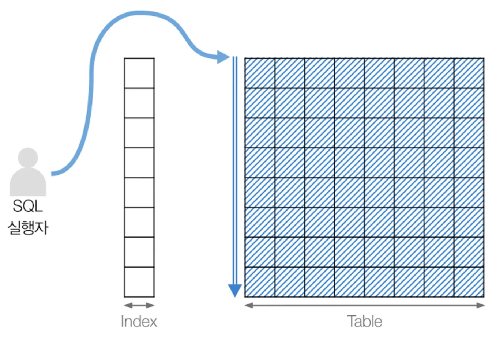

## 3. 기본 데이터 처리

### 풀 테이블 스캔



- 인덱스를 활용하지 않고 테이블을 처음부터 끝까지 전부 다 뒤져서 데이터를 찾는 방식.

1. 테이블의 레코드 건수가 매우 작아 인덱스를 스캔하는 것보다 테이블 스캔이 더 빠른 경우
2. where절이나 on 절에 인덱스를 사용할 수 있는 조건이 없는 경우
3. 옵티마이저가 판단한 조건 일치 레코드 건수가 너무 많은 경우

---

### 풀 인덱스 스캔

.webp>)

- 인덱스 테이블을 처음부터 끝까지 다 뒤져서 데이터를 찾는 방식.
- 풀 데이터 스캔 방식보다 효율적이지만, 인덱스 테이블 전체를 읽어야 하기 때문에 아주 효율적이라고 할 수 없음.

---

### ODER BY

- 정렬을 처리하는 방법
- |          | 장점                                                               | 단점                                                                             |
  | -------- | ------------------------------------------------------------------ | -------------------------------------------------------------------------------- |
  | 인덱스   | 이미 인덱스가 정렬되어 있어 순서대로 읽기만 하면 되므로 매우 빠름. | 부가적인 인덱스 추가/삭제는 느리다, 디스크 공간이 많이 필요. 메모리가 많이 필요. |
  | FileSort | 인덱스를 생성하지 않는 방법으로 인덱스를 이용할 때의 단점이 장점.  | 정렬 작업 시 실행 시 처리되므로 레코드의 수가 많을수록 성능 저하.                |

```sql
explain
WITH filtered AS (
    SELECT
        h.member_id,
        m.member_name,
        h.two_point_count,
        h.three_point_count
    FROM
        highlight AS h
            JOIN
        member AS m ON h.member_id = m.member_id
    WHERE
        m.is_aggregation_agreed = TRUE
      AND h.is_selected = TRUE
      AND h.created_at >= '2025-11-01 00:00:00'
      AND h.created_at <  '2025-11-01 00:00:00'
)
SELECT
    f.member_name,
    f.member_id,
    SUM(f.two_point_count * 2) AS two_total,
    SUM(f.three_point_count * 3) AS three_total,
    (SUM(f.two_point_count * 2) + SUM(f.three_point_count * 3)) AS total
FROM
    filtered AS f
GROUP BY
    f.member_name, f.member_id
ORDER BY
    total DESC,
    three_total DESC,
    two_total DESC
LIMIT 10;
```

- <실제 프로젝트에서 사용중인 쿼리 실행계획>
  

---

#### 소트 버퍼

- MySQL이 정렬을 수행할 때 별도의 메모리 공간을 할당받아서 사용하는데, 이 메모리 공간을 의미.
- 쿼리의 실행이 완료되면 즉시 시스템으로 반납.
- 정렬할 레코드의 수 > 소트 버퍼의 크기

1. 메모리의 소트 버퍼에서 정렬 수행(Multi-Merge)
2. 수행 Multi-Merge 횟수는 Sort_merge_passes 상태 변수에 누적 집계

- 8MB 이상부터는 소트 버퍼 크기에 따른 성능향상 변화 X
- MySQL의 소트 버퍼 크기는 56KB ~ 1MB 미안이 적절.
- 소트 버퍼의 크기를 크게 설정 -> OOM 가능성과 함께 OOM-Killer가 여유 메모리 확보를 위한 프로세스 종료 위험 존재.

#### 정렬 알고리즘

###### 싱글 패스

- 소트 버퍼에 정렬 기준 컬럼을 포함해 **SELECT** 대상이 되는 컬럼을 전부 담아 정렬 수행.
- 정렬에 필요하지 않은 컬럼 또한 소트 버퍼에 담아 정렬
- 단점 : 많은 소트 버퍼 공간 필요.

###### 투 패스

- 정렬 대상 + PK 만 소트 버퍼에 담아서 정렬 수행 -> 정렬된 순서대로 다시 PK로 테이블을 읽어 **SELECT**할 컬럼을 가져오는 방식.
- 단점 : 테이블을 2번 읽음.

> 최신 버전에서는 싱글 패스 전략을 사용. 하지만 아래와 같은 경우는 투 패스 전략을 사용한다.
>
> 1. 레코드의 크기가 max_lenght_for_sort_data 시스템 변수에 설정된 값보다 큰 경우
> 2. BLOB나 TEXT 타입의 컬럼이 SELECT 대상에 포함된 경우

###### 정렬 처리 방법

- 성능 : 인덱스 정렬 > 조인에서 드라이빙 테이블 정렬 > 조인에서 조인 결과를 임시 테이블로 저장 정렬
- 인덱스 사용 🅾️ : FileSort 과정 없이 인덱스를 순서대로 읽어 결과 반환.
- 인덱스 사용 ❌ : 정렬 버퍼에 저장하면서 정렬을 처리.

- **인덱스 정렬**
  - 조건
    1. ORDER BY에 명시된 컬럼이 제일 먼저 읽는 테이블에 속해야함.
    2. ORDER BY 순서대로 생성된 인덱스가 존재.
    3. WHERE절에 첫 번째로 읽는 테이블의 컬럼에 대한 조건 == ORDER BY 인덱스

```sql
SELECT *
FROM employees as e, salaries s
WHERE s.emp_no = e.emp_no
    AND e.emp_no BETWEEN 10 AND 20
ORDER BY e.emp_no;
```

- 조인의 **드라이빙 테이블** 정렬
  - 드라이빙 테이블 : 조인 시 먼저 엑세스되는 테이블
  - 조인을 실행하기 이전에 조인 대상이 되는 첫 번쨰 테이블의 레코드를 우선 정렬 -> 조인 실행

```sql
SELECT *
FROM employee as e, salaries as s
WHERE s.emp_no=e.emp_no
    AND e.emp_no BETWEEN 10 AND 20
ORDER BY e.last_name;
```

- employees 테이블 : 드라이빙 테이블

- **임시 테이블** 정렬
  - 2개 이상의 테이블을 조인하지 않는 경우는 임시 테이블을 생성하여 조인 결과를 저장 -> 저장된 테이블 정렬 수행.

###### 쿼리 처리 방법

| 스트리밍                                  | 버퍼링                                                           |
| ----------------------------------------- | ---------------------------------------------------------------- |
| 레코드가 검색될 떄마다 바로 전송하는 방식 | 먼저 결과를 모아 MySQL에서 가공 후 스토리지 엔지으로부터 가져옴. |
| GROUP BY / ORDER BY 쿼리에서는 불가능     | LIMIT를 사용해도 절감 효과 X                                     |

---

### GROUP BY

- 스트리밍 처리를 할 수 없는 처리
- **GROUP BY**에 사용된 조건은 인덱스 사용 불가 -> HAVING절에서 인덱스를 이용하는 튜닝은 불필요.

##### GROUP BY 작업 방식

###### 인덱스를 사용하는 경우

- **인덱스 스캔**(인덱스를 차례대로 읽는 방법) : 이미 정렬된 인덱스를 읽는 것으로 쿼리 실행 시점에 추가적인 정렬 작업이나 내부 임시 테이블은 필요 ❌
- **루스 인덱스 스캔**(인덱스를 건너뛰면서 읽는 방법)
  - 실행 계획의 Extra 컬럼 : _Using index for group-by_
  - 단일 테이블에 대해 수행되는 GROUP BY 처리에만 사용 가능.
  - 인덱스의 유니크한 값의 수가 적을수록 성능 향상.
  - 임시 테이블 필요 ❌

###### 인덱스를 사용하지 않는 경우

- **임시 테이블 사용**
  - 내부적으로 GROUP BY 절의 컬럼들로 구성된 유니크 인덱스를 가진 임시 테이블 생성 -> 중복 제거 및 집합 연산 수행.

#### DISTINCT 작업 방식

- 집계 함수 👌
  - 주의할 점! : DISTINCT는 SELECT하는 레코드를 유니크하게 SELECT하는 것이지, 특정 컬럼만을 유니크하게 조회하는 것 ❌
  - first_name만 유니크한 것을 가져오는 것이 아닌 **(first_name, last_name) 조합**이 유니크한 레코드를 가지고 옴.

```sql
SELECT DISTINCT first_name, last_name FROM employees;
```

```sql
SELECT DISTINCT(first_name), last_name FROM employees;
```
> DISTINCT는 함수가 아니라서 괄호는 의미가 없다. 따라서, first_name만 유니크한 레코드를 조회하는 것이 아니라 (fist_name,last_name)이 유니크한 레코드를 조회.


- 집계 함수 🙅‍♂️
    - 함수의 인자로 전달된 컬럼값이 유니크한 것만 가져옴.


---

#### 고급 최적화
###### 인덱스 확장
```sql
CREATE TABLE dept_emp (
    emp_no INT NOT NULL,
    dept_no CHAR(4) NOT NULL,
    from_date DATE NOT NULL,
    to_date DATE NOT NULL,
    PRIMARY KEY (dept_no, emp_no),
    KEY ix_fromdate (from_date)
    ) ;
```
- PK : (dept_no, emp_no) / 2번째 KEY : from_date
- 2번째 인덱스는 데이터 레코드를 찾아가기 위해 PK인 dept_no와 emp_no를 순서대로 포함.

###### 인덱스 머지
- 하나의 테이블에 대해 2개 이상의 인덱스를 이용해 쿼리를 처리.
- 조건이 여러 개 존재하더라도 하나의 인덱스에 포함된 컬럼에 대한 조건만으로 인덱스 검사->나머지 조건은 읽어온 레코드에 대해서는 체크만 수행.

> Spring Boot에서의 인덱스 머지 사용
```java
@Getter
@Entity
@Builder(toBuilder = true)
@NoArgsConstructor(access = AccessLevel.PROTECTED)
@AllArgsConstructor
@Table(name = "expend",indexes={
        @Index(name="idx_expend_date_user_id",columnList="expendDate, userId",unique=true)
})
public class Expend {
   // 엔티티 변수
}

```
.png)
- <적용된 모습>


- **실행 계획**
  - index_merge_intersection(교집합)
  - index_merge_sort_union(합집합)
  - index_merge_union(정렬 후 합집합)