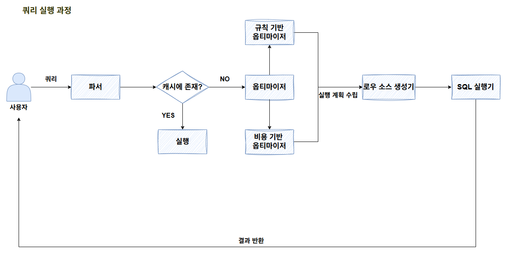
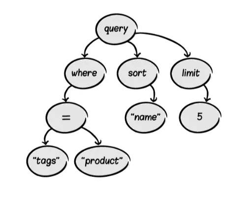
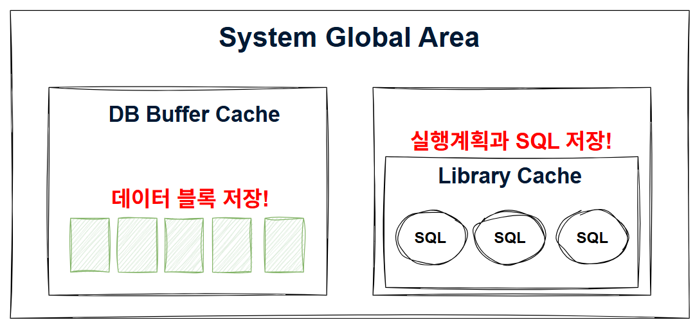
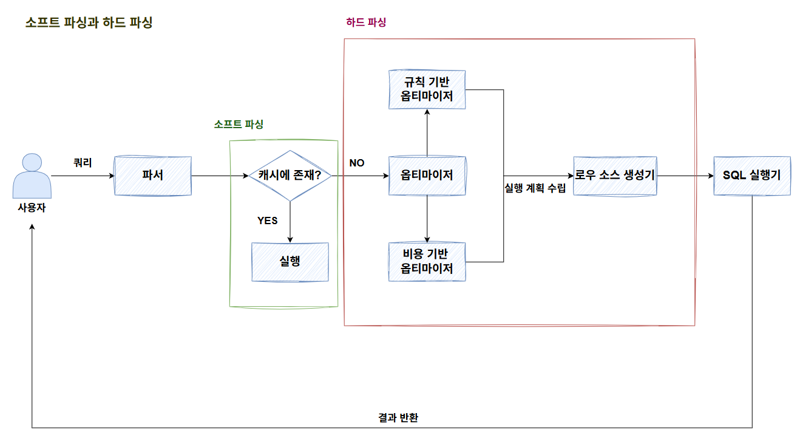
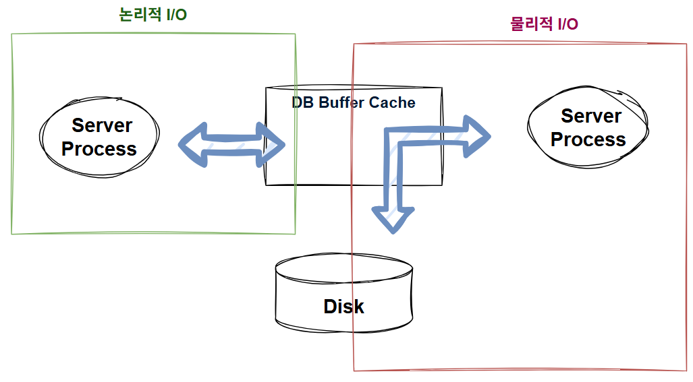
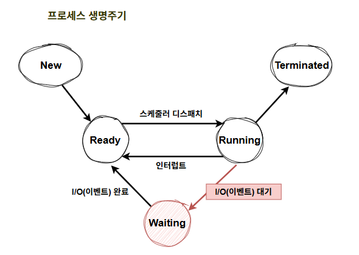
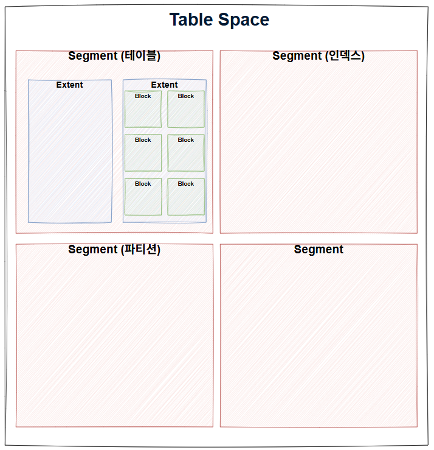
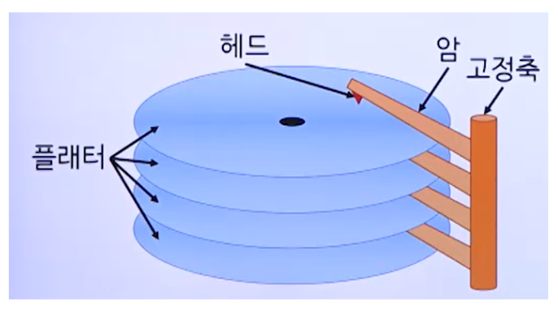
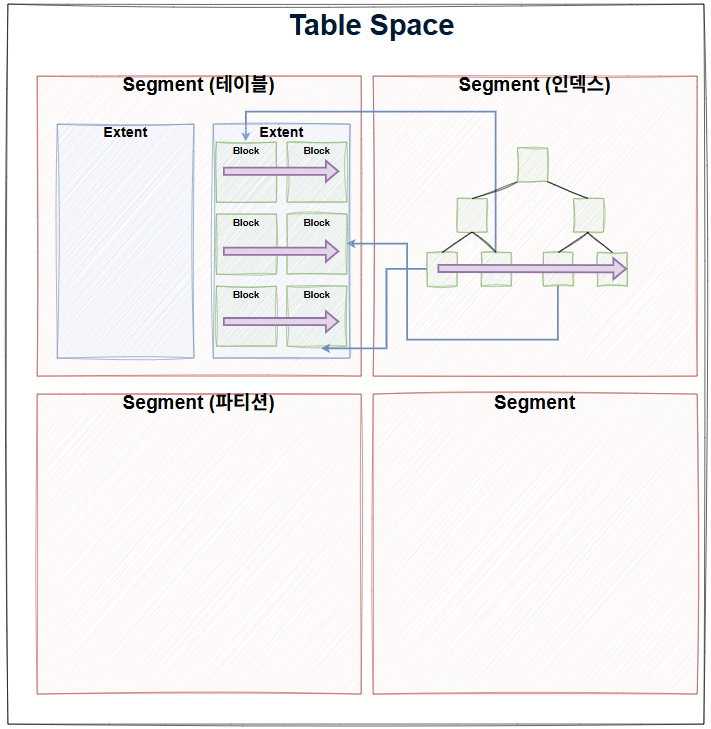

## 주제

쿼리 실행 과정, SQL, I/O

---

# [SQL 실행 과정]

**: 사용자 SQL 실행 → DB 서버 도착 → SQL 파싱 → SQL 최적화 → SQL 실행 → 결과 반환**



## 1. 사용자 SQL 작성 및 실행 : Application Layer

```java
// Spring Boot + JPA 
String loginId = "user123";
String sql = "SELECT * FROM customer WHERE login_id = ?";

PreparedStatement ps = connection.prepareStatement(sql);
ps.setString(1, loginId);
ResultSet rs = ps.executeQuery();
```

- 바인드 변수 vs 리터럴 : 캐싱과 SQL Injection에서 차이 발생
1. **메모리에 SQL 문자열 생성**, JDBC Driver가 DB 연결 준비 (Connection Pool에서 가져옴)
2. **JDBC Driver**가 SQL 패킷 생성
    1. PreparedStatement의 경우 SQL(” = ?”)과 파라미터 분리(”user123”)
    2. **네트워크로 전송 (TCP/IP)**

## 2. DB 서버 도착

- C**onnection Handler (스레드 풀)**
    - 새로운 커넥션 요청이 오면 스레드 풀에서 워커 스레드 할당 (중요한 건 **Connection 할당**)
    - 해당 스레드가 이 SQL 요청을 처리함
- **인증 & 권한 체크**
    - 연결된 사용자가 `customer` 테이블에 SELECT 권한이 있는지 확인
    - 권한이 없으면 여기서 에러 반환

## 3. SQL 파싱

### **[흐름]**

- Lexer(Tokenizer, 토큰화) → Parsing(Parser, Parse Tree) → 문법 검사(Parser, Syntax Check) → 의미 검사(Parser, Semantic Check) / → 라이브러리 캐시 확인 → Soft Parsing

### **SQL 파싱** : 사용자로부터 SQL을 전달받으면 가장 면저 SQL Parser가 파싱을 진행함

- 파스 트리 생성 : SQL 문을 이루는 개별 구성요소를 분석해서 파스 트리 생성 (+ AST)



- Syntax 체크 : **문법적 오류**가 없는지 확인. ex> 사용할 수 없는 키워드 사용(SLCLET) 등
- semantic 체크 : **의미상 오류**가 없는지 확인. ex> 존재하지 않는 테이블 혹은 컬럼 사용 등
- Parser가 SQL 분석 후 캐시(Library Cache) 확인, 캐시에 해당 SQL 존재 여부로 다음 행동이 결정됨
    - **여기서 캐시는 “SQL”에 대한 캐시 (Not 데이터)**

  

    - 캐시 히트 → Soft Parsing (SQL 최적화 이후 단계를 수행하지 않고, 결과를 캐시에서 찾아감)
    - 캐시 미스 → Hard Parsing (SQL 최적화 이후 단계 수행)

## 4. SQL 최적화

### 규칙 기반 옵티마이저 vs ✅**비용 기반 옵티마이저**

- **SQL 최적화** : 옵티마이저는 미리 수집한 시스템 및 오브젝트 통계 정보를 바탕으로 다양한 실행 경로를 생성해서 비교한 후 가장 효율적인 하나를 선택함
    - **비용 등을 확인**해 **실행 계획 생성** 후 실행 가능한 **로우 소스 생성**
    - 이 과정에서 조인 순서, 조인 방법, 사용 인덱스, 스캔 방식, 집계 방식 등 고민
        - 테이블 5개 조인만 해도 5!, 어떤 인덱스 사용할지, 어떻게 스캔할지 .. 등 많은 시간이 소요됨
- 옵티마이저가 **통계 정보 수집**
    - 테이블, 인덱스 통계 및 컬럼 분포도, 히스토그램 등
- 실행 계획 후보 생성 후 비용 계산
    - Disk I/O, CPU 등의 비용을 통계 정보를 바탕으로 계산
- **로우 소스 생성** (실행 계획의 실행 가능한 세부 구현) : SQL 옵티마이저가 선택한 실행 경로를 실제 실행 가능한 코드 또는 프로시저 형태로 포맷팅 하는 단계. 로우 소스 생성기가 진행함
    - 로우 소스?

        ```jsx
        Sort (ORDER BY e.SAL DESC)
        └─ Nested Loop Join
           ├─ Table Access Full (DEPT)
           └─ Table Access By Index Rowid (EMP)
                └─ Index Range Scan (IDX_EMP_SAL)
        ```

      여기서 **각 줄의 실행 가능한 코드가 Row Source**

        - `Index Range Scan`
        - `Table Access By Index Rowid`
        - `Nested Loop Join`
        - `Sort`

      이런 각각이 **로우를 만들어서 위로 넘겨주는 함수 단위(모듈)**임

- 라이브러리 캐시에 저장
    - SQL 텍스트 원본, 파스 트리, 실행 계획, 로우 소스 코드(Template)
        - Row Source Template → Library Cache (SGA) (최적화 시점 캐시 적재, 실행 가능한 구조체)

            ```java
            // 라이브러리 캐시에 저장
            struct row_source_template {
                // 1. 어떤 연산인지
                operation_type: INDEX_RANGE_SCAN
                
                // 2. 어떤 객체를 사용하는지
                object_name: "idx_customer_id"
                
                // 3. 어떤 함수를 호출할지
                open_function: &index_scan_open      // 함수 포인터
                fetch_function: &index_scan_fetch    // 함수 포인터
                close_function: &index_scan_close    // 함수 포인터
                
                // 4. 자식 노드 (트리 구조)
                children: [...]
            }
            ```

        - Row Source Instance → PGA (실행 시점)

            ```java
            // PGA에만 존재 (실행 중)
            struct row_source_instance {
                template: → 라이브러리 캐시 참조
                
                // 실행 중 상태 (라이브러리 캐시에 없음!)
                current_position: 150      // 현재 위치
                rows_fetched: 10          // 읽은 행 수
                temp_buffer: [...]        // 임시 버퍼
                bind_values: [123]        // 바인드 변수 값
            }
            ```

    - **소프트 파싱 vs 하드 파싱** (파싱이지만 옵티마이저의 최적화 단계까지 포함)
      
      

        - 라이브러리 캐시에 최초 1회 등록, 그 후 SQL문 자체를 키로 캐시 확인
        - **하드 파싱**은 **최적화 및 로우 소스 생성 과정**을 거치기 때문에 CPU 사용이 높은 작업임
        - 반면, **소프트 파싱**은 캐시에 있다면 최적화 및 로우 소스 생성 과정을 거치지 않음
        - 따라서 하드 파싱을 줄이는 것이 중요함. 이를 위해 **‘바인드 변수’**를 사용할 수 있음
            - SQL 문 자체 텍스트를 캐시의 키로 사용하기 때문에 한 글자만 달라져도 다시 하드 파싱 과정을 거쳐 캐시에 적재함
            - 단기간에 많은 요청이 몰리는 경우, 캐시가 부족해져서 캐시를 삭제하고, 또 똑같은 쿼리를 적재하는 일이 빈번하게 발생하므로 속도가 많이 저하될 수 있음
            - **바인드 변수**를 사용하는 것은 프로시저처럼 파라미터 Driven 방식으로 SQL을 작성함
                - ex. `“SELECT * FROM CUSTOMET WHERE LOGIN_ID = ?”`
                - vs `“SELECT * FROM CUSTOMET WHERE LOGIN_ID = HELLO”`
                    - 후자의 방법은 각각의 id까지 완벽히 같아야 캐시 히트가 됨
                - 이 SQL에 대한 하드 파싱은 최초 한 번만 일어나고, 캐싱된 SQL을 사용자(프로세스)가 공유하면서 사용함

## 5. SQL 실행

- 실행 엔진 (Executor)
    - 바인드 변수 바인딩, 실행 계획에 따라 실행
- (인덱스) 스캔 시작
    
    - **데이터 가져오기**
        - 버퍼 캐시 확인 (데이터 블록 존재 여부)

          

            - **여기서 캐시는 “데이터 블록”에 대한 캐시**
        - 캐시에 데이터 블록 존재 시, 논리적 I/O로, 시스템 콜 X
        - 캐시에 데이터 블록 존재하지 않을 시, 물리적 I/O로, 시스템 콜 O
            - 이 또한 Disk에서 읽은 데이터 블록을 캐시에 저장하는 과정을 거치므로 이 과정에 논리적 I/O도 해당됨
            - 시스템 콜 → Disk I/O 요청 → 프로세스 상태 변경 (Running → Waiting(I/O 대기 큐)) 및 컨텍스트 스위칭
            - Disk I/O 완료(인터럽트) → 프로세스 상태 변경 (Waiting → Ready 큐) → 스케줄링 디스패치

              

- 실행 엔진이 결과 레코드 생성

## 6. 결과 반환

- DB 서버가 결과 패킷 생성
- 네트워크를 통해 애플리케이션 서버로 전송
- JDBC Driver가 결과 파싱
- 애플리케이션에서 사용

# [SQL]

## SQL이 느린 이유

: Disk I/O 때문 !

### 프로세스 생명 주기

- new → ( ready - running - waiting ) → terminated



- CPU를 사용하며 작업해야 하는데, I/O 인터럽트로 인해 대기 및 준비 상태로 변경되며 할 일을 하지 못하는 것이 가장 큰 문제
    - **CPU 작업 (Compute)**: 쿼리 파싱, 최적화, 정렬, 조인 등
    - **I/O 작업 (Disk/Network)**: 테이블 데이터, 인덱스, 로그 파일 읽기/쓰기
        - `“디스크야 이 Block 읽어줘”` : 직접 읽는 것이 아니라 OS 커널에게 시스템 콜(read(), pread())를 날리고 (실행 상태에서) 대기 상태로 전환됨
        - **프로세스 대기 흐름 (I/O Interrupt)**
            1. DB 엔진이 read() 시스템 콜 호출
            2. **컨텍스트 스위칭** 발생 (User Mode → Kernel Mode)
            3. 커널이 디스크 컨트롤러에 I/O 요청
            4. 프로세스는 **Waiting** 큐로 이동
            5. 디스크가 인터럽트로 완료 신호
            6. 커널이 프로세스를 **ready** 큐로 이동
            7. 다시 **스케줄링**되어 **실행**
- 결국 동기/Blocking 때문에 **IO 작업 동안 CPU를 사용하지 못하기 때문**
    - 그럼 비동기로 하면 되지 않나?
        - DB는 정합성(일관성)이 매우 중요한데, 비동기 방식은 이를 만족시키기가 어려움
        - 그럼에도 일부에서 사용 중 (비동기 IO)
            - Read Ahead (프리페치) : 순차 스캔 시 다음 블록 미리 읽기(비동기)
            - Background Flush / Checkpoint : 버퍼풀 Dirty Page 비동기 쓰기
- **개선 방법**
    1. (Disk) I/O 줄이기 (캐시(버퍼), 메모리, 배치)
    2. I/O 속도 빠르게 하기
        1. **검색 범위 줄이기 (인덱스로 접근)**
        2. 순차 접근하기

## 데이터 저장 구조



- Disk File → Tablespace → Segment → Extent → Block

### **Datafile** : 디스크 상의 물리적인 OS 파일 (.ibd …)

- 모든 데이터는 결국 이 파일 안의 바이트로 저장됨
- DB 스토리지 엔진이 저장함
- 하드디스크 위에 있는 실제 문서 파일
- **데이터파일(Datafile)**은

  디스크 위에 존재하는 **OS 파일(저장 대상)** 이고,

  **DBMS와 OS의 직접적인 소통은 “버퍼풀의 읽기·쓰기 요청” 형태로 일어나며**,

  그 결과가 **OS를 통해 디스크의 데이터파일에 기록된다.**

  즉,
  > DBMS ↔ OS 간의 “통신 채널”은 시스템 콜(read/write/pwrite) 이고,
  >
  > 그 “목적지(Target)”가 **Datafile이라는 디스크 파일**임

### **Tablespace** : 세그먼트를 담는 (논리적) 컨테이너

- 여러 세그먼트를 묶는 논리적 저장 공간 단위임
- 하나 이상의 Datafile 포함
- 테이블, 인덱스 등 다양한 객체들을 묶어서 관리하기 위함

### **Segment** : 데이터 저장공간이 필요한 오브젝트(실제 ‘객체’의 저장 단위)

- 테이블, 인덱스, 파티션, LOB 등

### **Extent** : 블록 묶음 (**연속된** 블록 집합)

### **Block (Page)** : I/O의 최소 단위로, 데이터를 읽고 쓰는 단위

# [I/O]

- **블록 단위 I/O**
    - 클라우드에 있는 파일? → 파일 단위 I/O
    - 데이터베이스의 데이터? → 블록 단위 I/O

## **순차 접근 vs 랜덤 접근**





### **순차 접근**

1. 인덱스 블록
    1. 인덱스 블록의 리프 블록은 앞뒤를 가리키는 주소값을 통해 서로 논리적으로 연결되어 있음
    2. 이 주소 값에 따라 앞 또는 뒤로 순차적으로 스캔하는 방식이 순차 접근임
2. 테이블 블록
    1. 테이블 블록 간에는 서로 논리적인 연결고리를 갖고 있지 않음
    2. 세그먼트에 할당된 익스텐트 목록을 세그먼트 헤더에 맵(Map)으로 관리함
    3. 익스텐트 맵은 각 익스텐트의 첫 번째 주소 값을 갖고, 각 익스텐트의 첫 번째 블록 뒤에 연속해서 저장된 블록을 순서대로 읽으면 그것이 곧 Table Full Scan임

### **랜덤 접근**

1. 논리적, 물리적인 순서를 따르지 않고, 레코드 하나를 읽기 위해 한 블록씩 접근하는 방식
2. 인덱스 블록 리프를 통해 테이블 블록에 접근할 때, 랜덤으로 접근하게 됨

## **논리적 I/O vs 물리적 I/O**


- DB 버퍼 캐시 : ‘데이터 캐시’ (디스크에서 읽은 데이터 블록을 캐싱)
- Library 캐시 : ‘코드 캐시’ (SQL, 실행계획, 프로시저 등 캐싱)
- **논리적 I/O**
    - SQL 문을 처리하는 과정에서 메모리 버퍼 캐시에서 발생한 총 블록 I/O
        - Direct Path I/O가 작동하는 경우가 있으므로 논리적 I/O와 메모리 I/O가 정확히 같은 의미는 아니지만, 일반적으로 같다고 봐도 됨
        - SQL을 수행하면서 읽은 총 블록 I/O가 논리적 I/O
            - Direct Path Read 방식 제외하면 모든 블록은 DB 버퍼 캐시를 경유해서 읽음
- **물리적 I/O**
    - 디스크에서 발생한 총 블록 I/O
        - SQL 처리 도중 읽어야 할 블록을 버퍼캐시에서 찾지 못할 때만 디스크에 접근하므로, 논리적 블록 I/O 중 일부를 물리적으로 I/O함
        - DB 버퍼캐시에서 블록을 찾지 못해 디스크에서 읽은 블록 I/O가 물리적 I/O
- **SQL 튜닝**
    - **논리적 I/O(I/O 자체)를 줄이는 것이 곧 SQL 튜닝! : I/O 수 혹은 크기를 줄이기**
        - 물리적 I/O는 통제 불가능한 변수로, 메모리를 증설하여 버퍼캐시 크기를 늘리는 방법 외에는 직접 줄일 방법이 없음
        - 논리적 I/O를 줄이는 건 SQL을 튜닝해서 읽는 총 블록 개수를 줄이면 됨
            - 추가로 메모리 공유 자원(캐시)에서 직렬화 매커니즘을 위한 래치(Latch)와 Lock 경합으로 인해 지연이 발생하기도 하므로, 역시나 논리적 I/O를 줄이는 것도 필요함!!
        - 이것이 스터디에서 할 것

## **Single Block I/O vs Multiblock I/O**

- Disk에서 데이터를 읽어올 땐, 캐시에서 데이터를 읽어옴
  캐시에서 찾지 못한 데이터는 해당 블록을 디스크에서 읽고, 캐시에 적재하고, 이를 위해 I/O Call 함
  하지만, 메모리에는 한계가 있기 때문에 데이터를 모두 캐시에 적재할 수 없음

### **Single Block I/O** : 한 번의 I/O Call로 한 블록씩 읽는 방식

- 인덱스를 이용할 때는 기본적으로 인덱스와 테이블 블록 모두 Single Block I/O 방식을 사용함 / 소량 데이터를 읽을 때 좋음
    - 인덱스 루트 블록을 읽을 때
      인덱스 루트 블록에서 얻은 주소 정보로 브랜치 블록을 읽을 때
      인덱스 브랜치 블록에서 얻은 주소 정보로 리프 블록을 읽을 때
      인덱스 리프 블록에서 얻은 주소 정보로 테이블 블록을 읽을 때

### **Multiblock I/O** :한 번의 I/O Call로 여러 블록씩 읽는 방식

- 인덱스를 이용하지 않고 테이블 전체를 스캔할 때 사용 ( Index Fast Full Scan )
- 많은 데이터 블록을 읽을 때는 Multiblock I/O 방식이 효율적임.
  핵심은 프로세스가 잠자는 횟수를 줄이는 것
- 하지만, 익스텐트의 경계를 넘지는 못 함. 익스텐트는 연속된 블록의 모임이지만, 8개 단위로 20개의 블록이 있는 익스텐트를 읽을 때, 3번째에 4개의 블록만 읽어 들인다는 뜻임

## 스캔 방식 비교로 정리

### Table Full Scan vs Index Range Scan

- **Table Full Scan**
    - 테이블 전체를 스캔해서 데이터를 읽는 방식
    - 순차 접근 + Multiblock I/O 방식으로 디스크 블록을 읽음
        - 캐시에서 못 찾으면 한 번의 I/O Call을 통해 인접한 수십 ~ 수백 개 블록을 한꺼번에 I/O 함
- **Index (Range) Scan**
    - 인덱스를 이용해서 데이터를 읽는 방식
    - 랜덤 접근 + Single Block I/O 방식으로 디스크 블록을 읽음
        - 왜 랜덤? → 인덱스 타고 리프 가도 결국 테이블 접근해야 하고, **이는 ‘랜덤 접근’임**
- Table Full Scan은 마냥 피해야만 하는 존재가 아니다
    - 한 번에 많은 데이터를 처리하는 집계용 SQL과 배치 프로그램 등은 Table Full Scan이 더 효율적일 수 있음

