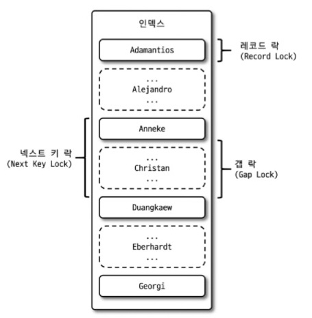

# 🍏잠금

---

## MySQL 엔진 잠금

### 글로벌 락

```sql
FLUSH TABLES WITH READ LOCK
```

- 한 세션에서 글로벌 락 획득 → 다른 세션에서 SELECT 제외한 DDL문장 + DML 문장 대기 상태.
- 범위 : MySQL 서버 전체에 존재하는 모든 테이블
- 글로벌 락은 테이블에 실행 중인 모든 종류의 쿼리가 완료되어야 함.
- 웹 서비스용 MySQL에서는 가급적 사용❌
- mysqldump와 같은 백업프로그램으로 백업을 수행할 때 사용.

### 테이블 락

```sql
LOCK TABLES table_name [ READ | WRITE ]
```

- 개별 테이블 단위로 설정되는 잠금.
- UNLOCK TABLES 명령으로 잠금을 반납 가능.
- 글로벌 락과 동일하게 작업에 영향을 크게 미치므로 특별한 상황을 제외하고는 사용 필요❌
- ***언제가 특별한 상황?***
    - 여러 테이블을 한 번에 업데이트.
    - 특정 테이블 전체를 갱신
    
    →Batch 작업 , 백업 또는 데이터 덤프 , 테이블 구조 변경 작업 , 마이그레이션 작업
    

### 네임드 락

```sql
GET_LOCK()
```

- 임의의 `문자열`에 대해 잠금 설정.
- 사용자가 지정한 `문자열`에 대해 획득하고 반납.
- 많은 레코드에 대해 복잡한 요건으로 레코드를 변경하는 트랜잭션에서 유용.
- ***실제 적용 사례***
    
    상황 : `100`명의 사용자가 동시에 지출 내역의 새로운 카테고리 생성 요청 → Race Condition 발생
    
    예시 : **사용자A**가 지출 카테고리 ‘교통비’를 생성요청과 동시에 **사용자B**가 같은 카테고리명 생성 요청.(DB에는 중복된 카테고리명이 들어가서는 안된다.)
    
    - MySQL의 **NAMED LOCK**
        - **GET_LOCK(String,time)** : 입력받은 String으로 time동안 잠금 획득.
        - **RELEASE_LOCK (String)** : 입력받은 String으로 잠금 해제.
    
    Lock만을 위한 `JpaRepository`를 구성.
    
    ```java
    @Repository
    public interface LockRepository extends JpaRepository<CategoryExpend,Long> {
        @Query(value = "select get_lock(:key,10)",nativeQuery = true)
        Integer getLock(@Param("key") String key);
    
        @Query(value = "select release_lock(:key)",nativeQuery = true)
        void releaseLock(@Param("key") String key);
    }
    ```
    
    - 사용자가 입력하는 `카테고리명`에 대해서만 ***NAMED_LOCK*** 수행.

### 메타데이터 락

- 데이터베이스 객체(테이블,뷰)의 이름이나 구조 변경 시 자동으로 획득.
- RENAME_TABLE 명령인 경우 원본 이름과 변경될 이름 2개 모두 잠금.

---

## InnoDB 스토리지 엔진 잠금

- 스토리지 엔진 내부에서 레코드 기반의 잠금 방식.
- MySQL 서버의 i`nformation_schema` - `INNODB_TRX`, `INNODB_LOCKS`, `INNODB_WAITS` 테이블 조인 후 조회 시 어떤 트랜잭션이 어떤 잠금을 대기하며 가지고 있는지 확인 가능.
    
    
    

### 레코드 락

- 레코드 자체만을 잠금.
- 레코드를 잠그는 것이 아닌 인덱스의 레코드를 잠금.
- 키 또는 유니크 인덱스에 의한 변경 작업 시 레코드 자체에 대해서만 락.

### 갭 락

- 레코드와 인접한 레코드 사이의 간격만을 잠금.
- 역할 : 레코드와 레코드 사이의 간격에 새로운 레코드 생성되는 것 제어.

### 넥스트 키 락

- `레코드 락 + 갭 락`
- `innodb_locks_unsafe_for_binlog` 시스템 비활성화(0)이 되면 검색하는 레코드에 넥스트 키 락 잠금.
- ***목적*** : 바이너리 로그에 기록되는 쿼리가 레플리카 서버에서 실행될 때 소스 서버에서 만들어 낸 결과와 동일한 결과를 만들어내도록 보장.

### 자동증가 락

- `AUTO_INCREMENT` 락 수준의 잠금 사용.
- `INSERT` / `REPLACE` 쿼리 문장과 같이 새로운 레코드를 저장하는 쿼리에서만 필요.
- AUTO_INCREMENT 값을 가져오는 순간만 락이 걸렸다가 즉시 해제.
- 명시적으로 획득하고 해제하는 방법은 ❌
