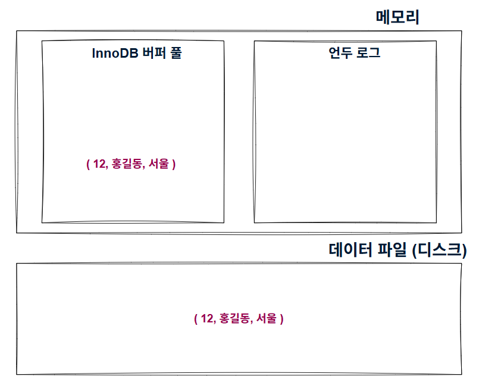
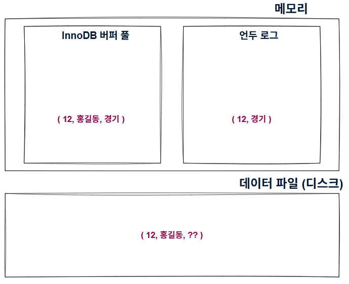
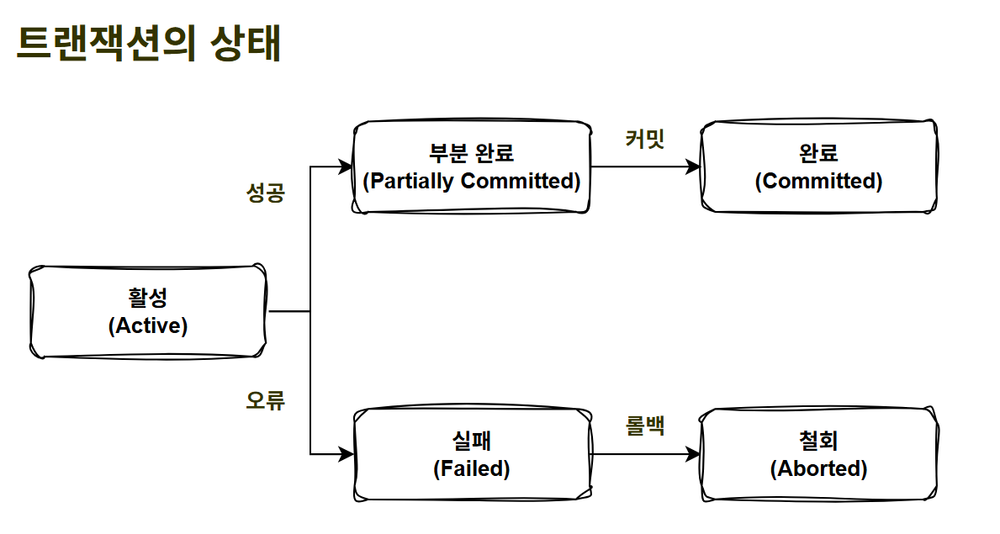
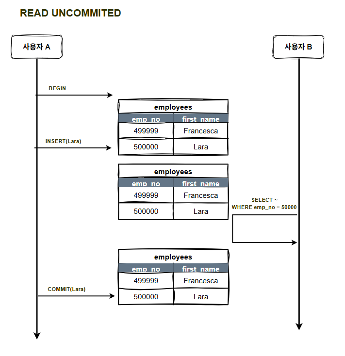
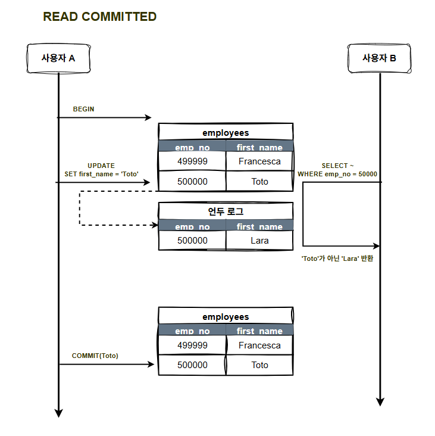
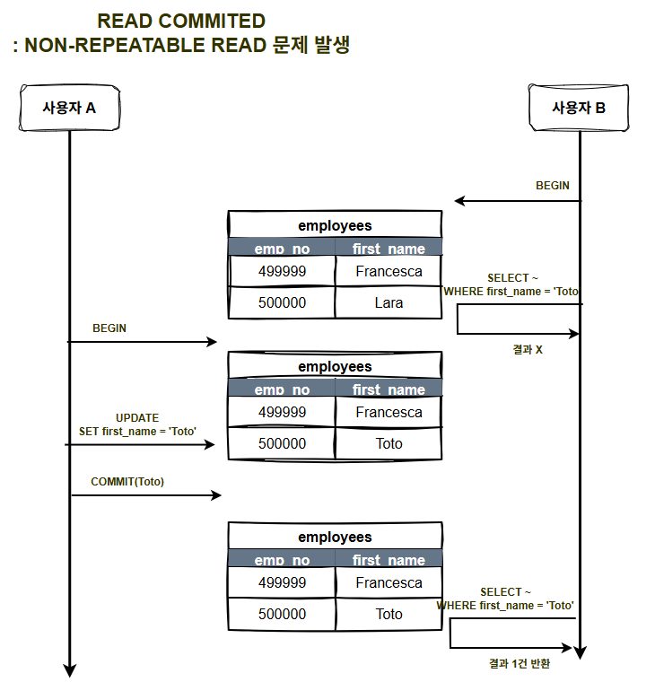
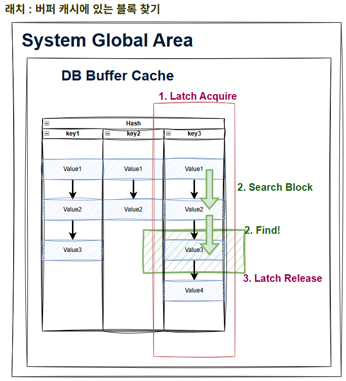
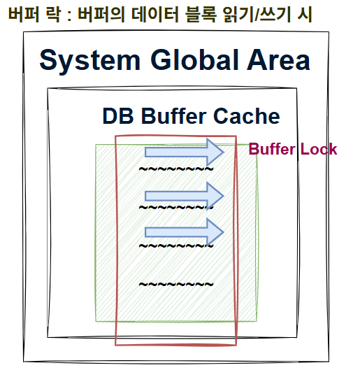
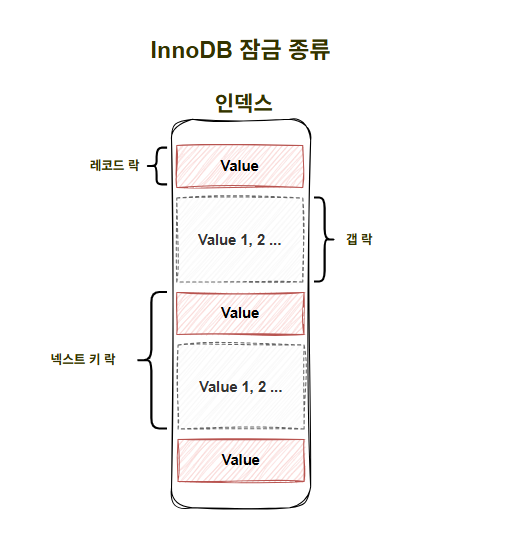

## 주제

트랜잭션과 잠금

### 세부 주제

- MVCC, 트랜잭션의 상태, 격리 수준, DML 락, 동시성 제어

### 당연하게 여겼던 것들과 궁금했던 것

- 트랜잭션 없는 쿼리가 존재하는가?
- Serializable 격리 수준은 어떤 건가? (’가장 엄격한’이라는 특징 말고)
- Lock은 오직 논리적인가? (실제 디스크에 락을 걸 수 있는가?)
- 락과 트랜잭션은 어떻게 관리되는가?
- 격리 수준은 왜 항상 SELECT만 강조하는가?

---

오라클과 MySQL 모두 참고하며 학습했지만, 최대한 DBMS에 종속되지 않는 특성 위주로 알아보고자 했다. 기본 설정 값과 같은 부분에 대한 내용이 아니라면 대부분 DBMS에서도 통용될 것이다.

## MVCC (Multi Version Concurrency Control)

<aside>
💡

**하나의 레코드에 대해 2개의 버전이 유지**되고, 필요에 따라 어느 데이터가 보여지는지 상황에 따라 달라지는 구조로, **잠금을 사용하지 않는 일관된 읽기를 제공**하는 데 가장 큰 **목적**이 있다.

**MVCC**는 일반적으로 **레코드 레벨 트랜잭션을 지원하는 DBMS가 제공하는 기능**이며, **언두 로그를 이용해 이 기능을 구현**한다.

</aside>

- **[예시]**
    1. **삽입**

    ```sql
    INSERT INTO member (m_id, m_name, m_area)
    VALUES (12, '홍길동', 서울)
    ```

  

    - 삽입인데 버퍼 풀에 있는 이유 : Insert 시 버퍼 풀에 기록 후 백그라운드 스레드가 지연된 쓰기 진행
    1. **변경**

    ```sql
    UPDATE member SET m_area = '경기' WHERE m_id = 12;
    ```

  

    - 마찬가지로, 버퍼 풀의 내용은 (INSERT에 국한되지 않고, 쓰기 작업이라면) 백그라운드 스레드에 의해 지연되어 기록됨
        - 따라서 버퍼 풀의 변경 내용이 디스크에 기록되었는지는 시점에 따라 다름

  **) 이 상태에서 트랜잭션이 커밋되지 않았지만, 다른 쿼리로 작업 중인 레코드를 조회하면 어떻게 될까?

  **→ ‘트랜잭션 격리 수준에 따라 달라짐’**

    - 여기서 버퍼 풀을 읽는다면, 이것이 Dirty Read!
- 트랜잭션, 언두 영역이 중요하게 얽혀 있음
    - 트랜잭션이 커밋되면 지금 상태(버퍼 풀)를 영구적인 데이터(디스크)로 만듦
    - 트랜잭션이 롤백되면 백업된 데이터(언두 영역)를 버퍼 풀로 다시 복구하고, 언두 영역의 내용을 삭제함
    - 또한, 커밋된다고 언두 영역의 백업 데이터가 바로 삭제되는 것은 아님.
        - 이 언두 영역을 필요로 하는 트랜잭션(다른 트랜잭션이 쓰고 있을 수 있음)이 없을 때 삭제됨
    - 결국, 트랜잭션이 길어지면 언두 영역에 쌓이는 데이터가 많아질 것임

### 잠금 없는 일관된 읽기

- InnoDB 스토리지 엔진은 MVCC를 이용해 잠금 없이 읽기 작업을 수행함
- 격리 수준이 SERIALIZABLE이 아니라면 순수한 읽기(SELECT) 작업은 다른 트랜잭션의 변경 작업과 관계없이 항상 잠금을 대기하지 않고 바로 실행됨
- 역시나 이는 MVCC 덕분이며, 언두 로그를 통해 가능함

### 언두 로그

언두 로그에 락?

잠금이 필요한 읽기 (select for update, select for share …)

데이터 변경 (Update, Delete)

### 언두 로그의 탄생과 소멸

<aside>
💡

언두 로그 **존재**의 핵심은 **“나보다 먼저 시작한 트랜잭션이 모두 끝날 때까지” 유지한다**는 것이다.

</aside>

- 언두 로그 유지 조건 (둘 중 하나라도 만족)
    - 생성한 트랜잭션이 커밋되지 않음
    - 이 버전을 읽을 수 있는 트랜잭션이 존재함
- 언두 로그 삭제 조건 (Purge, 모두 만족)
    - 생성한 트랜잭션이 커밋됨
    - 이 버전을 읽을 트랜잭션이 없음
        - 어떤 활성 트랜잭션의 Read View에도 이 언두 로그의 trx_id가 포함되지 않는 경우

트랜잭션과 잠금에 앞서.. 트랜잭션은 데이터의 정합성을 보장하기 위한 기능이고, 잠금은 동시성을 제어하기 위한 기능이다.

# 트랜잭션

<aside>
💡

**트랜잭션**은 **작업의 완전성을 보장**해 주는 것이다. **논리적인 작업 셋**을 **모두 완벽하게 처리**하거나, 처리하지 못할 경우에는 **원 상태로 복구**해서 **작업의 일부만 적용되지 않게** 만들어주는 기능이다.

</aside>

## 1. 상태

<aside>
💡

트랜잭션은 상태가 존재한다. 작업의 성공 혹은 오류 여부에 따라 상태가 변화하며, 최종적으로 커밋/롤백을 진행한다.

</aside>



### 활성

- 트랜잭션이 정상적으로 실행 중인 상태

### 성공

- 부분 완료 : 트랜잭션의 마지막까지 실행되었고, 커밋 직전 상태
- 완료 : 트랜잭션이 성공되어 커밋까지 완료된 상태

### 오류

- 실패 : 트랜잭션 작업 중 오류가 발생하여 중단된 상태
- 철회 : 트랜잭션이 비정상적으로 종료되어 롤백 연산을 수행한 상태

### 커밋과 롤백

- 커밋 : 모든 작업이 성공적으로 진행되었음을 확정하는 것으로, 작업을 DB에 영구 저장한다는 것
- 롤백 : 작업 중 오류가 발생하여 트랜잭션 처리 과정에서 발생한 변경 사항을 취소하겠다는 것으로, 시작되기 이전 상태로 되돌아가는 것

## 2. 사용 방식

### 쿼리 실행 시 트랜잭션 필수

<aside>
💡

스프링을 사용하다 보면 `@Transactional` 어노테이션을 많이 사용하는데, 이것 때문에 헷갈릴 수 있다. 우선 스프링은 배제하고 DB 관점에서 보자면, **트랜잭션은 쿼리 실행 시 무조건 필요**하다.

</aside>

- 하나의 쿼리마다 트랜잭션 필요
    - 그렇다고 쿼리마다 독립적인 트랜잭션이 필요한 것은 아니고, 하나의 트랜잭션에 여러 쿼리가 포함될 수 있음

### Auto-Commit

이름처럼 트랜잭션을 자동으로 커밋할 것인지 결정하는 속성이다.

- False 설정 시 : 하나의 쿼리 실행 후 자동 커밋 x, 수동으로 COMMIT 명령어를 입력해줘야 함
- True 설정 시 : 하나의 쿼리 실행 후 자동으로 커밋

### 명시적 트랜잭션 (Auto-Commit : false)

: 트랜잭션의 시작과 끝을 명시적으로 작성해주는 방식으로, 여러 쿼리를 하나로 묶을 수 있다.

```sql
START TRANSACTION 
SELECT .. ~, SELECT .. ~, UPDATE .. ~ ...
COMMIT
```

- 명시적으로 트랜잭션의 범위를 설정하는 것이므로, 트랜잭션 내부에 있는 쿼리들이 자동 커밋되지 않고 트랜잭션 기준으로 커밋/롤백됨
- 따라서 트랜잭션의 목적인 ‘하나의 작업 단위’를 만들 수 있게 됨

스프링의 `@Transactional`은 내부에서 auto-commit(false) 설정을 하므로 명시적 트랜잭션을 사용하겠다는 것이다. 이는 쿼리마다 트랜잭션이 아닌, **한 번에 모든 쿼리를 커밋/롤백**하겠다는 뜻이다.

```java
try (connection) { 
    connection.setAutoCommit(false); // 쿼리마다 커밋 X!
    // execute some SQL statements... 
    connection.commit(); 
} catch (SQLException e) { 
    connection.rollback();
}
```

### 암묵적 트랜잭션 (Auto-Commit : true)

트랜잭션의 시작과 끝을 명시적으로 작성하지 않는 방식으로, Auto-Commit true(1) 설정인 상태이다. 각 쿼리마다 자동으로 트랜잭션이 생성/종료된다.

```sql
SELECT .. // tx1 - commit 
SELECT .. // tx2 - commit
UPDATE .. // tx3 - commit
```

## 3. 주의 사항

### 트랜잭션 범위 최소화

<aside>
💡

**트랜잭션은 여러 작업을 하나의 작업처럼 묶어서 관리**한다. 그렇기에 하나의 트랜잭션 내에 여러 작업이 존재할 수 있고, **꼭 필요한 작업만 묶어서 실행하여 범위를 최소화할 필요**가 있다.

</aside>

- 데이터베이스 커넥션은 제한되어 있고, 보통 서버의 개수보다 데이터베이스의 수가 적기 때문에 커넥션 관리가 중요함
- 트랜잭션이 길어지면 요청이 많아질 때 사용할 수 있는 커넥션이 부족할 수 있음
- **DB 자원 낭비**
    1. 커넥션 고갈 : 트랜잭션이 길어지는 경우 새 요청이 커넥션을 얻지 못할 수 있음
    2. 락 보유 시간 증가 : 락 보유가 길어지면 대기하는 다른 트랜잭션도 작업을 진행하지 못 함
        1. 락 해제 시점은 커밋/롤백이므로!
- **어떤 작업을 줄일까?**
    - 트랜잭션 내부에 존재하는 **DB를 쓰지 않는 작업**을 줄일 필요가 있음
        - DB를 쓰지 않는 작업은 대표적으로 CPU 작업, 네트워크 작업 등이 있음
            - ex. 입력값 검증, 내용의 오류 여부 확인 등
            - ex. 외부 서버 통신

## 4. 격리 수준

<aside>
💡

**격리 수준**은 **하나의 트랜잭션 내**에서 **또는 여러 트랜잭션 간**의 **작업 내용을 어떻게 공유하고 차단할 것인지를 결정하는 레벨을 의미**한다.

특히, 여러 트랜잭션이 동시에 처리될 때 특정 트랜잭션이 다른 트랜잭션에서 변경하거나 조회하는 데이터를 **볼 수 있게 허용할지 말지**를 결정하는 것이다.

</aside>

- **트랜잭션의 격리 수준은 4가지로 나뉘는데**, 뒤로 갈수록 트랜잭션 간 데이터 고립 정도가 높아지며, 동시 처리 성능이 떨어진다고 볼 수 있음
- **격리 수준**에는 **레벨에 따라** 발생할 수 있기도, 발생하지 않기도 하는 **3가지의 부정합 문제**를 고려해야 함

|  | DIRTY READ | NON-REPEATABLE READ | PHANTOM READ |
| --- | --- | --- | --- |
| READ UNCOMMITED | O | O | O |
| READ COMMITTED | X | O | O |
| REPEATABLE READ | X | X | O (InnoDB는 X) |
| SERIALIZABLE | X | X | X |
- 일반적인 서비스에서는 주로 READ COMMITTED와 REPEATABLE READ 중 하나를 사용함
- MySQL은 REPEATABLE READ, Oracle은 READ COMMITTED를 기본 레벨로 사용함

### READ UNCOMMITTED

: 각 트랜잭션의 **변경 내용**이 COMMIT이나 ROLLBACK 여부에 관계없이 다른 트랜잭션에서 보인다.



### READ COMMITTED

: Oracle에서 기본으로 사용되는 격리 수준으로, 어떤 트랜잭션에서 데이터를 변경했더라도 COMMIT이 완료된 데이터만 다른 트랜잭션에서 조회할 수 있다.



- 다른 트랜잭션에서 변경 중인 내용을 조회하고자 한다면, 테이블이 아닌 언두 로그에 저장된 데이터를 읽어옴 → 따라서 Dirty Read가 발생하지 않음



- 하지만, 중간에 변경이 일어났을 때, 처음 조회한 결과와 다른 결과를 가져오는 NON-REPEATABLE READ 정합성 문제가 발생할 수 있음
- 이는 SELECT마다 일종의 스냅샷인 Read View를 새로 만들기 때문임
- **테이블과 언두 로그 중 어떤 것을 읽어야 하는지 판단하는 방법**

    <aside>
    💡

  **변경 중인 트랜잭션이 존재하는지 알아내는 방법**이기도 한데, **트랜잭션 ID**로 확인한다.

    </aside>

  우리가 만드는 테이블에는 각 테이블마다 **숨겨진 컬럼**들이 존재한다.

    ```sql
    DB_TRX_ID BIGINT, // 마지막 수정한 트랜잭션 ID
    DB_ROLL_PTR BIGINT // 언두 로그 포인터
    ```

  해당 로우를 마지막으로 수정한 트랜잭션과 수정하면서 사용한 언두 로그의 포인터를 기록하고, 이를 통해 시점에 따라 어떤 데이터를 읽어야 할 지 결정할 수 있다.

    ```sql
     현재 데이터 (Clustered Index)
    Row:
    ├─ order_id: 100
    ├─ status: 'PROCESSING'  ← 현재 값 (Tx 12345가 수정)
    ├─ amount: 5000
    ├─ DB_TRX_ID: 12345      ← 이 Row를 마지막으로 수정한 트랜잭션
    └─ DB_ROLL_PTR: 0x7F...  ← Undo 로그 위치
    
     Undo 로그
    Undo Log:
    ├─ TRX_ID: 12345         ← 어느 트랜잭션의 Undo인지
    ├─ Old status: 'PENDING' ← 이전 값
    ├─ Old amount: 5000
    └─ Prev version: 0x8A... ← 더 이전 버전 (있다면)
    ```

  **SELECT 쿼리가 새로운 트랜잭션(READ_COMMITTED)으로 나타나서 order_id=100인 데이터를 읽고자 한다면, 해당 로우의 trx_i**d가 활성 트랜잭션인지, 내 트랜잭션 이후에 수정이 있었는지, 내가 고려하지 않아도 될만큼 이전에 수정되었는지 등**을 확인한 후 테이블을 읽을지 언두 로그를 읽을지 결정한다.**

  만약 활성 트랜잭션이 아니라면 테이블의 값을 읽고, 활성 트랜잭션이라면 DB_ROLL_PTR을 통해 언두 로그에 접근하여 데이터를 읽는다.

  다른 점검 요소들의 판단 기준도 아래에 함께 정리되어 있다.

  이 과정에서 Read View와 활성 트랜잭션을 참고한다.


### REPEATABLE READ

: MySQL의 InnoDB에서 기본으로 사용되는 격리 수준으로, 앞에서 살펴본 NON-REPEATABLE READ 정합성 문제가 발생하지 않는다.

- Read Committed와 Repeatable Read의 차이는 언두 영역에 백업된 레코드의 여러 버전 가운데 몇 번째 이전 버전까지 찾아 들어가냐에 있음
- InnoDB는 Phantom Read가 발생하지 않는다고 하지만, Select … for share / Select … for update 쿼리의 경우에는 언두 로그를 잠글 수 없으므로 **Phantom Read**가 발생함
    - 하지만 이는 '잠금이 수반된 읽기’로, 잠금 없는 읽기가 아닌 예외라고 본다고 함..
    - 추가로 위 경우 Phantom Read뿐만 아니라 Non-Repeatable Read도 발생함

### SERIALIZABLE

: 가장 단순하면서, 엄격한 격리 수준이다.

- 모든 읽기 작업에서 ‘잠금 없는 일관된 읽기’가 아닌 잠금을 획득하고 읽기를 수행함

---

### Dirty Read

: 어떤 트랜잭션에서 처리한 작업이 완료(커밋)되지 않았는데도, 다른 트랜잭션에서 볼 수 있는 현상이다.

### (Non) Repeatable Read

: 하나의 트랜잭션 내에서 똑같은 SELECT 쿼리를 실행했을 때 항상 같은 결과를 가져와야 한다는 것이다.

### Phantom Read

: 다른 트랜잭션에서 수행한 변경 작업에 의해 레코드가 보였다 안 보였다 하는 현상이다.

- 두 Select 중간에 Insert가 있고, 처음 Select에는 나타나지 않던 로우가 다음 Select에서는 조회되는 상황
- 언두 레코드에는 잠금을 걸 수 없는데, 잠금이 필요한 조회(SELECT … FOR UPDATE)의 경우 언두 레코드가 아닌 테이블을 읽어야 하기 때문에 발생

## 5. 쿼리와 트랜잭션

앞서, ‘쿼리 실행 시 트랜잭션 필수’라고 했는데, 이에 대해 조금 더 자세히 살펴보겠다.

트랜잭션 내에서 **Select 실행 시점의 모습을** 기록하는 Read View와 현재 실행 중인 트랜잭션인 활성 트랜잭션이라는 것이 있다.

### Read View

<aside>
💡

Read View는 **‘특정 시점의 트랜잭션 스냅샷’**으로, **해당 쿼리에서 무엇을 볼 수 있는지 판단하는 기준**이 된다.

MVCC를 지원하기 위해 존재하며, 활성 트랜잭션을 알아낼 때도 사용된다.

</aside>

- 생성 시점 : 트랜잭션 시작 시점이 아닌, **개별 SELECT 단위로 Read View가 생성됨**
    - 격리 수준에 따라 Read View 재사용이 가능하기도 함
        - 이에 따라 Repeatable Read 문제 발생 여부가 갈림
- 저장 위치 : 트랜잭션 객체 내부(메모리) 구조체로 생성됨

```cpp
Transaction {
    trx_id: 100,
    state: ACTIVE,
    read_view: ReadView {  // ← 여기
        creator_trx_id: 100,
        low_limit_id: 150,
        up_limit_id: 301,
        m_ids: [150, 200, 250]
    },
    ...
}
```

- 역할 : 테이블 가시성 판단 (테이블을 읽을 것인지, 언두 로그를 읽을 것인지)

```sql
Row의 DB_TRX_ID를 Read View와 비교
→ 이 Row를 볼 수 있는가?

판단 로직:
IF DB_TRX_ID == creator_trx_id:
    → 본인 수정 → 보임 ✓
ELSE IF DB_TRX_ID >= up_limit_id:
    → 미래 변경 → 안 보임 ✗
    → Undo 읽기
ELSE IF DB_TRX_ID < low_limit_id:
    → 과거 커밋 → 보임 ✓
ELSE IF DB_TRX_ID IN m_ids:
    → 활성 중 → 안 보임 ✗
    → Undo 읽기
ELSE:
    → 커밋됨 → 보임 ✓

==> 내 Read View의 trx_id보다 작은(혹은 내가) trx_id에서 변경한 것만 본다!!
```

### 활성 트랜잭션

- 메모리에 활성된 트랜잭션 목록을 관리한다

```sql
InnoDB 내부 트랜잭션 시스템:

활성 트랜잭션 목록 (Read-Write):
├─ TRX ID: 12345 (Active)
├─ TRX ID: 12346 (Active)
└─ TRX ID: 12347 (Active)

커밋된 트랜잭션:
├─ TRX ID: 12344 (Committed)
├─ TRX ID: 12343 (Committed)
└─ ...
```

- **활성 트랜잭션 관점에서 Repeatable Read와의 차이 : Non-Repeatable read 정합성의 이유**

  두 격리 수준은 Read View 생성/재사용에 차이가 있다

    1. **Read Committed**

    ```sql
    BEGIN; -- Tx 12346
    
    -- 조회 1
    SELECT * FROM orders WHERE order_id = 100;
    → Read View 생성 (trx_ids: [12345])
    → Tx 12345 활성 → Undo 읽기 → 'PENDING'
    
    -- Tx 12345 커밋
    
    -- 조회 2
    SELECT * FROM orders WHERE order_id = 100;
    → Read View 재생성! (trx_ids: [])
    → Tx 12345 커밋됨 → 현재 값 읽기 → 'PROCESSING'
    
    특징:
    ✓ 매 SELECT마다 Read View 재생성
    ✓ 커밋된 최신 값 읽음
    ✓ Non-Repeatable Read 발생 가능
    ```

    1. **Repeatable Read**

    ```sql
    BEGIN; -- Tx 12346
    
    -- 조회 1
    SELECT * FROM orders WHERE order_id = 100;
    → Read View 생성 (trx_ids: [12345])
    → Tx 12345 활성 → Undo 읽기 → 'PENDING'
    
    -- Tx 12345 커밋
    
    -- 조회 2
    SELECT * FROM orders WHERE order_id = 100;
    → Read View 재사용! (trx_ids: [12345])
    → Tx 12345 여전히 "활성"으로 취급
    → Undo 읽기 → 'PENDING'
    
    특징:
    ✓ 트랜잭션 시작 시 Read View 한 번만 생성
    ✓ 항상 같은 값 읽음
    ✓ Repeatable Read 보장
    ```

- 흐름 예시 (언두, 트랜잭션, Read View, 쿼리 총합)

    ```sql
    -- 초기
    Row: status = 'PENDING', DB_TRX_ID = 50
    Undo: 없음
    활성: []
    
    -- Time 1: Tx1 시작
    BEGIN; -- Tx1 (100)
    
    활성: [100]
    Undo: 없음
    
    -- Time 2: Tx1 SELECT
    SELECT * FROM orders WHERE order_id = 100;
    
    Read View (Tx1):
    ├─ creator_trx_id: 100
    ├─ trx_ids: []
    ├─ low_limit_id: 101
    └─ up_limit_id: 101
    
    결과: 'PENDING' (테이블)
    
    활성: [100]
    Undo: 없음
    
    -- Time 3: Tx2 시작
    BEGIN; -- Tx2 (200)
    
    활성: [100, 200]
    Undo: 없음
    
    -- Time 4: Tx2 UPDATE
    UPDATE orders SET status = 'PROCESSING' WHERE order_id = 100;
    
    Undo 생성! ←
    Undo Log:
    ├─ TRX_ID: 200
    ├─ Old status: 'PENDING'
    ├─ Old DB_TRX_ID: 50
    └─ Prev: NULL
    
    Row:
    ├─ status: 'PROCESSING'
    ├─ DB_TRX_ID: 200
    └─ DB_ROLL_PTR: 0x7F... (Undo)
    
    활성: [100, 200]
    Undo: [TRX 200]
    
    -- Time 5: Tx3 시작
    BEGIN; -- Tx3 (300, REPEATABLE READ)
    
    활성: [100, 200, 300]
    Undo: [TRX 200]
    
    -- Time 6: Tx3 SELECT
    SELECT * FROM orders WHERE order_id = 100;
    
    Read View (Tx3):
    ├─ creator_trx_id: 300
    ├─ trx_ids: [100, 200]
    ├─ low_limit_id: 100
    └─ up_limit_id: 301
    
    판단:
    DB_TRX_ID = 200
    200 IN [100, 200]? YES!
    → Undo 읽기
    
    결과: 'PENDING' (Undo)
    
    활성: [100, 200, 300]
    Undo: [TRX 200] ← Tx3이 사용 중
    
    -- Time 7: Tx2 COMMIT
    COMMIT; -- Tx2
    
    활성: [100, 300]
    Undo: [TRX 200] ← 여전히 유지! (Tx1, Tx3 때문)
    
    -- Time 8: Tx4 시작 및 UPDATE
    BEGIN; -- Tx4 (400)
    UPDATE orders SET status = 'SHIPPED' WHERE order_id = 100;
    
    새 Undo 생성! ←
    Undo Log (new):
    ├─ TRX_ID: 400
    ├─ Old status: 'PROCESSING'
    ├─ Old DB_TRX_ID: 200
    └─ Prev: 0x7F... (이전 Undo)
    
    Row:
    ├─ status: 'SHIPPED'
    ├─ DB_TRX_ID: 400
    └─ DB_ROLL_PTR: 0x8A...
    
    활성: [100, 300, 400]
    Undo: [TRX 200 ← TRX 400] (체인)
    
    -- Time 9: Tx1 두 번째 SELECT (REPEATABLE READ)
    SELECT * FROM orders WHERE order_id = 100;
    
    Read View (Tx1, 재사용):
    ├─ creator_trx_id: 100
    ├─ trx_ids: []
    ├─ low_limit_id: 101
    └─ up_limit_id: 101
    
    판단:
    DB_TRX_ID = 400
    400 >= 101? YES!
    → Undo 읽기
    
    Undo (TRX 400):
    ├─ TRX_ID: 400
    └─ Old: 'PROCESSING'
    
    판단:
    400 >= 101? YES!
    → 이전 Undo로
    
    Undo (TRX 200):
    ├─ TRX_ID: 200
    └─ Old: 'PENDING'
    
    판단:
    200 >= 101? YES!
    → 이전 버전으로 (또는 이게 최종)
    
    결과: 'PENDING' (체인 따라감)
    
    활성: [100, 300, 400]
    Undo: [TRX 200 ← TRX 400] ← Tx1, Tx3 사용 중
    
    -- Time 10: Tx4 COMMIT
    COMMIT; -- Tx4
    
    활성: [100, 300]
    Undo: [TRX 200 ← TRX 400] ← 여전히 유지
    
    -- Time 11: Tx1 COMMIT
    COMMIT; -- Tx1
    
    활성: [300]
    Undo: [TRX 200 ← TRX 400] ← Tx3만 남음
    
    -- Time 12: Tx3 COMMIT
    COMMIT; -- Tx3
    
    활성: []
    Undo: [TRX 200 ← TRX 400]
    
    Purge 체크:
    "TRX 200, 400 Undo 삭제?"
    → 어떤 활성 트랜잭션도 없음
    → Read View 없음
    → ✓ 삭제 가능!
    
    Purge 실행:
    Undo: [] (삭제됨)
    ```


# 잠금

: 오라클은 공유 리소스와 사용자 데이터 보호 목적으로 DML Lock, DDL Lock, 래치(Latch), Buffer Lock, 라이브러리 캐시 Lock/Pin을 대표로, 다양한 Lock을 사용하며, 이 외에도 내부에 더 많은 종류의 Lock이 존재한다.

## 1. 래치와 버퍼 락

래치와 버퍼 락은 ‘쿼리 실행 과정’에서 가볍게 다뤘던 ‘캐시’ 탐색 매커니즘에 사용된다.

- 래치: 버퍼 캐시의 '해시 체인(목록)'을 보호
  여러 블록 헤더가 연결된 리스트 전체를 보호
- 버퍼 락: 찾아낸 '특정 블록' 하나를 보호
  해당 블록의 내용을 읽거나 변경하는 동안 보호

## 래치와 버퍼 락 그리고 트랜잭션 내부에서의 락(DML Lock)

### 정리

```
┌─────────────────────────────────────────────────┐
│           락의 3단계 계층                        │
└─────────────────────────────────────────────────┘

레벨 1: 래치 (Latch)
├─ 목적: 메모리 자료구조 보호
├─ 대상: 해시 체인, LRU 리스트 등
├─ 시간: 마이크로초
└─ 사용자 인지: 불가능 (내부 동작)

레벨 2: 버퍼 락 (Buffer Lock)
├─ 목적: 버퍼 블록 내용 보호
├─ 대상: 8KB 블록 (메모리)
├─ 시간: 밀리초
├─ 모드: S (읽기), X (쓰기)
└─ 사용자 인지: 불가능 (내부 동작)

레벨 3: 트랜잭션 락 (DML Lock)
├─ 목적: 논리적 데이터 일관성 보장
├─ 대상: Table, Row (논리적 개념)
├─ 시간: 초 ~ 분 (COMMIT까지)
├─ 모드: 
│   ├─ 테이블 락: IS, IX, S, SIX, X
│   └─ Row 락: S, X
└─ 사용자 인지: 가능 (Lock 대기 발생)
```

- 트랜잭션 실행 시 구체적인 락 순서

    ```
    ❌ 잘못된 이해:
    "트랜잭션 시작 시 트랜잭션 락을 건다"
    
    ✓ 올바른 이해:
    "트랜잭션 시작 시점에는 락을 안 걸음"
    "SQL 실행 시 필요한 락을 건다"
    
    UPDATE employees SET salary = 5000 WHERE emp_id = 100;
    
    실제 순서:
    ──────────────────────────────────────
    1단계: 트랜잭션 시작
       BEGIN;
       ├─ 트랜잭션 ID 할당: 12345
       ├─ MVCC 스냅샷 생성: Snapshot 12345
       └─ 락은 아직 없음! ← 중요!
    
    2단계: SQL 파싱 및 계획
       UPDATE employees ...
       ├─ 실행 계획 수립
       └─ 필요한 락 결정
    
    3단계: 테이블 락 획득 (먼저!)
       acquire_table_lock(employees, IX);
       ├─ Lock Manager에 등록
       ├─ 다른 트랜잭션의 락 체크
       └─ IX 모드 획득 (의도 표시)
    
    4단계: 블록 찾기 (래치 사용)
       ├─ hash = hash(file, block_id)
       ├─ acquire_latch(hash_chain[hash])  ← 해시 체인 래치
       ├─ 해시 체인 탐색 (포인터 따라가기)
       ├─ BufferHeader 찾음
       └─ release_latch(hash_chain[hash])  ← 즉시 해제
    
    5단계: 버퍼 락 획득 (블록 읽기/쓰기)
       acquire_buffer_lock_exclusive(buffer);
       ├─ 블록 내용 읽기
       ├─ Row 100 찾기
       └─ (아직 수정 안 함)
    
    6단계: Row 락 획득 (그 다음!)
       acquire_row_lock(emp_id=100, X);
       ├─ Lock Manager에 등록
       ├─ 다른 트랜잭션의 Row 락 체크
       └─ X 모드 획득 (실제 잠금)
    
    7단계: 실제 수정
       ├─ salary를 5000으로 변경
       ├─ Undo 레코드 생성 (old value)
       └─ is_dirty = true
    
    8단계: 버퍼 락 해제 (빠르게!)
       release_buffer_lock_exclusive(buffer);
       └─ 밀리초만 보유
    
    9단계: 커밋
       COMMIT;
       ├─ Undo 레코드 정리
       ├─ 테이블 락 해제 (IX)
       └─ Row 락 해제 (X)
    ```

  테이블 락 먼저 걸 수 있는 이유 : 테이블 ID만 알면 Lock Manager(메모리)에서 락을 획득할 수 있기 때문에, 실제 블록에 접근하지 않아도 됨. 따라서 래치 전에 테이블 락을 먼저 걸 수 있음.

- **트랜잭션 락 상세 구조**

    ```
    트랜잭션 락
    │
    ├─ 테이블 락 (Table Lock)
    │   │
    │   ├─ 의도 락 (Intention Lock)
    │   │   ├─ IS (Intention Shared)
    │   │   │   └─ 목적: "나는 이 테이블의 일부 Row를 읽을 거야"
    │   │   │   └─ 효과: 테이블은 안 잠김, 의도만 표시
    │   │   │
    │   │   └─ IX (Intention Exclusive)
    │   │       └─ 목적: "나는 이 테이블의 일부 Row를 쓸 거야"
    │   │       └─ 효과: 테이블은 안 잠김, 의도만 표시
    │   │
    │   └─ 실제 락 (Actual Lock)
    │       ├─ S (Shared)
    │       │   └─ 목적: "나는 이 테이블 전체를 읽을 거야"
    │       │   └─ 효과: 테이블 전체 잠김 (읽기만 허용)
    │       │
    │       ├─ SIX (Shared + Intention Exclusive)
    │       │   └─ 목적: "테이블 전체 읽기 + 일부 Row 쓰기"
    │       │   └─ 효과: 테이블 잠김 (읽기만 허용, 일부 쓰기)
    │       │
    │       └─ X (Exclusive)
    │           └─ 목적: "나는 이 테이블 전체를 독점할 거야"
    │           └─ 효과: 테이블 전체 잠김 (모든 접근 차단)
    │
    └─ Row 락 (Row Lock)
        ├─ S (Shared)
        │   └─ 목적: "이 Row를 읽고 다른 수정 막기"
        │   └─ 효과: 여러 트랜잭션이 동시 읽기 가능, 쓰기 차단
        │   └─ 예: SELECT ... FOR SHARE
        │
        └─ X (Exclusive)
            └─ 목적: "이 Row를 독점적으로 쓰기"
            └─ 효과: 다른 모든 접근 차단
            └─ 예: UPDATE, DELETE, SELECT ... FOR UPDATE
    ```


래치와 버퍼 락은 ‘쿼리 실행 과정’에서 가볍게 다뤘던 ‘캐시’ 탐색 매커니즘에 사용된다.

- 래치: 버퍼 캐시의 '해시 체인(목록)'을 보호
  여러 블록 헤더가 연결된 리스트 전체를 보호
- 버퍼 락: 찾아낸 '특정 블록' 하나를 보호
  해당 블록의 내용을 읽거나 변경하는 동안 보호

### **래치 : [버퍼 블록 찾을 때 사용] / 가장 가볍고 빠른 Lock / spin lock 구현, Atomic 연산**



- SGA(System Global Area, 모든 프로세스가 공유하는 메모리 영역)에 공유된 **각종 자료구조를 보호**하기 위해 사용됨
- 버퍼 캐시에 있는 블록을 빠르게 찾기 위함
    - 특히, 해시에 저장되어 있는 블록에 접근, Chaining 방식으로 연결된 버킷 내 블록들 중 ‘해시 체인’을 보호하기 위함
    - 블록이 버퍼 캐시에 있나? 확인 후 있다면 블록의 메모리 주소를 반환 받고 그제서야 진짜 데이터 블록을 찾으러 감
- 래치는 한꺼번에 잡아야 함
    - 데드 락이 발생할 수 있기 때문 ! (프로세스 A : L1 Lock 획득, L2 spin / 프로세스 B : L2 Lock 획득, L1 Splin)
    - 래치는 원자적 연산을 사용하기 때문에 spin하더라도 하나의 프로세스가 획득하는 것이 보장됨
- **왜 래치를 거는가?** 버퍼 캐시에 있는 블록(메모리 주소)를 찾기 위해서인데, 왜?
    - 찾는 도중에 다른 프로세스가 변경한다면 올바르게 찾지 못할 수 있기 때문
    - Block3 찾고 있는데, 다른 프로세스가 Block3를 삭제해버리면? → Segmentation Fault 발생!

### **버퍼 락 : [버퍼 블록 읽기/쓰기 시 사용] / Semaphore 구현, 대기 큐 존재**



- 버퍼 블록에 대한 액세스를 직렬화하기 위해 사용함
- 블록을 읽을 때, **왜 버퍼 락을 거는가?**
    - 블록 단위로 읽고 쓰는데, 해당 블록을 읽는 중 다른 프로세스가 데이터 하나를 변경하고, 읽던 프로세스가 읽어버릴 수 있음
- 락 획득 불가능한 상태일 때 대기 큐 진입 (세마포어 count == 0)

### **트랜잭션 락 : 작업의 논리적 순서 결정**

- 버퍼 락이 있는데, **왜 트랜잭션 락을 거는가**?
    - 같은 로우의 컬럼을 수정하는데, 먼저 수정한 트랜잭션을 롤백해야 하는 경우, 트랜잭션 락이 없으면 불가능함

    ```sql
    트랜잭션 락 없이:
    Tx1: UPDATE emp SET salary = 5000 WHERE id = 100;
         (버퍼 락만 사용)
         버퍼 락 획득 → 수정 → 버퍼 락 해제
    
    Tx2: UPDATE emp SET salary = 6000 WHERE id = 100;
         버퍼 락 획득 → 수정 → 버퍼 락 해제
    
    Tx1: ROLLBACK;
         💥 문제! Tx2의 수정도 같이 롤백? 안 됨?
    
    트랜잭션 락 사용:
    Tx1: UPDATE emp SET salary = 5000 WHERE id = 100;
         Row Lock 획득 (COMMIT까지 유지)
    
    Tx2: UPDATE emp SET salary = 6000 WHERE id = 100;
         Row Lock 시도 → 대기 (Tx1의 COMMIT까지)
    
    Tx1: COMMIT;
         Row Lock 해제
    
    Tx2: Row Lock 획득 → 수정 가능
    ```


### 트랜잭션 락만 있으면 되는 거 아닌가?

- 애초에 각 락(래치)는 목적이 다르고, 그에 맞게 구현이 되어 있음
    - 예를 들어, 트랜잭션은 어떤 일들이 포함되어 있을지 모르고, 얼마나 길어질지 모르는데, 버퍼 락으로 퉁치게 된다면 버퍼 락 점유 시간이 어마어마 해질 수 있음.
- 기본적으로 락은 로우 단위 → 버퍼 캐시 내부 자료구조(래치 대상)는 로우가 아님! → 래치가 없을 때의 문제가 발생할 수 있음
- 마찬가지로 블록 단위의 이동이 이루어지는 경우에도 문제가 발생할 수 있음
    - LRU 리스트 corruption
    - Free List 관리

```
계층별 책임 정리
┌─────────────────────────────────────────┐
│  래치 (Latch)                           │
│  - 목적: 자료구조 포인터 보호            │
│  - 대상: 해시 체인, LRU 리스트, Free 리스트│
│  - 시간: 마이크로초                      │
│  - 작업: 포인터 읽기/쓰기                │
└─────────────────────────────────────────┘
            ↓ 포인터를 따라가서
┌─────────────────────────────────────────┐
│  버퍼 락 (Buffer Lock)                  │
│  - 목적: 버퍼 블록 내용 보호             │
│  - 대상: data[], is_dirty, pin_count    │
│  - 시간: 밀리초                          │
│  - 작업: 데이터 읽기/쓰기, I/O           │
└─────────────────────────────────────────┘
            ↓ 블록 안의 Row에 대해
┌─────────────────────────────────────────┐
│  트랜잭션 락 (DML Lock)         │
│  - 목적: 논리적 데이터 일관성            │
│  - 대상: Row, Table                      │
│  - 시간: 초 ~ 분                         │
│  - 작업: 트랜잭션 연산                   │
└─────────────────────────────────────────┘
```

### 왜 래치만 데드락 방지하는 방식(한꺼번에 획득/해제)으로 구현?

- 래치는 스핀락 방식으로 획득을 검사하는데, 한 번에 모두 획득한다. 3개의 래치가 필요할 때, 2개만 획득하고 1개를 실패하면 모두 해제한 다음에 다시 시도한다.
- 버퍼 락과 트랜잭션 락은 데드락이 발생할 수 있는데, 래치처럼 한꺼번에 획득/해제하지 않는 세 가지 이유가 있다
    1. 점유 시간이 매우 짧은 래치 vs 점유 시간이 긴 락
    2. 복잡한 의존성
        1. 래치는 필요한 래치 목록을 미리 알 수 있는 반면, 락은 알지 못하기 때문에 개별 락으로 진행됨
    3. 예측 불가
        1. 버퍼 락은 대기 큐로 공정성을 관리하지만, 트랜잭션은..  사용자 코드에서 어떤 일이 일어날 지 모름. 가령, 트랜잭션 안에 외부 API를 묶는다거나 한다면 영원히 락을 획득하지 못할 수도 있음

```
구조적 차이
┌─────────────────────────────────────────────┐
│  래치 (Latch)                               │
├─────────────────────────────────────────────┤
│  코드 경로: 정적                             │
│  - 함수가 항상 같은 자료구조 접근            │
│  - if문 있어도 경로가 제한적                 │
│                                             │
│  예:                                        │
│  void func() {                              │
│      latch_A 필요 (항상)                    │
│      if (condition) {                       │
│          latch_B 필요 (조건부, 예측 가능)   │
│      }                                      │
│  }                                          │
│                                             │
│  → 정적 분석으로 알 수 있음!                 │
└─────────────────────────────────────────────┘

┌─────────────────────────────────────────────┐
│  버퍼 락 (Buffer Lock)                      │
├─────────────────────────────────────────────┤
│  코드 경로: 부분적으로 동적                  │
│  - 데이터 구조 상태에 의존                   │
│  - 페이지 분할, 병합 등                      │
│                                             │
│  예:                                        │
│  void insert() {                            │
│      buffer_A 필요 (항상)                   │
│      if (page_is_full) {  // 런타임 체크    │
│          buffer_B 필요                      │
│          buffer_C 필요                      │
│      }                                      │
│  }                                          │
│                                             │
│  → 어느 정도 예측 가능                       │
│  → 범위가 제한적 (2-3개)                    │
│  → 순서 규칙으로 데드락 방지                 │
└─────────────────────────────────────────────┘

┌─────────────────────────────────────────────┐
│  트랜잭션 락 (Transaction Lock)             │
├─────────────────────────────────────────────┤
│  코드 경로: 완전히 동적                      │
│  - 사용자 쿼리에 의존                        │
│  - WHERE 조건, JOIN 결과                    │
│  - 데이터 분포에 의존                        │
│                                             │
│  예:                                        │
│  UPDATE ... WHERE dept_id = ?               │
│                                             │
│  → dept_id = 10: 5개 Row                   │
│  → dept_id = 20: 100개 Row                 │
│  → 실행 전에는 전혀 모름!                    │
│                                             │
│  → 예측 불가능                               │
│  → All-or-Nothing 불가능                    │
│  → 데드락 탐지 필요                          │
└─────────────────────────────────────────────┘
```

### 정리

```
┌─────────────────────────────────────────────────┐
│           락의 3단계 계층                        │
└─────────────────────────────────────────────────┘

레벨 1: 래치 (Latch)
├─ 목적: 메모리 자료구조 보호
├─ 대상: 해시 체인, LRU 리스트 등
├─ 시간: 마이크로초
└─ 사용자 인지: 불가능 (내부 동작)

레벨 2: 버퍼 락 (Buffer Lock)
├─ 목적: 버퍼 블록 내용 보호
├─ 대상: 8KB 블록 (메모리)
├─ 시간: 밀리초
├─ 모드: S (읽기), X (쓰기)
└─ 사용자 인지: 불가능 (내부 동작)

레벨 3: 트랜잭션 락 (Transaction Lock)
├─ 목적: 논리적 데이터 일관성 보장
├─ 대상: Table, Row (논리적 개념)
├─ 시간: 초 ~ 분 (COMMIT까지)
├─ 모드: 
│   ├─ 테이블 락: IS, IX, S, SIX, X
│   └─ Row 락: S, X
└─ 사용자 인지: 가능 (Lock 대기 발생)
```

- 트랜잭션 실행 시 구체적인 락 순서

    ```
    ❌ 잘못된 이해:
    "트랜잭션 시작 시 트랜잭션 락을 건다"
    
    ✓ 올바른 이해:
    "트랜잭션 시작 시점에는 락을 안 걸음"
    "SQL 실행 시 필요한 락을 건다"
    
    UPDATE employees SET salary = 5000 WHERE emp_id = 100;
    
    실제 순서:
    ──────────────────────────────────────
    1단계: 트랜잭션 시작
       BEGIN;
       ├─ 트랜잭션 ID 할당: 12345
       ├─ MVCC 스냅샷 생성: Snapshot 12345
       └─ 락은 아직 없음! ← 중요!
    
    2단계: SQL 파싱 및 계획
       UPDATE employees ...
       ├─ 실행 계획 수립
       └─ 필요한 락 결정
    
    3단계: 테이블 락 획득 (먼저!)
       acquire_table_lock(employees, IX);
       ├─ Lock Manager에 등록
       ├─ 다른 트랜잭션의 락 체크
       └─ IX 모드 획득 (의도 표시)
    
    4단계: 블록 찾기 (래치 사용)
       ├─ hash = hash(file, block_id)
       ├─ acquire_latch(hash_chain[hash])  ← 해시 체인 래치
       ├─ 해시 체인 탐색 (포인터 따라가기)
       ├─ BufferHeader 찾음
       └─ release_latch(hash_chain[hash])  ← 즉시 해제
    
    5단계: 버퍼 락 획득 (블록 읽기/쓰기)
       acquire_buffer_lock_exclusive(buffer);
       ├─ 블록 내용 읽기
       ├─ Row 100 찾기
       └─ (아직 수정 안 함)
    
    6단계: Row 락 획득 (그 다음!)
       acquire_row_lock(emp_id=100, X);
       ├─ Lock Manager에 등록
       ├─ 다른 트랜잭션의 Row 락 체크
       └─ X 모드 획득 (실제 잠금)
    
    7단계: 실제 수정
       ├─ salary를 5000으로 변경
       ├─ Undo 레코드 생성 (old value)
       └─ is_dirty = true
    
    8단계: 버퍼 락 해제 (빠르게!)
       release_buffer_lock_exclusive(buffer);
       └─ 밀리초만 보유
    
    9단계: 커밋
       COMMIT;
       ├─ Undo 레코드 정리
       ├─ 테이블 락 해제 (IX)
       └─ Row 락 해제 (X)
    ```

  테이블 락 먼저 걸 수 있는 이유 : 테이블 ID만 알면 Lock Manager(메모리)에서 락을 획득할 수 있기 때문에, 실제 블록에 접근하지 않아도 됨. 따라서 래치 전에 테이블 락을 먼저 걸 수 있음.

- **트랜잭션 락 상세 구조**

    ```
    트랜잭션 락
    │
    ├─ 테이블 락 (Table Lock)
    │   │
    │   ├─ 의도 락 (Intention Lock)
    │   │   ├─ IS (Intention Shared)
    │   │   │   └─ 목적: "나는 이 테이블의 일부 Row를 읽을 거야"
    │   │   │   └─ 효과: 테이블은 안 잠김, 의도만 표시
    │   │   │
    │   │   └─ IX (Intention Exclusive)
    │   │       └─ 목적: "나는 이 테이블의 일부 Row를 쓸 거야"
    │   │       └─ 효과: 테이블은 안 잠김, 의도만 표시
    │   │
    │   └─ 실제 락 (Actual Lock)
    │       ├─ S (Shared)
    │       │   └─ 목적: "나는 이 테이블 전체를 읽을 거야"
    │       │   └─ 효과: 테이블 전체 잠김 (읽기만 허용)
    │       │
    │       ├─ SIX (Shared + Intention Exclusive)
    │       │   └─ 목적: "테이블 전체 읽기 + 일부 Row 쓰기"
    │       │   └─ 효과: 테이블 잠김 (읽기만 허용, 일부 쓰기)
    │       │
    │       └─ X (Exclusive)
    │           └─ 목적: "나는 이 테이블 전체를 독점할 거야"
    │           └─ 효과: 테이블 전체 잠김 (모든 접근 차단)
    │
    └─ Row 락 (Row Lock)
        ├─ S (Shared)
        │   └─ 목적: "이 Row를 읽고 다른 수정 막기"
        │   └─ 효과: 여러 트랜잭션이 동시 읽기 가능, 쓰기 차단
        │   └─ 예: SELECT ... FOR SHARE
        │
        └─ X (Exclusive)
            └─ 목적: "이 Row를 독점적으로 쓰기"
            └─ 효과: 다른 모든 접근 차단
            └─ 예: UPDATE, DELETE, SELECT ... FOR UPDATE
    ```


<aside>
💡

하지만, 역시나 애플리케이션 개발 측면에서 가장 중요한 건 **DML Lock**이다.

</aside>

## 2. DML Lock

<aside>
💡

**DML 락**은 **다중 트랜잭션**이 **동시에 액세스**하는 사용자 **데이터의 무결성**을 보호해준다. DML 락에는 **테이블 락**과 **로우 락**이 있다.

트랜잭션이 시작되고, 쿼리 실행 시 락이 필요한 경우 테이블 락을 먼저 건 후 로우 락을 건다.

</aside>

- **쿼리별 락 예시**

    ```
    ┌─────────────────────────────────────────────────┐
    │              SQL별 락 매핑                       │
    └─────────────────────────────────────────────────┘
    
    SELECT * FROM emp WHERE id = 100;
    ├─ 테이블: IS (의도 락)
    └─ Row: 락 없음 (MVCC)
    
    SELECT * FROM emp WHERE id = 100 FOR SHARE;
    ├─ 테이블: IS (의도 락)
    └─ Row: S (Row 락)
    
    SELECT * FROM emp WHERE id = 100 FOR UPDATE;
    ├─ 테이블: IX (의도 락)
    └─ Row: X (Row 락)
    
    UPDATE emp SET salary = 5000 WHERE id = 100;
    ├─ 테이블: IX (의도 락)
    └─ Row: X (Row 락)
    
    DELETE FROM emp WHERE id = 100;
    ├─ 테이블: IX (의도 락)
    └─ Row: X (Row 락)
    
    INSERT INTO emp VALUES (100, 'John', 5000);
    ├─ 테이블: IX (의도 락)
    └─ Row: X (Row 락)
    
    LOCK TABLE emp IN SHARE MODE;
    └─ 테이블: S (실제 락, 테이블 전체 잠김!)
    
    LOCK TABLE emp IN EXCLUSIVE MODE;
    └─ 테이블: X (실제 락, 테이블 전체 잠김!)
    
    ALTER TABLE emp ADD COLUMN age INT;
    └─ 테이블: X (실제 락, 테이블 전체 잠김!)
    
    DROP TABLE emp;
    └─ 테이블: X (실제 락, 테이블 전체 잠김!)
    ```


### 로우 락

: 로우 락은 **두 개의 동시 트랜잭션이 같은 로우를 변경하는 것을 방지**한다. 따라서 하나의 로우를 변경하려면 로우 락을 먼저 설정해야 한다.

<aside>
💡

**로우 락**은 로우 자체를 잠그는 락을 말하며, **S락과 X락** 두 가지 모드가 존재한다.

</aside>

- UPDATE / DELETE
    - 배타적 모드(X락)를 사용하기 때문에 UPDATE 혹은 DELETE 작업을 진행 중이라면 다른 트랜잭션이 해당 로우를 UPDATE하거나 DELETE 할 수 없음
- INSERT
    - INSERT에 대한 로우 경합은 Unique 인덱스가 있을 때만 발생함
    - 두 트랜잭션이 같은 값을 입력하려고 할 때, 블로킹이 발생하고, 선행 트랜잭션이 커밋하면 후행 트랜잭션의 INSERT는 실패함
- **SELECT**
    - **MVCC를 지원하기 때문에** (for update 키워드가 없다면) **SELECT 시 로우 락을 걸지 않음**
    - 따라서 다른 DML과 SELECT / SELECT끼리는 서로 방해하지 않음

높은 동시성을 위해서는 Lock을 필요 이상으로 길게 점유하지 않는 것이 중요하고, 커밋 시점을 잘 조절해야 한다.

### 테이블 락

: 현재 트랜잭션이 갱신 중인 **테이블 구조**를 다른 트랜잭션이 변경하지 못하게 막기 위해 사용하는 락으로, (DML로는)**테이블 전체에 락을 거는 것이 아니라** **해당 테이블에서 현재 어떤 작업을 수행 중인지 알리는** 일종의 **푯말**이라고 볼 수 있다.

<aside>
💡

**테이블 락**은 ‘의도’를 표시하는 **IS, IX 락**과 실제 테이블에 잠금을 거는 **S, X 락** 모드, 모두 표시하는 **SIX 락** 모드가 존재한다.

</aside>

- DML 로우 락을 설정하기에 앞서 테이블 락을 먼저 설정함
- **대부분의 DML은 테이블을 잠그지 않음**(S, X) (DDL, 명시적 테이블 락 등으로 잠근다)

**[락 모드별 호환]**

|  | RS (IS) | RX (IX) | S | SRX (SIX) | X |
| --- | --- | --- | --- | --- | --- |
| RS (IS) | O | O | O | O |  |
| RX (IX) | O | O |  |  |  |
| S | O |  | O |  |  |
| SRX (SIX) | O |  |  |  |  |
| X |  |  |  |  |  |
- 위 표처럼 다양한 모드가 존재하고, 이 모드에 따라 후행 트랜잭션의 수행 가능 작업 범위가 결정됨
    - 만약 기다리기로 결정했다면, 대기자 목록에 Lock 요청을 등록하고 기다림

        ```
        Tx1: Row 100에 X락 보유 중
        Tx2: Row 100에 X락 요청 → 대기!
        
        내부 동작:
        1. Tx2가 락 획득 시도
        2. Lock Manager가 충돌 감지
        3. Tx2를 대기 큐(Wait Queue)에 등록
        4. OS가 Tx2 프로세스/스레드를 SLEEP 상태로 전환
        → CPU 양보, 다른 트랜잭션 실행
        5. Tx1이 COMMIT → 락 해제
        6. Lock Manager가 Tx2를 깨움 (WAKEUP)
        7. Tx2가 락 획득 후 계속 실행
        
        타임아웃 설정:
        - MySQL: innodb_lock_wait_timeout (기본 50초)
        - 시간 초과 시 에러 발생 후 롤백
        ```

- **[Intent 락]**
    - 테이블에 ‘의도’를 표시하는 락. 해당 테이블의 ‘일부’에 S혹은 X 작업을 하겠다는 ‘의도’를 표시
    - DML 간 충돌 체크가 아닌, **DDL 차단과 명시적 테이블 락 차단을 위해 사용함**
- **[테이블 S, X 락]**
    - DDL, 명시적 테이블 락 사용 시 걸림 / DML로는 테이블 S, X 락이 걸리지 않음
    - 테이블에 거는 S, X락은 진짜 테이블을 잠그면서 DML로 인한 수정도 차단함
- **테이블 락**의 **모드**

    ```
    IS (Intention Shared):
    "나는 Row들에 S락을 걸 거야"
    - 몇 개? 1개든 100만 개든 상관없음
    - 예: SELECT (풀스캔이어도 IS)
    
    IX (Intention Exclusive):
    "나는 Row들에 X락을 걸 거야"
    - 몇 개? 1개든 100만 개든 상관없음
    - 예: UPDATE (WHERE 없어도 IX)
    
    S (Shared):
    "나는 테이블을 명시적으로 공유 잠금할 거야"
    - 테이블 전체가 실제로 잠김
    - 예: LOCK TABLE ... IN SHARE MODE
    
    SIX (Shared + Intention Exclusive):
    "나는 테이블 전체를 읽고, 일부 Row를 수정할 거야"
    예: SELECT ... 후 일부 UPDATE
        (드물게 사용)
    
    X (Exclusive):
    "나는 테이블을 명시적으로 독점 잠금할 거야"
    - 테이블 전체가 실제로 잠김
    - 예: DROP TABLE, ALTER TABLE
    ```


### 트랜잭션에서 락 획득/해제의 흐름

```cpp
Phase 0: 트랜잭션 시작
├─ BEGIN;
├─ Transaction ID 할당 (예: 100)
├─ 활성 트랜잭션 목록 추가
│  └─ trx_sys->rw_trx_list: [100]
└─ 락: 없음!

Phase 1: Growing Phase (락 획득 단계)
├─ SQL 실행마다 필요한 락 획득
├─ 락만 누적, 해제 안 함
└─ 트랜잭션 종료 전까지 계속

Phase 2: Shrinking Phase (락 해제 단계)
├─ COMMIT 또는 ROLLBACK 시점
├─ 모든 락 일괄 해제
└─ 활성 트랜잭션 목록 제거

----------------
트랜잭션 시작
테이블 락 획득
래치 - 버퍼 락
로우 락 획득
커밋/롤백
```

### 락 그리고 커밋/롤백

<aside>
💡

락을 푸는 방법은 커밋 혹은 롤백뿐이다.

</aside>

- **읽기(SELECT) 시 Lock을 사용하지 않**기 때문에(MVCC) 다른 트랜잭션의 진행을 막지 않고, 충분히 트랜잭션을 길게 가져갈 수 있을 것 같**지만**, 여전히 **트랜잭션은 필요한 만큼만 사용하는 것이 좋음**
    - 트랜잭션이 너무 길면 **Undo 세그먼트**가 고갈되거나 경합이 발생할 수 있고, 롤백 시 오랜 시간이 발생할 수 있기 때문임
        - **SELECT인데 Undo 세그먼트 참조?**
            - Undo 세그먼트는 그 세그먼트를 사용하는 트랜잭션이 모두 끝나야만 사라지기 때문
            - UPDATE 문을 위한 트랜잭션에서 Undo 영역이 시작되었더라도, SELECT가 같은 데이터를 읽는다면 Undo 영역을 사용하는 것임!

같은 데이터를 갱신하는 트랜잭션이 동시에 수행되지 않도록 설계하고, DML 락 때문에 동시성이 저하되지 않도록 적절한 시점에 커밋해야 한다.

### 2PL (2 Phase Lock)

: 잠금은 획득 단계와 해제 단계로 나누어 진행되며, 잠금의 획득과 해제가 번갈아 발생할 수 없다.

- 획득 단계 (Growing Phase)
    - 트랜잭션 내에서 쿼리 단위로 필요한 락(테이블, 로우)을 획득함
- 해제 단계 (Shrinking Phase)
    - 트랜잭션 커밋/롤백 시 획득한 잠금을 일괄 해제함

## 3. 트랜잭션 동시성 제어

<aside>
💡

동시성 제어는 **비관적 동시성 제어**와 **낙관적 동시성 제어**로 나눌 수 있다.

</aside>

### 비관적 동시성 제어

: 사용자들이 같은 데이터를 동시에 수정할 것으로 가정한다.

- 한 사용자가 데이터를 읽는 시점에 Lock을 걸고 조회 또는 갱신 처리가 완료될 때까지 이를 유지함

```sql
// 동시성 문제 발생
SELECT ~ FROM ~ WHERE ~
-- 다른 계산 작업
UPDATE ~ SET ~ WHERE ~

// Lock을 사용해 데이터가 잘못 갱신되는 문제 방지 (IX, X락)
SELECT ~ FROM ~ WHERE ~ **FOR UPDATE**
```

### 낙관적 동시성 제어

: 사용자들이 같은 데이터를 동시에 수정하지 않을 것으로 가정한다.

- 데이터를 읽을 시점에 Lock을 설정하지 않음
- 하지만, 데이터를 수정하고자 하는 시점에 앞서 읽은 데이터가 다른 사용자에 의해 변경되었는지 반드시 검사해야 함

# MySQL 잠금

<aside>
💡

MySQL에서 사용되는 잠금은 크게 스토리지 엔진 레벨과 MySQL 엔진 레벨로 나눌 수 있다.

</aside>

## MySQL 엔진의 잠금

: 테이블 데이터 동기화를 위한 테이블 락 이외에도 테이블의 구조를 잠그는 메타데이터 락, 사용자의 필요에 맞게 사용할 수 있는 네임드 락이라는 잠금 기능을 제공한다.

### 1. 글로벌 락

: MySQL에서 제공하는 잠금 중 가장 범위가 크다.

- 한 세션에서 글로벌 락을 획득하면 다른 세션에서 SELECT를 제외한 대부분의 DDL, DML 문장을 실행하는 경우 글로벌 락이 해제될 때까지 해당 문장이 대기 상태로 남음
- 백업, 복제 등의 상황에서 사용

### 2. 테이블 락

: **개별 테이블 단위**로 설정되는 잠금이다.

- InnoDB 테이블의 경우 스토리지 엔진 차원에서 레코드 기반의 잠금을 제공하기 때문에 DML에 영향을 주는 테이블 락(테이블 S, X락)이 걸리는 경우는 거의 없음
- DDL, 명시적 테이블 락 명령 시 발생함

### 3. 네임드 락

: 네임드 락은 **임의의 문자열**에 대해 잠금을 설정할 수 있다.

- 대상이 테이블이나 레코드 등과 같은 데이터베이스 객체가 아님
- 네임드 락은 많은 레코드에 대해 복잡한 요건으로 레코드를 변경하는 트랜잭션에 유용하게 사용될 수 있음
    - 동일 데이터를 변경하거나 참조하는 프로그램끼리 네임드 락을 걸고 쿼리를 실행하면 데드락 방지 가능

### 4. 메타데이터 락

: **데이터베이스 객체의 이름이나 구조를 변경하는 경우**에 획득하는 잠금이다.

- 명시적으로 획득하거나 해제할 수 있는 것이 아닌, 자동으로 획득하는 락

## InnoDB 스토리지 엔진의 잠금

<aside>
💡

InnoDB 스토리지 엔진은 별개로 내부에서 **레코드 기반 잠금 방식**을 탑재하고 있다.

</aside>

: 잠금 정보가 상당히 작은 공간으로 관리되기 때문에 레코드 락 → 페이지 락, 테이블 락으로 에스컬레이션되는 경우는 없다.

- **락 에스컬레이션**

  : 작은 락이 많아질 때, 큰 락으로 전환시키는 것이다.

    - 좁은 범위로 락이 여러개 잡히는 것 보다 큰 범위로 적은 수의 락이 잡히는 것이 **메모리 사용이 더 적음**
        - 필요한 락 자체는 동일하지만, 락 정보를 저장하는 공간, 관리하는 오버헤드 등이 줄어듦
    - 주로 레코드, 페이지 단위의 락이 테이블 단위의 락으로 상승하는 현상이 일어남

  ### InnoDB

  락 에스컬레이션 없음

    - MVCC를 지원하기 때문 : 읽기 시 락이 필요하지 않기 때문에 락 개수 자체가 적음!

  ### Oracle

  락 에스컬레이션 없음

    - MVCC
    - Lock 정보를 디스크에 저장 (Row Lock : 데이터 블록 헤더, ITL / Table Lock : 메모리)



### 레코드 락

- **인덱스**의 레코드를 잠그는 것 (InnoDB)
    - 보조 인덱스를 이용한 변경 작업은 넥스트 키 락 or 갭 락을 사용함
    - PK or 유니크 인덱스에 의한 변경 작업은 레코드 자체에 대해서만 락을 걺

### 갭 락

- 레코드 자체가 아닌, 레코드와 바로 인접한 레코드 사이의 **간격**만을 잠그는 것
- 레코드와 레코드 사이의 간격에 새로운 레코드가 생성(INSERT)되는 것을 제어하기 위해 사용됨
- 넥스트 키 락의 일부로 자주 사용됨

### 넥스트 키 락

- 레코드 락과 갭 락을 합쳐 놓은 형태의 잠금을 넥스트 키 락이라고 함
- (REPEATABLE READ에서 사용 가능함)

### 자동 증가 락

- INSERT 시 필요한 락으로, AUTO_INCREMENT와 같은 자동 증가하는 숫자 값을 추출할 때 사용됨

---

### 인덱스와 잠금

레코드 락에서 ‘레코드를 잠그는 것이 아니라 인덱스를 잠근다’라고 했다. 이는 변경해야 할 레코드를 찾기 위해 **검색한 인덱스의 레코드를 모두 락 걸어야 한다**는 의미다.

- MySQL은 PK를 기준으로 클러스터드 인덱스가 실제 Row 역할을 하기 때문에, 이를 인덱스라고 표현함
- 검색한 부분 모두 락을 걸기 때문에, 인덱스로 범위를 줄여 락을 최소화할 필요가 있음