### 주제

인덱스

### 세부 주제

인덱스 종류, 인덱스 구조, 인덱스 스캔 방식, 인덱스 튜닝 (조인, 소트 제외)

### 더 알아볼 것

1. 전문 검색 인덱스와 검색 엔진 (elastic search)
2. OR Expansion과 IN-List Iterator
3. 부분 (범위) 처리 (가능) vs 전체 처리 + Top-N 쿼리
4. https://tech.kakao.com/posts/351
5. Adaptive Hash Index

# 인덱스

<aside>
💡

인덱스는 **추가적인 쓰기 작업과 저장 공간을 활용**하여 데이터베이스 테이블의 **검색 속도를 향상**시키기 위한 자료구조이다.

</aside>

## 특징

### 0. 정렬된 데이터 셋

읽기 성능을 향상시키기 위해 데이터를 테이블과 다른 새로운 자료구조에 정렬된 상태로 저장한다. 이를 통해 스캔 범위를 줄이고, 필요한 데이터에 빠르게 접근할 수 있다.

### 1. 읽기 성능 향상

인덱스 생성의 목적인 만큼 읽기 작업의 성능이 향상된다.

비단 SELECT 작업만이 아니라 UPDATE나 DELETE의 조건 절에 사용되는 검색에도 적용되기 때문에 이러한 읽기 또한 포함된다.

### 2. 추가적인 쓰기 작업

새로운 공간에 데이터를 저장하는 것이고, 새로운 데이터가 추가되거나 변경, 삭제될 때에도 정렬을 유지하기 위해 추가적인 쓰기 작업이 발생한다.

## 고려 요소

<aside>
💡

대부분의 서비스는 읽기 작업이 압도적으로 많기 때문에 서비스의 성능을 위해서는 인덱스 활용이 불가피하다. 그렇다면 무엇을 고려하여 인덱스를 구성해야 하는가?

</aside>

### 카디널리티 (Cardinality, 기수)

<aside>
💡

카디널리티는 집합의 본질적인 속성으로, 집합이 포함하는 개별 객체 수를 의미한다. 우리에게 조금 더 와닿게 표현하면 **특정 컬럼의 중복되지 않는 고유한 값의 개수**를 뜻한다.

</aside>

1. 테이블 카디널리티

테이블 간 관계를 생각할 때, 카디널리티를 따져본다. 1:1, 1:M 등이 있는데, 컬럼의 카디널리티와 본질적으로 같다.

2. 컬럼 카디널리티

한 테이블의 어떤 컬럼에서 중복을 뺐을 때 원소 개수가 몇 개인지를 말한다.

- 카디널리티가 높다 : 컬럼의 값이 매우 다양하다.
    - ex. 주민등록번호, 이메일 주소 등
- 카디널리티가 낮다 : 컬럼의 값의 수가 적고, 반복되는 경우가 많다.
    - ex. 성별

일반적으로 **카디널리티가 높을수록 인덱스의 효율이 좋다.** 스캔 범위가 줄어들기 때문이다.

### 서비스의 특징

쓰기(CUD) 작업이 많은 서비스, 그 중에서도 유독 많은 테이블과 컬럼에 인덱스를 걸 때는 신중할 필요가 있다. 인덱스를 걸기 가장 좋은 상황은 역시 읽기 작업이 많고, 쓰기 작업이 적은 상황이다. 그 중에서도 조건 절에 자주 사용되는 컬럼에 인덱스를 거는 것이 좋다.

### 결론

아래와 같은 상황에서 인덱스를 걸면 좋다.

1. 카디널리티가 높고, 선택도가 낮은 컬럼
2. WHERE 절에 자주 사용되는 컬럼
3. Join 조건 컬럼
4. 정렬, 그루핑에 자주 사용
5. 읽기 작업이 많은 경우

# 구조 : 저장 관점

## B Tree Index

<aside>
💡

Balanced는 어떤 값으로 탐색하더라도 인덱스 루트에서 리프 블록에 도달하기까지 읽는 블록 수가 같음을 의미한다. 즉, 루트로부터 모든 리프 블록까지의 높이가 항상 같다.

</aside>

### B-Tree

<aside>
💡

트리 높이 - 인덱스 수직 탐색 - 랜덤 I/O

이진 트리는 하나의 노드가 두 개의 자식만 가질 수 있기 때문에 높이가 높다는 문제가 있다. **하나의 노드에 여러 개의 키를 저장**하고, **두 개보다 많은 자식**을 갖도록 하면 트리의 높이를 낮출 수 있다.

</aside>

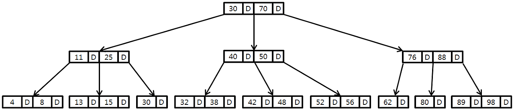

### **기본 속성**

- **차수(Order) M**: 한 노드가 가질 수 있는 최대 자식 수
- **키의 개수**: 최소 [M/2]-1개, 최대 M-1개
- **자식의 개수**: 최소 [M/2]개, 최대 M개
- **모든 리프 노드는 같은 레벨**에 있음 (완전 균형)

```
[노드 내부 구조]
┌─────────────────────────────────────┐
│ P0 | K1 | P1 | K2 | P2 | ... | Pn  │
└─────────────────────────────────────┘
P: Pointer (자식 노드 포인터)
K: Key (실제 데이터 또는 데이터 포인터)
```

**모든 노드(Root, Branch, Leaf)**에 **키와 데이터가 함께 저장**된다.

### B-Tree의 동작

```
초기 트리:
                [40]
               /    \
          [10,20]   [50,60]
         /   |   \   /  |  \
       [5] [15] [25][45][55][65]
```

### **(1) 검색 (Search)**

예시: 15 검색

```
1. Root [40] 비교:
   15 < 40 → 왼쪽 포인터로 이동

2. Branch [10,20] 비교:
   10 < 15 < 20 → 중간 포인터로 이동

3. Leaf [15] 도착:
   15 == 15 → 찾음! ✅
   데이터 반환
```

**과정**:

1. Root부터 시작: 15는 10과 20 사이 → 중간 포인터로 이동
2. [15] 노드에 도착 → 데이터 찾음! ✅

**시간 복잡도**: O(log M/2 N) = O(log N)

---

### **(2) 삽입 (Insert)**

**Case 1: 노드에 공간이 있는 경우**

예시: 12 삽입

```
삽입 전:
                [40]
               /    \
          [10,20]   [50,60]
         /   |   \
       [5] [15] [25]

과정:
1. Root [40]: 12 < 40 → 왼쪽
2. Branch [10,20]: 10 < 12 < 20 → 중간
3. Leaf [15]: 공간 있음 → 삽입

삽입 후:
                [40]
               /    \
          [10,20]   [50,60]
         /   |   \
       [5] [12,15] [25]
            ↑ 삽입됨
```

**Case 2: 노드가 가득 찬 경우 (분할 발생)**

예시: 17 삽입 (M=3, 최대 키 2개)

```
삽입 전:
                [40]
               /    \
          [10,20]   [50,60]
         /   |   \
       [5] [15,16] [25]
              ↑ 이미 가득 참 (2개)

과정:
1. [15,16]에 17 삽입 시도
2. 임시로 [15,16,17] 생성 (오버플로우!)
3. 중앙값 16을 부모로 올림
4. [15] | [17]로 분할

삽입 후:
                  [40]
                 /    \
            [10,16,20]  [50,60]
           /   |  |  \
         [5] [15][17][25]
                  ↑ 새로 생긴 노드
```

### **Case 3: Root 분할**

**예시: 연속 삽입으로 Root까지 분할**

```
삽입 전:
         [20,40]  ← Root 가득 참
        /   |   \
     [10] [30] [50]

60 삽입:
1. [50]에 삽입 → [50,60]
2. 70 삽입 → [50,60,70] 오버플로우
3. 중앙값 60을 부모로
4. 부모 [20,40]도 [20,40,60] 오버플로우!
5. Root 분할 발생

삽입 후:
             [40]  ← 새 Root
            /    \
        [20]      [60]
       /   \     /   \
    [10] [30] [50] [70]
    
트리 높이 증가! (유일하게 높이가 증가하는 경우)
```

---

### **(3) 삭제 (Delete)**

**Case 1: Leaf 노드에서 삭제 (키가 충분한 경우)**

```
삭제 전:
                [40]
               /    \
          [10,20]   [50,60]
         /   |   \
       [5] [15] [25]

15 삭제:
1. Leaf [15] 찾기
2. 단순 제거

삭제 후:
                [40]
               /    \
          [10,20]   [50,60]
         /    |   \
       [5]   [ ] [25]
             ↑ 비어있지만 최소 조건 만족
```

**Case 2: 키가 부족해지는 경우 (언더플로우)**

```
삭제 전:
          [20]
         /    \
      [10]    [30]

10 삭제:
1. [10] 제거 → [ ] 빈 노드 (언더플로우!)
2. 형제 [30]에서 빌려오기 (재분배)

재분배 과정:
- 부모 20을 내려받고
- 형제 30을 부모로 올림

삭제 후:
          [30]
         /    \
      [20]    [ ]
```

**Case 3: Branch 노드에서 삭제**

```
삭제 전:
                [40]
               /    \
          [10,20]   [50,60]
         /   |   \
       [5] [15] [25]

20 삭제 (Branch 노드):
1. Successor(후속자) 찾기: [25] (오른쪽 서브트리 최소값)
2. 20을 25로 대체
3. Leaf에서 25 삭제

삭제 후:
                [40]
               /    \
          [10,25]   [50,60]
         /   |   \
       [5] [15] [ ]
```

**Case 4 : 병합 (Merge)**

```
삭제 전:
          [20,40]
         /   |   \
      [10] [30] [50]

10 삭제:
1. [10] 제거 → [ ]
2. 형제 [30]도 최소 키만 가짐 (빌려줄 수 없음)
3. 병합 수행

병합 과정:
- 부모 20을 내려받고
- [30]과 합침 → [20,30]

삭제 후:
            [40]
           /    \
       [20,30]  [50]
```

### 장점

1. 균형 보장 : 모든 리프 노드가 같은 레벨 → 안정적인 성능
2. 낮은 높이 : 하나의 노드에 여러 키를 저장하므로, 이진 트리보다 높이가 훨씬 낮음 → 디스크 I/O 감소 (수직 탐색)
3. **범위 검색 가능** : **중위 순회**로 정렬된 순서 접근 가능

### 단점

1. 비효율적인 범위 검색
    1. 리프 노드끼리 연결되어 있지 않음
    2. 따라서 범위 검색 시 트리를 계속 타고 올라갔다 내려가야 함
2. 낮은 노드 활용도
    1. 모든 노드에 데이터가 저장됨 → 그만큼 하나의 노드에 담을 수 있는 키의 개수가 적어짐 → 트리 높이가 상대적으로 높아짐
3. 순차 접근 성능 : 다음 키를 찾으려면 부모로 올라가야 함

### B+Tree

<aside>
💡

B+Tree는 B-Tree의 문제점을 해결하고자 만든 개선 버전이다. **리프 노드를 연결**하고, 루트, 브랜치에서 데이터를 제거하여 키만 저장하는 등의 방법으로 단점을 개선하고자 한다.

</aside>

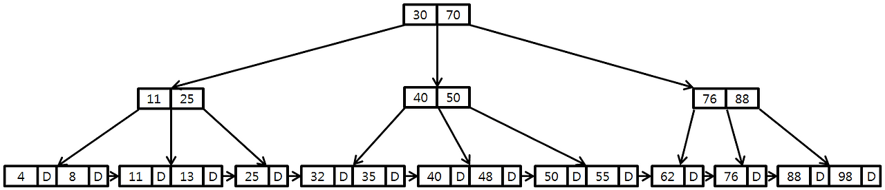

### 특징

1. 리프 노드 연결 : 양방향 연결 리스트
2. 데이터 분리 : 리프 노드에만 데이터 저장

루트, 브랜치 노드에는 Key, Pointer / 리프 노드에는 Data, Pointer를 저장한다.

### B*Tree

<aside>
💡

B-Tree의 삽입 과정에서 분열, 삭제 과정에서의 합병 등 보조 **연산을 줄이기 위해** 나타났다.

노드 개수의 제한을 바꾸는 아이디어로 연산을 **지연**시킨다.

</aside>

### 특징

1. **최소 채움률 증가**

    ```
    B+Tree:
    - 최소 채움률: 50% (⌈M/2⌉)
    - 노드가 반만 차도 유지
    
    B*Tree:
    - 최소 채움률: 66.7% (⌈2M/3⌉)
    - 노드가 2/3 이상 차야 유지
    ```

2. **형제 노드로 재분배 우선**

    ```
    B+Tree:
    노드 가득 참 → 즉시 분할
    
    B*Tree:
    노드 가득 참 → 형제로 재분배 시도
    형제도 가득 참 → 그때 분할
    ```

3.  **2-to-3 분할**

    ```
    B+Tree 분할:
    [A,B,C,D] → [A,B] | [C,D]  (1개 → 2개)
    
    B*Tree 분할:
    [A,B,C,D,E,F] → [A,B] | [C,D] | [E,F]  (2개 → 3개)
    ```


## 그 외

### Hash Index

<aside>
💡

해시 함수를 이용해 키를 버킷 위치로 직접 변환하여 데이터에 접근하는 인덱스 구조다. **동등 비교(=) 검색에 최적화**되어 있으며, 이론적으로 **O(1)** 시간 복잡도를 제공한다. 하지만 **범위 검색, 정렬, 부분 일치 검색은 불가능**하다.

</aside>

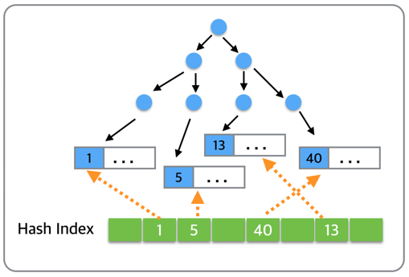

위 그림처럼 B Tree를 직접 탐색하지 않고, 해시 함수 버킷을 알아낸 후 바로 접근할 수 있다.

### 어댑티브 해시 인덱스

<aside>
💡

InnoDB가 **자주 사용되는 데이터 페이지에 대해 자동으로 생성하는 해시 인덱스**다. 사용자가 직접 생성하거나 관리할 수 없으며, InnoDB가 **워크로드 패턴을 분석해 동적으로 구성**한다. B+Tree 인덱스 위에 **추가 계층**으로 작동하여 특정 조회를 가속화한다.

</aside>

### Full Text Index

<aside>
💡

문서의 내용 전체를 인덱스화해서 특정 키워드가 포함된 문서를 검색하는 전문 검색에는 일반적인 용도의 B Tree를 사용할 수 없다. 문서 전체에 대한 분석과 검색을 위한 인덱싱 알고리즘을 전문 검색 인덱스라고 한다.

</aside>

### 인덱스 알고리즘

전문 검색에서는 문서 본문의 내용에서 사용자가 검색하게 될 키워드를 분석해 내고, 빠른 검색용으로 사용할 수 있게 이러한 키워드로 인덱스를 구축한다.

B Tree와 다르게 역 인덱스 구조를 사용한다.

```
단어 → 문서 목록

"MySQL": [문서1, 문서3]
"데이터베이스": [문서1, 문서2, 문서3]
"최적화": [문서1, 문서4]
```

**어근 분석 알고리즘**

MySQL 서버의 전문 검색 인덱스는 아래 두 가지 중요한 과정을 거쳐 색인 작업이 수행된다.

- 불용어 (Stop Word) 처리
    - 검색에서 가치 없는 단어를 모두 필터링해서 제거하는 자겅ㅂ
    - 불용어의 개수는 많지 않음
    - MySQL 서버에 정의되어 있지만, 별도로 정의할 수도 있음
- 어근 분석 (Stemming)
    - 검색어로 선정된 단어의 뿌리인 원형을 찾는 작업
    - MeCab 플러그인으로 가능, 형태소 분석

**n-gram 알고리즘**

MeCab은 매우 전문적이라 많은 시간과 노력이 필요함.

- 형태소 분석이 문장을 이해하는 알고리즘이라면, n-gram은 단순히 키워드를 검색해내기 위한 인덱싱 알고리즘
- 본문을 무조건 몇 글자씩 잘라서 인덱싱
    - 공백과 마침표를 기준으로 단어 구분
    - n글자씩(일반적으로 2글자) 토큰으로 구분
- 이 과정에서 불용어 토큰은 거름

### 전문 검색 인덱스의 가용성

**전문 검색 인덱스 사용 조건**

1. 쿼리 문장이 전문 검색을 위한 문법 (MATCH … AGAINST …) 사용
2. 테이블이 전문 검색 대상 컬럼에 대해 전문 인덱스 보유

### R-Tree Index

<aside>
💡

MySQL에는 공간 인덱스(Spatial Index)가 있다. 공간 인덱스는 R-Tree 인덱스 알고리즘을 이용해 2차원의 데이터를 인덱싱하고 검색하는 목적의 인덱스다. B-Tree와 흡사한데, R-Tree는 컬럼의 값이 2차원 공간 개념 값이다.

</aside>

### MySQL의 공간 확장

1. 공간 데이터를 저장할 수 있는 데이터 타입
2. 공간 데이터의 검색을 위한 공간 인덱스 (R-Tree 알고리즘)
3. 공간 데이터의 연산 함수 (거리 또는 포함 관계의 처리)

**데이터 타입**

<aside>
💡

MySQL에는 Point(점), Line(선), Polygon(다각형), Geometry 타입이 존재한다.

</aside>

Geometry 타입은 나머지 3개의 슈퍼 타입으로, 세 객체를 모두 저장할 수 있다.

**MBR (Minimum Bounding Rectangle)**

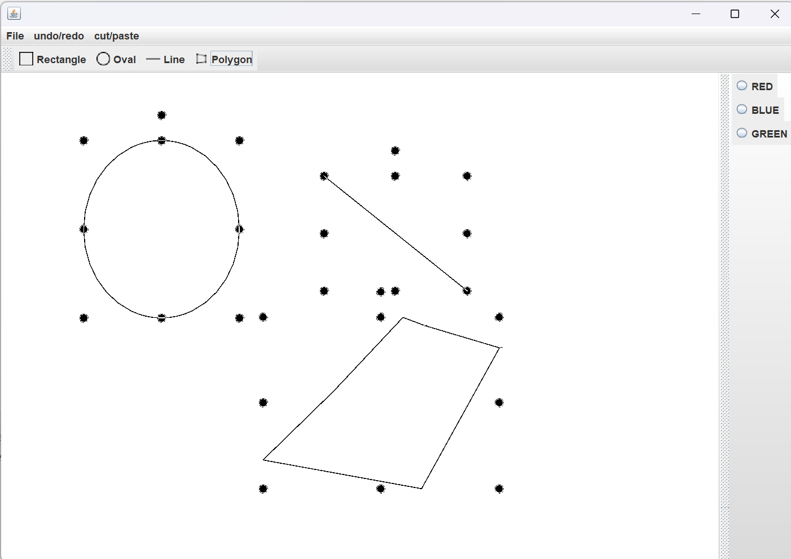

- 해당 도형을 감싸는 최소 크기의 사각형
- 이 사각형들의 포함 관계를 B-Tree로 구현한 인덱스가 R-Tree 인덱스

**3개의 레벨**

인덱스 구조를 이해하려면 도형들의 MBR과, 3개의 레벨을 이해해야 한다.

1. 최상위 레벨 : R1, R2
2. 차상위 레벨 : R3, R4, R5, R6
3. 최하위 레벨 : R7 ~ R 14

순서대로 루트 - 브랜치 - 리프 노드라고 생각하면 된다. 리프 노드는 각 도형의 개별 MBR이다.

### R-Tree 인덱스의 용도

일반적으로 위도, 경도 좌표 기반 정보 저장에 사용된다.

**반경 5km 검색**

현재 위치 P(x, y) 기준으로 5km 원을 그린 후, 해당 원의 MBR 내에 있는 점들을 찾아낸다.

간혹, MBR과 원 사이 공간에 존재하는 점들이 있을 수 있는데, 이 경우 조금 더 복잡한 비교가 필요하다. 서비스에 따라 큰 문제가 없다면 조금의 오차는 허용해도 될 것이다.

# 종류 : 구성 관점

## 클러스터링 인덱스

<aside>
💡

테이블의 레코드를 프라이머리 키를 기준으로 묶어서 저장하는 형태로, PK 값에 의해 레코드의 저장 위치가 결정된다.

MySQL은 클러스터링 인덱스로 저장한다.

</aside>

클러스터링 인덱스는 PK 값에 의해 레코드의 저장 위치가 결정되므로 테이블 레코드의 저장 방식이라고 볼 수 있다.

### 세컨더리 인덱스와의 차이

- 클러스터링 인덱스의 리프 노드에는 레코드의 모든 컬럼이 저장되어 있음
- 반면, 세컨더리 인덱스의 리프 노드에는 인덱싱된 컬럼만 저장되어 있고, PK 값을 가짐

### PK가 없는 테이블

InnoDB는 PK 기준 클러스터링 인덱스로 데이터를 저장한다고 했다. PK가 없다면 아래 우선순위에 따라 대체할 컬럼을 선택해야 한다.

1. PK가 있으면 PK를 클러스터링 키로 선택
2. NOT NULL 옵션의 Unique Index 중 첫 번째 인덱스를 선택
3. 자동으로 유니크한 값을 가지도록 증가되는 컬럼을 내부적으로 추가한 후, 선택

자동으로 만들어지는 경우 PK는 사용자에게 노출되지 않으며, 쿼리에 명시적으로 사용할 수 없다.

### 세컨더리 인덱스에 미치는 영향

세컨더리 인덱스의 리프 노드는 PK 값을 저장한다.

- 세컨더리 인덱스 크기 증가
- 세컨더리 인덱스 단일 사용 시, 성능 저하
    - 인덱스(세컨더리)를 검색해 레코드의 PK 값을 확인한 후, 프라이머리 키 인덱스를 검색해서 최종 레코드를 가져옴

### 장점

- PK로 검색할 때 처리 성능이 매우 빠름. 특히, 범위 검색 시 좋음
- 테이블의 모든 세컨더리 인덱스가 PK를 가지고 있기 때문에 인덱스만으로 처리될 수 있는 경우가 많음

### 단점

- 테이블의 모든 세컨더리 인덱스가 클러스터링 키를 갖기 때문에 클러스터링 키 값의 크기가 클 경우 전체적인 인덱스 크기가 커짐
- 세컨더리 인덱스를 통해 검색할 때, PK로 다시 한 번 검색해야 하므로 처리 성능이 느림
- INSERT 시 PK에 의해 레코드의 저장 위치가 결정되기 때문에 처리 성능이 느림
- PK 변경 시 DELETE + INSERT 하므로 느림

### 소감

클러스터링 인덱스만 단독으로 사용하는 경우가 아니라면 세컨더리 인덱스 → 클러스터링 인덱스 검색해야 하니까 더 느리지 않나? 그리고 손해라고 생각했다.

하지만 중점을 두는 건 PK의 활용도 인 듯 하다. 많은 조건 절에 PK를 기재하고, SELECT 절에서 조회하는데, 커버링 인덱스와 같이 그 활용도를 높일 수 있는 상황이 많기 때문에 이득이 큰 것으로 보인다.

## 유니크 인덱스

<aside>
💡

유니크는 테이블이나 인덱스에 같은 값이 2개 이상 저장될 수 없음을 말하는데, MySQL에서는 인덱스 없이 유니크 제약만 설정할 수 없다. 또한, NULL도 저장 되는데, 2개 이상 저장될 수 있다.

</aside>

Unique에 Nullable을 붙이면 PK와 같지만, 클러스터링 인덱스의 역할을 하지 못한다는 점이 크게 다르다.

### 세컨더리 인덱스와의 차이

1. **[읽기]** 유니크 인덱스가 더 빠른가?
    1. 1건 읽기 시, 유니크는 1건이라는 것이 보장되어 있기 때문에 1건만 읽어도 됨
    2. 세컨더리 인덱스는 다음 컬럼도 읽어야 하니까 1건 더 읽어야 되는거 아닌가?
        1. 맞는 말이지만, 이는 디스크 I/O가 아니라 CPU 작업이고, 필터링이므로 성능에 영향이 거의 없음
    3. 읽어야 할 레코드 개수가 같다면 차이는 미미함
    4. 그냥 유니크하니까 읽을 개수가 적어서 일반적으로 빠른 것임
2. INSERT 시
    1. 유니크는 중복된 값이 존재하는지 체크하는 과정이 필요함
    2. 체크할 때 읽기 잠금, 쓸 때 쓰기 잠금을 사용하는데, 데드락이 빈번하게 발생함

## 외래 키

<aside>
💡

외래 키 제약이 설정되면 자동으로 연관되는 테이블의 컬럼에 인덱스까지 생성된다. 외래 키가 제거되지 않은 상태에서는 자동으로 생성된 인덱스를 삭제할 수 없다.

</aside>

### 두 가지 특징

1. **자식 테이블의 변경이 대기하는 경우**
- 테이블의 변경(쓰기 잠금)이 발생하는 경우에만 잠금 경합(잠금 대기)이 발생함
    - 자식 테이블의 외래 키 컬럼의 변경(INSERT, UPDATE)은 부모 테이블의 확인이 필요하다.
- 외래 키와 연관되지 않은 컬럼의 변경은 최대한 잠금 경합(잠금 대기)을 발생시키지 않음
    - 자식 테이블의 외래 키가 아닌 컬럼의 변경은 외래 키로 인한 잠금 확장이 발생하지 않음

1. **부모 테이블의 변경이 대기하는 경우**
- ON DELETE CASCADE가 있는 경우 부모 테이블의 레코드를 삭제하고자 할 때, 자식 테이블에서 해당 fk(부모 PK)를 가진 레코드에 대한 잠금에 영향을 받음

# 튜닝 관점 접근

<aside>
💡

인덱스 탐색 과정은 **수직적 탐색**과 **수평적 탐색** 단 두 단계로 이루어진다.

데이터베이스 테이블에서 데이터를 찾는 방법도 **테이블 전체 스캔**과 **인덱스 이용** 두 가지 방법이 있다.

</aside>

### 인덱스 튜닝의 두 가지 핵심 요소

인덱스는 큰 테이블에서 소량 데이터를 검색할 때 사용한다.

튜닝의 핵심 요소는 크게 두 가지로 나뉜다.

1. 인덱스 스캔 과정에서 발생하는 비효율을 줄이는 **‘인덱스 스캔 효율화 튜닝’**
2. 테이블 액세스 횟수 줄이기. 인덱스 스캔 후 테이블 레코드 액세스는 Random I/O이므로, **‘랜덤 액세스 최소화 튜닝’**이라고 함
    1. ‘필터링이 얼마나 잘 되는가’도 포함, 커버링 인덱스 등이 있음

카디널리티와 중복도, 선택도 중요! SQL 튜닝은 랜덤 I/O와의 전쟁!

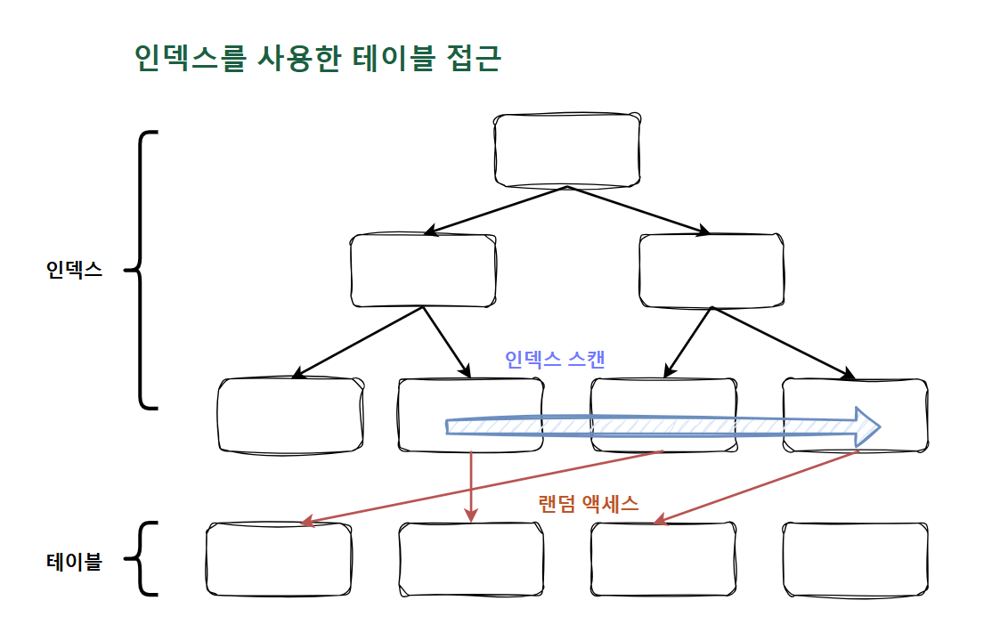

## 수직적 탐색

<aside>
💡

정렬된 인덱스 레코드 중 **조건을 만족하는 첫 번째 레코드를 찾는 과정**이다. 즉, **인덱스 스캔 시작 지점을 찾는 과정**이다.

</aside>

### **루트(root) 블록에서 시작**

- 인덱스 수직적 탐색은 루트 블록부터 시작함
- 루트를 포함해 브랜치 블록에 저장된 각 인덱스 레코드는 하위 블록에 대한 주소값을 가짐
    - 루트에서 시작해 리프 블록까지 수직적 탐색이 가능한 이유
- 찾고자 하는 값보다 크거나 같은 값을 만나면, 바로 직전 레코드가 가리키는 하위 블록으로 이동


인덱스를 수직적으로 탐색할 때, 루트를 포함한 브랜치 블록은 등산 푯말과 같은 역할을 한다. 이 푯말을 따라가며 어딘가에 있는 리프 노드인 ‘조건을 만족하는 첫 번째 레코드’를 찾는 것이 목표다.

## 수평적 탐색

<aside>
💡

수직적 탐색을 통해 스캔 시작점을 찾았으면, 찾고자 하는 데이터가 더 안 나타날 때까지 인덱스 **리프 블록**을 **수평적으로 스캔**한다. 인덱스에서 본격적으로 **데이터를 찾는 과정**이다.

</aside>

인덱스 리프 블록끼리는 서로 앞뒤 블록에 대한 주소값을 갖는 양방향 연결 리스트 구조다.


수평 탐색의 이유

- 조건절을 만족하는 데이터를 모두 찾기 위함
- RowId를 얻기 위함

필요한 컬럼을 인덱스가 모두 갖고 있어 인덱스만 스캔하고 끝나는 경우도 있지만, 일반적으로 인덱스를 스캔하고서 테이블도 액세스하는데, 이때 RowId가 필요하다.

# 인덱스 사용법

## 정상성 : Index Range Scan

### 인덱스를 사용한다는 것

<aside>
💡

‘인덱스를 정상적으로 사용한다’는 건 리프 블록에서 **스캔 시작점**을 찾아 거기서부터 스캔하다가 **중간에 멈추는 것**을 의미한다.

</aside>

- 인덱스 컬럼을 가공하지 않아야 인덱스를 정상적으로 사용할 수 있음
    - 인덱스 컬럼을 가공해도 인덱스를 사용할 수는 있지만, 스캔 시작점과 끝점을 찾을 수 없기 때문에 리프 노드를 전체 스캔해야 함. 즉, Index Full Scan 방식으로 작동함
- ‘인덱스를 정상적으로 사용한다’는 건 리프 블록에서 스캔 시작점을 찾아 거기서부터 스캔하다가 중간에 멈추는 것을 의미함
    - 즉, 리프 블록 일부만 스캔하는 Index Range Scan을 의미함
    - 시작점과 끝점을 알아야 한다는 의미
        - 시작점만 알아도 range scan이라고 볼 순 있지만, 보통 끝점도 제한되는 경우가 많음

아래와 같은 조건절에는 인덱스를 정상적으로 사용할 수 없다!

```sql
WHERE SUBSTR(생년월일, 5, 2) = '05'
WHERE NVL(주문수량, 0) < 100
WHERE 업체명 LIKE '%대한%'
WHERE (전화번호 = :tel_no OR 고객명 = :cust_mm)
WHERE 전화번호 IN (:tel_no1, :tel_no2)
```

### 가공하면 Range Scan이 안되는 이유

1. 1999년 1월에 태어난 학생을 찾으려면?
    1. 1999.01.01 이후 출생 첫 번째 학생 찾기
    2. 1999.02.01 이후 출생 첫 번째 학생 만나면 멈추기
    3. 굿!!
2. 년도에 관계없이 5월에 태어난 학생을 찾으려면?
    1. 시작점은 어디? 어디서 멈춰야?
    2. 5월 : (MONTH(05)) → 함수 → 가공 → Range Scan 어렵 ..
3. 그 외에도.. (위 조건절 예시)
    1. LIKE로 중간 값 검색 : ‘%대한%’
    2. OR 조건으로 검색할 때, WHERE (전화 번호 = :tel_no OR 고객명 = :cust_nm) 같이 시작 지점을 찾을 수 없는 경우
        - **OR Expansion**

            <aside>
            💡

          OR 조건을 UNION ALL로 변환하여 각각의 인덱스를 활용하는 최적화 기법이다.

            </aside>

          age, city 컬럼에 복합 인덱스, 혹은 개별 인덱스가 존재하는 상황에서 OR 조건으로 인덱스 활용 불가능한 경우 → Table Full Scan

          이때, 옵티마이저가 자동으로 쿼리를 변환해준다.

            ```sql
            -- 원본 쿼리
            SELECT * FROM users
            WHERE age = 30 OR city = 'Seoul';
            
            -- OR Expansion 적용 (내부적으로 변환)
            SELECT * FROM users WHERE age = 30
            UNION ALL
            SELECT * FROM users WHERE city = 'Seoul'
            AND (age <> 30 OR age IS NULL);  -- 중복 제거 조건
            ```

          ### **OR Expansion 발생 조건**

            1. 각 OR 조건에 사용 가능한 인덱스가 있어야 함
            2. OR로 연결된 조건이 독립적이어야 함
                1. IN절도 마찬가지! IN절은 OR 조건을 표현하는 다른 방식임
                - **IN-List Iterator**

                    ```sql
                    SELECT * FROM users
                    WHERE age IN (20, 30, 40);
                    
                    -----
                    In-List Iterator:
                    1. age = 20 → INDEX RANGE SCAN
                    2. age = 30 → INDEX RANGE SCAN  
                    3. age = 40 → INDEX RANGE SCAN
                    
                    각각 독립적으로 인덱스 스캔 후 결과 합침
                    ```

                  IN절의 경우 옵티마이저가 자동으로 최적화를 해준다. Index Range Scan을 여러 번 수행하게끔 UNION ALL로 바꿔 실행해주는 것이다.

            3. 비용이 효율적이어야 함

### 선행 조건

<aside>
💡

인덱스를 **Range Scan**하기 위한 가장 첫 번째 조건은 **인덱스 선두 컬럼이 가공되지 않은 상태로 조건절에** 있어야 한다는 사실이다.

</aside>

- 두 번째 컬럼부터는 가공해도 됨!
    - 왜? Range Scan은 구간을 찾는 것 → 시작점과 끝점을 알면 됨 → 조금 불필요한 스캔이 발생할 수 있지만, 결국 선두 컬럼이 그 범위를 결정하기 때문

### 인덱스를 잘 탄다?

Index Range Scan을 한다고 인덱스를 잘 사용하고 있는 건 아니다.

```sql
SELECT *
FROM 주문상품
WHERE 주문일자 = :ord_dt
AND 상품번호 LIKE '%PING';

SELECT *
FROM 주문상품
WHERE 주문일자 = :ord_dt
AND SUBSTR(상품번호, 1, 4) = 'PING';
```

- 가공되지 않은 선두 컬럼이 조건절에 있기 때문에 Range Scan이 가능함
- 하지만, 뒷 컬럼이 **스캔 범위**를 줄이는 데 전혀 **도움**되지 않음
    - 위 예시의 LIKE 중간 검색 / 가공된 컬럼
- 과연 이는 ‘인덱스를 잘 타는’ 것일까?

## 인덱스 스캔

### Index Range Scan

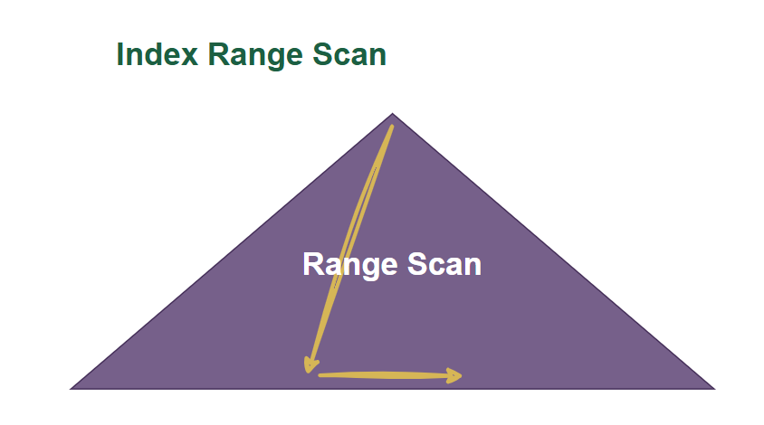

B*Tree 인덱스의 가장 일반적이고 정상적인 형태의 액세스 방식이다. **루트에서 리프 블록까지 수직적으로 탐색한 후에 ‘필요한 범위’만 스캔**한다.

**Index Range Scan을 사용하려면**

- **선두 컬럼**을 **가공하지 않은 상태**로 **조건절에 사용**해야 함
- 반대로, 선두 컬럼을 가공하지 않은 상태로 조건절에 사용하면 Index Range Scan은 무조건 가능함

하지만, Range Scan이 중요한 것이 아니라, **성능**은 **인덱스 스캔 범위**, **테이블 액세스 횟수**를 얼마나 줄일 수 있느냐로  결정된다.

### Index Full Scan

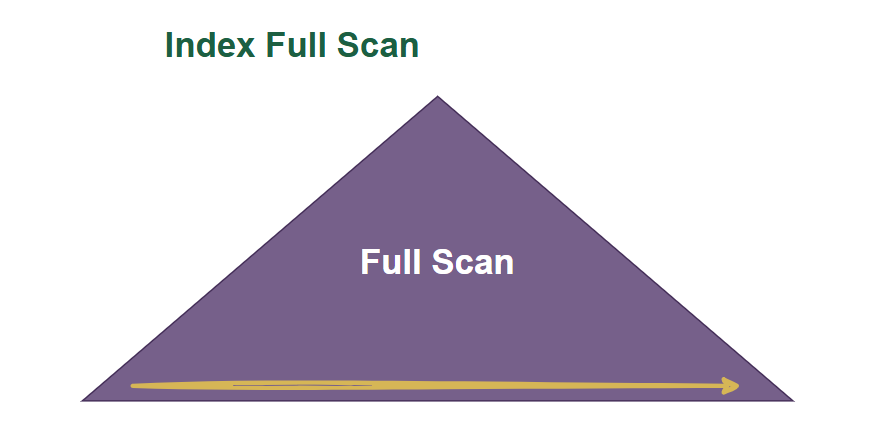

**수직적 탐색 없이 인덱스 리프 블록을 처음부터 끝까지 수평적으로 탐색**하는 방식이다.

- 대개 데이터 검색을 위한 **최적의 인덱스가 없을 때 차선**으로 선택됨
- 인덱스 선두 컬럼을 조건절에 사용하지 않으면 기본적으로 Table Full Scan을 선택함
- Table Full Scan보다 I/O를 줄일 수 있거나 정렬된 결과를 쉽게 얻을 수 있다면 Index Full Scan을 사용하기도 함

```sql
idx (ename, sal)
----
SELECT * FROM emp
WHERE sal > 2000
ORDER BY ename;
```

**Index Full Scan의 효용성**

1. 데이터 **저장 공간** : 컬림 길이 * 레코드 수에 의해 결정되므로 인덱스가 차지하는 면적은 테이블보다 훨씬 적다.
    1. 인덱스 스캔 단계에서 대부분 레코드를 **필터링**하고 아주 일부만 테이블을 액세스하는 상황이라면, **면적이 큰 테이블보다 인덱스를 스캔하는 쪽이 유리**하다.

       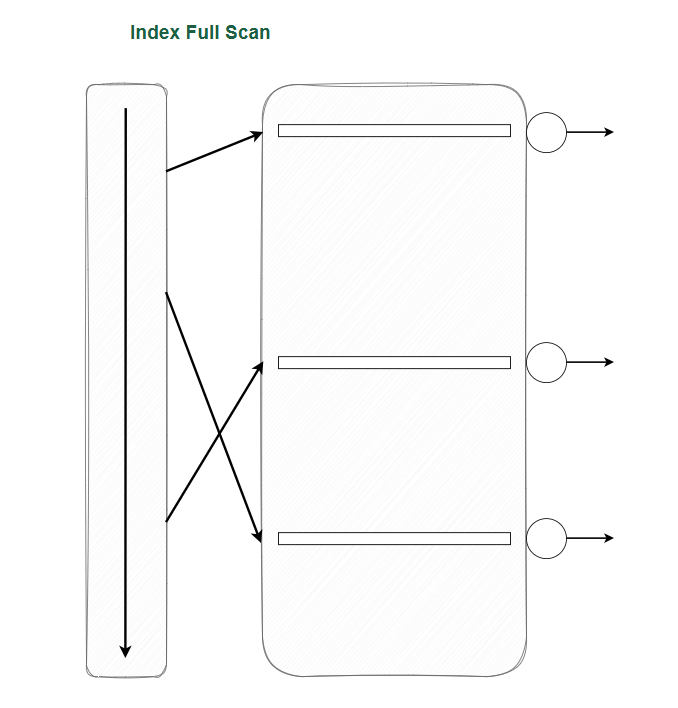

2. 인덱스를 이용한 소트 연산 생략
    - 부분 범위 처리가 가능한 상황에서 극적인 성능 개선 효과
    - 부분 범위 처리

        ```
        전체 범위 처리:
        - 모든 데이터를 읽고 정렬
        - 그 다음 LIMIT 적용
        - 100만 건 정렬 후 100건 추출 ❌
        
        부분 범위 처리:
        - 정렬된 상태로 읽으면서
        - 필요한 만큼만 읽고 즉시 종료
        - 100건만 읽고 종료 ✅
        ```

      결국, 정렬과 LIMIT !

    - 커버링 인덱스 사용 가능

**인덱스 풀 스캔 vs 테이블 풀 스캔**

- 인덱스 풀 스캔 vs 테이블 풀 스캔 : 무조건 테이블 풀 스캔이 낫지 않나?

    1. 커버링 인덱스 (가장 일반적)

    2. 정렬이 필요한 경우 (LIMIT 100)

    3. 인덱스 크기가 테이블보다 훨씬 작은 경우

    4. 선택적 컬럼 조회 + 대부분의 행이 필요한 경우

    5. MIN/MAX 같은 집계 함수


### Index Unique Scan

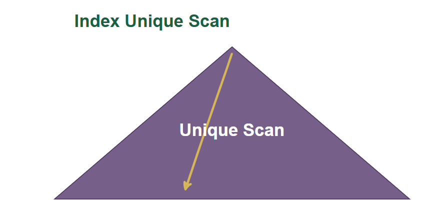

**수직적 탐색만으로 데이터를 찾는 스캔 방식**으로, **Unique 인덱스를 ‘=’ 조건으로 탐색**하는 경우에 작동한다.

- Unique 인덱스라고 해도 범위 검색 조건(between, 부등호, like)으로 검색할 때는 Index Range Scan으로 처리됨
    - 복합 Unique 인덱스(c1, c2, c3)에서  c1, c2로만 검색하는 경우가 해당됨

### Index Skip Scan

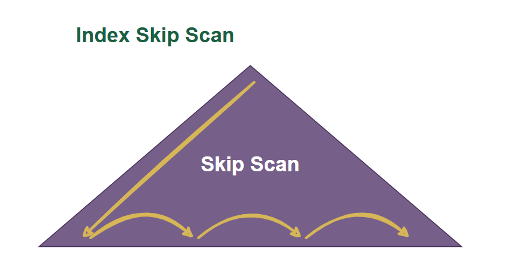

루트 또는 브랜치 블록에서 읽은 컬럼 값 정보를 이용해 조건절에 부합하는 레코드를 포함할 ‘가능성이 있는’ 리프 블록만 골라서 액세스하는 스캔 방식이다.

- 선두 컬럼이 조건절에 없어도 인덱스를 활용하는 스캔 방식
- Distinct Value 개수가 적은 선두 컬럼이 조건절에 없고, 후행 컬럼의 Distinct Value가 많을 때 효과적임
- 조건절에 빠진 인덱스 선두 컬럼의 Distinct Value 개수가 적고 후행 컬럼의 Distinct Value 개수가 많을 때 유용함
    - idx (성별, 연봉)
    - `select * from emp where sal between 2000 and 4000;`

**Index Skip Scan 작동 조건**

1. 선두 컬럼이 조건절에 없고, 후행 컬럼이 조건절에 있을 때
2. 선두 컬럼에 대한 조건절은 있고, 중간 컬럼에 대한 조건절이 없는 경우

    ```sql
    idx (c1, c2, c3)
    ----
    SELECT * FROM ?
    WHERE c1 = 1
    AND c3 BETWEEN '19990101' AND '19990131'
    ```

   c3 기준 선행 컬럼 c2가 없다고 생각해도 좋을 듯!

    - 위 경우 Range Scan 한다면.. c1 = 1인 것 모두 읽어야 함
    - Skip Scan 한다면 BETWEEN '19990101' AND '19990131' 조건을 **‘포함할 가능성이 있는’** 리프 **‘블록’만** 골라서 액세스할 수 있음

    ```sql
    idx (c1, c2, c3)
    ----
    SELECT * FROM ?
    WHERE c3 BETWEEN '19990101' AND '19990131'
    ```

   또한, c1, c2 모두 조건절에 없는 경우에도 유용하게 사용할 수 있음

3. 선두 컬럼이 부등호, BETWEEN, LIKE같은 범위 검색 조건인 경우

    ```sql
    idx (날짜, 유형 코드)
    ----
    SELECT * FROM ?
    WHERE 날짜 BETWEEN '19990101' AND '19990131'
    AND 유형 코드 = '01'
    ```

    - 마찬가지로 Range Scan을 한다면 BETWEEN 조건 만족하는 구간을 모두 스캔해야 함
    - Skip Scan 한다면 유형 코드 조건을 포함할 가능성이 있는 리프 ‘블록’만 골라서 액세스 할 수 있음

Index Range Scan이 불가능하거나 효율적이지 못한 상황에서 Index Skip Scan이 종종 빛을 발한다. 부분 범위 처리가 가능하다면 Index Full Scan이 도움 되기도 한다.

Index Skip Scan은 사용하는 것만이 아니라 선두 컬럼과 후행 컬럼의 Distinct Value 개수가 중요하다는 점 잊지 말 것 !

기본적으로 최적의 Index Range Scan을 목표로 하되, 이 방법이 오히려 비효율적일 때 이러한 스캔 방식을 차선책으로 활용하는 것이 바람직하다.

### Index Fast Full Scan

논리적인 인덱스 트리 구조를 무시하고, 인덱스 세그먼트 전체를 Multiblock I/O 방식으로 스캔하는 방식이다.

1. 논리적인 인덱스 트리 구조?
    1. 루트 - 정렬된 중간 브랜치 블록들 - 정렬된 리프 블록들
    2. 하지만, 실제 디스크에는 섞여있음
        1. 섞여있는데 어떻게 찾아가냐? ‘논리적인 인덱스 트리 구조’ 각 블록은 ‘하위 블록의 주소’를 가지고 있기 때문에 가능함
2. ‘인덱스 세그먼트’ 전체를 ‘Multiblock I/O’?
    1. 인덱스 세그먼트에는 루트 - 중간 브랜치 블록들 - 리프 블록들 의 순서는 같지만, 이들이 정렬되어 있지 않음

특징

- 순서를 생각하지 않고 전체를 한 번에 가져오는 Multiblock I/O를 사용하므로 디스크로부터 대량의 인덱스 블록을 읽어야 할 때 큰 효과를 발휘함
- 속도는 빠르지만, 결과 집합의 정렬은 되지 않음
- **쿼리에 사용한 컬럼이 모두 인덱스에 포함되어 있을 때만 사용할 수 있음**
- Index range Scan, Index Full Scan과 달리 인덱스가 파티션 되어 있지 않더라도 병렬 쿼리가 가능함
    - 병렬 쿼리 시에는 Direct I/O를 사용하므로 I/O 속도가 더 빨라짐

### Index Range Scan Descending

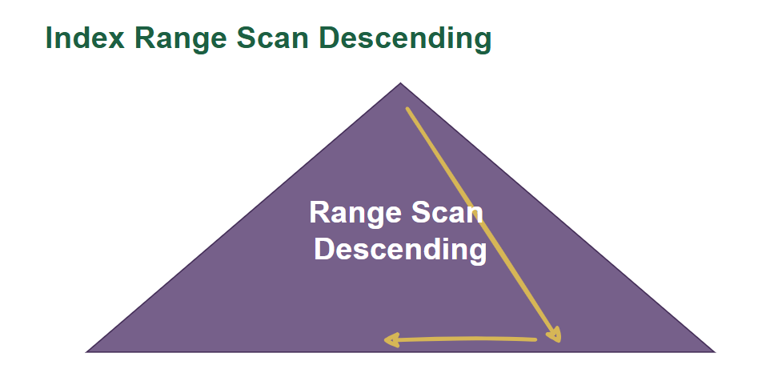

Index Range Scan과 기본적으로 동일한 스캔 방식이다. 내림차순으로 정렬된 결과 집합을 얻는다는 점만 다르다.

- ORDER BY 내림차순이 있을 때
- MAX 값을 구할 때

등의 상황에서 사용되곤 한다.