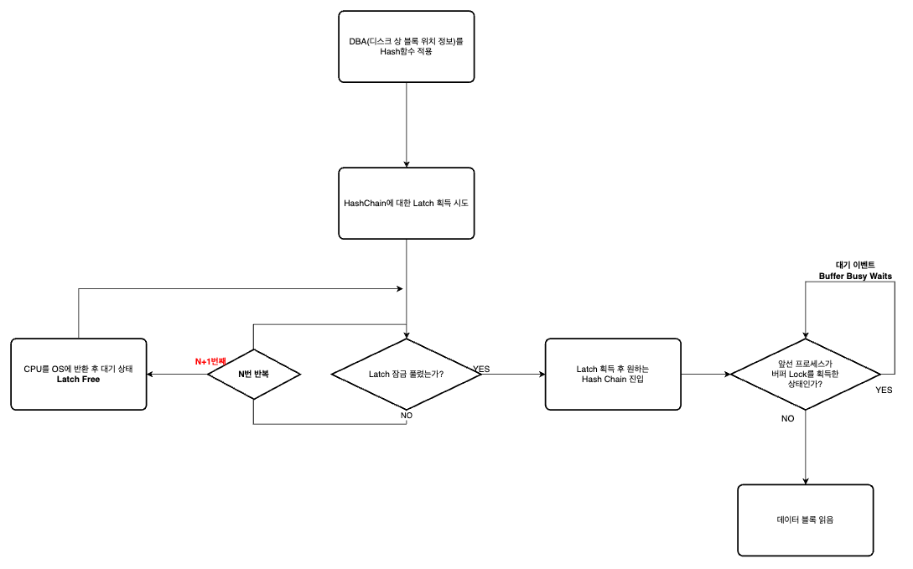

# 1. 테이블 액세스 최소화

---

## 1) 테이블 랜덤 엑세스

### 테이블 랜덤 엑세스 최소화가 최종 목표!

<aside>
💡

복습
***랜덤 엑세스*** : 데이터를 저장하는 블록을 한 번에 여러개 액세스 하는 것이 아닌 한 번에 하나의 블록만을 액세스 하는 싱글 I/O 방식. 데이터를 빠르게 찾을 수 있지만 블록 I/O 비용이 더 큼 → 시스템 자원을 더 많이 사용

***테이블 풀 스캔*** : 한 번에 여러 개의 블록을 액세스하는 멀티 블록 I/O 방식.

</aside>

- ROWID
    
    디스크 상 존재하는 데이터 레코드를 찾아가기 위한 위치 논리적 주소
    

.png)

### ROWID를 이용하여 Table 읽는 과정

1. ***데이터 블록에서 찾은 경우***
    1. Index Leaf Block에 존재하는 RowId마다 hash 함수 적용 → 해시값 반환
    2. 비슷한 결과값 묶어 Buffer Header 영역의 hash bucket에 묶는다.
        1. ex) 
        1 → 11,21,31,41…
        2 → 2,12,22,32,…
        3 → 3,13,23,33…
    3. 나머지 과정 순서도로 표현
        
        
        
    4. 위의 과정 이후 블록 읽기가 끝나면 버퍼 **Lock** 해제 → 다시 **Hash Chain Latch** 획득 시도 → 경합 발생🚨
2. ***데이터 블록에서 못 찾는 경우***
    1. Free 버퍼 할당 요구를 위해서 LRU 리스트 스캔
    2. LRU chain 래치 획득 시도 → 래치 경합 심한 경우 Latch Free 이벤트 발생.
    3. LRU 리스트 임계치만큼 스캔 → Free 버퍼 못 찾은 경우 Dirty 버퍼를 디스크에 기록하고 Free 버퍼 확보 신호 보냄 (이때, 대기 상태로 빠짐 - Free Buffer Waits)
    4. Free 버퍼 할당 받음 → I/O 시스템에 I/O 요청 후 대기상태(DB File Sequential Read)
    5. 읽어온 블록은 LRU 리스트에서 위치 옮겨야 함 → 다시 Cache Buffers LRU Chain 래치 획득을 위한 대기와 경합 발생.
    

***실행 계획에서 아래와 같은 문구 발견 시 위와 같은 수 많은 과정과 부하 발생 인지 → 제대로 된 인덱싱 필요***

```sql
Table Access By Index ROWID
```

## 2) 인덱스 클러스터링 팩터

- **클러스터링 팩터** : 군집성 계수. 특정 컬럼을 기준으로 같은 값을 갖는 데이터가 서로 모여있는 정도.
    
    .png)
    
- `왼쪽` → 클러스터링 팩터가 좋다
- `오른쪽` → 클러스터링 팩터가 나쁘다.

***클러스터링 팩터가 좋다***

→ 랜덤 엑세스 효율이 좋다.

→ 물리적인 Disk I/O 횟수 감소

→ 여러 블록을 거치지 않고 적은 블록 수에서 찾음.

→ 가장 좋을 때는 전체 테이블 블록 수와 일치 / 가장 안 좋을 때는 총 레코드 수와 일치

***온라인 프로그램 튜닝 VS 배치 프로그램 튜닝***

| 온라인 프로그램 | 배치 프로그램 |
| --- | --- |
| NL 조인(인덱스 활용 조인) | Full Scan 또는 해시 조인 |
|  | 파티션 활용+병렬 처리 |

## 3) 인덱스 컬럼 추가

- 운영 환경에서 인덱스 구성을 변경하는 것은 쉽지 않음.
- 새로운 인덱스의 생성 → 인덱스가 많아지는 경우 인덱스 관리 비용 증가 / DML 부하에 따른 트랜잭션 성능 저하

```sql
index(dep_no , job) 구성

SELECT *
FROM emp
WHERE deptno = 30
AND sal >= 2000;

-> 기존 인덱스에 새로운 컬럼 sal 추가

index(dep_no, job, sal)
```

→ 인덱스 스캔량은 큰 변화가 없지만, 테이블 랜덤 액세스 횟수는 감소.

## 4)인덱스만 읽고 처리

필터링 조건에 의해 버려지는 데이터가 많이 없는 경우 

- ***Covered 인덱스***
    - 쿼리에서 조회되는 컬럼을 모두 인덱스에 추가하여 테이블 액세스가 발생하지 않도록)의 적용  ⇒ 추가해야할 컬럼이 많으면 실제로 적용이 힘듬.
- Include 인덱스
    - 인덱스 키 외에 미리 지정한 컬럼을 리프 레벨에 함께 저장.
        
        ```sql
        create index emp_x01 on emp (deptno) include (sal);
        ```
        
        - sal 컬럼 → 리프 블록에만 저장
        - 수직적 탐색 : deptno
        - 수평적 탐색 : sal
        
        ```sql
        create index emp_x02 on emp (deptno, sal);
        ```
        
        - deptno 컬럼 , sal 컬럼 → 루트 노드와 브랜치 블록 저장.
        - 둘 다 수직적 탐색 가능.

## 5) 인덱스 구조 테이블

- ***클러스터형 인덱스(MySQL 기준)이란?***
    
    테이블의 데이터를 찾아가기 위한 ROWID를 갖는 일반 인덱스와 달리 클러스터형 인덱스는 테이블 데이터를 가지고 있다. 즉 인덱스 리프 블록에 데이터 블록을 함께 가지고 있다.
    
- 일반 테이블(힙 구조 테이블)
    - 데이터 입력 시 랜덤 방식
    
    ```sql
    create table heap_org_t (a number, b varchar(10), constraint heap_org_t_pk primary key(a))
    
    organization heap;
    ```
    
- 클러스터형 인덱스 테이블
    - 데이터 입력 시 정렬 상태 유지하며 데이터 입력
    - 시퀀셜 방식으로 데이터 액세스
    - ***BETWEEN***이나 ***부등호 조건***으로 넓은 범위 조회 시 유리.
    
    ```sql
    create table index_org_t (a number, b varchar(10), constraint index_org_t_pk primary key (a))
    
    organization index;
    ```
    

## 6) 클러스터 테이블

- ***인덱스 클러스터 테이블***
    
    .png)
    

🔼 클러스터 키 = `DEPNO`

- 클러스터 키 값이 같은 레코드를 한 블록에 모아서 저장하는 구조.
- 일반 테이블은 하나의 데이터 블록을 여러 테이블 공유 불가.
- 클러스터 인덱스의 키는 UNIQUE
- 구성 방법
    
    ```sql
    1. create cluster c_dept# (deptno number(2)) index;
     -> 클러스터 생성
     
    2. create index c_dept#_idx on cluster c_dept#;
     -> 클러스터 인덱스 정의
     
    3. create table dept (
    			deptno number(2).   not null,
    			dname  varchar2(14).not null,
    			loc    varchar2(13). )
    	 cluster c_dept#(deptno);
    	 
    	-> 클러스터 테이블 생성 
    ```
    
- ***해시 클러스터 테이블***
    
    .png)
    
    - 인덱스를 사용하지 않고 해시 알고리즘을 사용해 클러스터를 찾아감.
    - 구성 방법
        
        ```sql
        1. create cluster c_dept# (deptno number(2) ) hashkeys 4;
         -> 클러스터 생성
         
        2. create table dept (
        			deptno number(2).   not null,
        			dname. varchar2(14).not null,
        			loc.   varchar2(13) )
        	 cluster c_dept# (deptno);
        ```
        

# 3. 인덱스 스캔 효율화

---

## 1) 인덱스 탐색

- 인덱스 선행 컬럼이 조건절에 없거나 ‘=’ 조건이 아니면 인덱스 스캔 비효율적.
- 선행 컬럼이 조건절에 있는 경우
    
    ```sql
    where 
    	c1 = '성'
    	and
    	c2 = '능'
    	and
    	c3 = '검'
    	
    	=>인덱스 수직적 탐색을 통해 '성능검' -> '성능계'가 되는 시점까지 탐색. 
    
    ```
    
- 선행 컬럼이 조건절에 없는 경우
    
    ```sql
    where
    	c1 = '성'
    	and
    	c2 = '능'
    	and
    	c4 = '선'
    	
    	=> '성능'으로 시작되는 레코드 모두 스캔.
    ```
    

## 2) 엑세스 조건과 필터 조건

- 인덱스 액세스 조건
    - 인덱스 스캔 범위를 결정하는 조건.
    - 인덱스 수직적 탐색을 통해 스캔 시작점 결정 영향 → 인덱스 리프 블록 스캔 시 종료 지점 결정 영향
        
        ```sql
        where 
        	c1 = '성'
        	and
        	c2 = '능'
        	and
        	c3 = '검'
        	=> c1,c2,c3 모두 인덱스 액세스 조건
        	
        	where
        	c1 = '성'
        	and
        	c2 = '능'
        	and
        	c4 = '선'
        	=> c1,c2만 인덱스 엑세스 조건
        	=> c4는 인덱스 필터 조건
        ```
        
- 인덱스 필터 조건
    - 테이블로 액세스할지 결정하는 조건절.

```sql
테이블 액세스 비용 
		= 인덱스 수직적 탐색 비용 + 인덱스 수평적 탐색 비용 + 테이블 랜덤 액세스 비용
		= 인덱스 루트와 브랜치 레벨에서 읽는 블록 수 +
			인덱스 리프 블록을 스캔하는 과정에 읽는 블록 수 +
			테이블 액세스 과정에서 읽는 블록 수
```

## 3) 비교 연산자 종류와 컬럼 순서에 따른 군집성

- 인덱스에는 같은 값을 갖는 레코드들이 서로 모여있음.
- 조건 누락 OR ‘=’ 조건이 아닌 연산자로 조회 ⇒ 조건절 만족하는 레코드 서로 흩어진 상태로 변경됨.


```sql
[ 조건절 1 ]

where 
	c1 = 1
	and
	c2 = 'A'
	and
	c3 = '나'
	and 
	c4 = 'a'
	
|----------------|--------------|
| 인덱스 엑세스 조건 | 인덱스 필터 조건 |
|----------------|--------------|
|  c1,c2,c3,c4   |              |
|----------------|--------------|
```


```sql
[ 조건절 2 ]

where 
	c1 = 1
	and
	c2 = 'A'
	and
	c3 = '나'
	and 
	c4 >= 'a'
	
|----------------|--------------|
| 인덱스 엑세스 조건 | 인덱스 필터 조건 |
|----------------|--------------|
|  c1,c2,c3,c4   |              |
|----------------|--------------|
```


```sql
[ 조건절 3 ]

where 
	c1 = 1
	and
	c2 = 'A'
	and
	c3 between '가' and '다'
	and 
	c4 = 'a'
	
|----------------|--------------|
| 인덱스 엑세스 조건 | 인덱스 필터 조건 |
|----------------|--------------|
|  c1,c2,c3      |      c4      |
|----------------|--------------|
```


```sql
[ 조건절 4 ]

where 
	c1 = 1
	and
	c2 <= 'B'
	and
	c3 = '나'
	and 
	c4 between 'a' and 'b';
	
|----------------|--------------|
| 인덱스 엑세스 조건 | 인덱스 필터 조건 |
|----------------|--------------|
|  c1,c2         |   c4,c3      |
|----------------|--------------|
```

- 선행 컬럼이 모두 = 조건인 상태 ⇒ 첫 번째 나타나는 범위검색 조건까지만 만족하는 인덱스 레코드 모두 연속해서 모여있음.
- 그 이하 조건까지 만족하는 레코드는 비교 연산자 종류 상관없이 흩어짐.

```sql
[ 조건절 5 ]

where 
	c1 between 1 and 3
	and
	c2 = 'A'
	and
	c3 = '나'
	and 
	c4 = 'a';
	
|----------------|--------------|
| 인덱스 엑세스 조건 | 인덱스 필터 조건 |
|----------------|--------------|
|  c1.           |   c2,c3,c4   |
|----------------|--------------|
```

## 4) 인덱스 선행 컬럼이 등치 조건이 아닐 때 생기는 비효율

- 인덱스 선행 컬럼이 조건절에 없거나 부등호, BETWEEN, LIKE 같은 범위검색 조건 ⇒ 인덱스 스캔 비효율
- Ex) create_idx(**아파트 시세 코드 + 평형 + 평형 타입 + 인터넷 매물**)
    
    ```sql
    SELECT 
    		해당층, 평단가, 입력일, 해당동, 매물구분, 연사용일수, 중개업코드
    FROM
    		매물 아파트 매매
    WHERE
    		아파트 시세 코드 = 'A010213123'
    AND
    		평형 = '90'
    AND
    		평형타입 = 'A'
    AND
    		인터넷 매물 BETWEEN '1' AND '3'
    ORDER BY
    		입력일 DESC;
    ```
    
    
    

- 인덱스 선두 컬럼에 BETWEEN 연산자 사용하는 경우
- Ex) create_idx( **인터넷 매물**+**아파트 시세 코드 + 평형 + 평형 타입**)
    
    ```sql
    SELECT 
    		해당층, 평단가, 입력일, 해당동, 매물구분, 연사용일수, 중개업코드
    FROM
    		매물 아파트 매매
    WHERE
    		아파트 시세 코드 = 'A010213123'
    AND
    		평형 = '90'
    AND
    		평형타입 = 'A'
    AND
    		인터넷 매물 BETWEEN '1' AND '3'
    ORDER BY
    		입력일 DESC;
    ```
    
- ***아파트 시세 코드 = 'A010213123' + 평형 = '90' + 평형타입 = 'A'* 를 만족하는 레코드들이 흩어지게 됨. ⇒ 스캔하지 않아도 되는 레코드들도 스캔.**

## 5) BETWEEN ⇒ IN-LIST로 전환

- 범위 검색(BETWEEN)에 해당하는 컬럼이 뒤로 가도록 인덱스를 생성/수정하는 것이 좋다.← 실제 운영환경애서는 리스트가 큼.

***⇒ BETWEEN를 IN-LIST 형식으로 변환하자!!***

```sql
SELECT 
		해당층, 평단가, 입력일, 해당동, 매물구분, 연사용일수, 중개업코드
FROM
		매물 아파트 매매
WHERE
		인터넷 매물 IN ('1','2','3')
AND
		평형 = '90'
AND
		평형타입 = 'A'
ORDER BY
		입력일 DESC;
```

### ⇒ 인덱스 수직 탐색 3번만 발생!

- **위의 쿼리문의 3번의 인덱스 탐색과 동일한 쿼리문**

```sql
SELECT 
		해당층, 평단가, 입력일, 해당동, 매물구분, 연사용 일수, 중개업 코드
FROM
		매물아파트매매
WHERE
		**인터넷 매물 = '1'**
AND
		아파트 시세 코드 = 'A3491u1'
AND
		평형 = '534'
AND
		평형타입 = 'A'

UNION ALL

SELECT 
		해당층, 평단가, 입력일, 해당동, 매물구분, 연사용 일수, 중개업 코드
FROM
		매물아파트매매
WHERE
		**인터넷 매물 = '2'**
AND
		아파트 시세 코드 = 'A3491u1'
AND
		평형 = '534'
AND
		평형타입 = 'A'
		
UNION ALL

SELECT 
		해당층, 평단가, 입력일, 해당동, 매물구분, 연사용 일수, 중개업 코드
FROM
		매물아파트매매
WHERE
		**인터넷 매물 = '3'**
AND
		아파트 시세 코드 = 'A3491u1'
AND
		평형 = '534'
AND
		평형타입 = 'A'

```

### 주의사항

- IN-LIST의 개수가 많지 않아야 함.
    - 개수가 많으면 수직적 탐색이 많이 발생.
    - ***BETWEEN 조건으로 인한 리프 블록 스캔 비용 < IN-List 개수만큼의 브랜치 블록 스캔 비용***
- IN-List 스캔 과정 속 선택되는 레코드들이 서로 멀리 떨어져 있을 때 유용함.
- 레코드들이 얼마나 떨어져 있는지 확인하는 방법 - feat.Gemini
    
    ### 1. 물리적 정렬과 클러스터링 (Clustering)
    
    레코드들이 **물리적으로 저장된 순서**가 인덱스 키의 순서와 얼마나 일치하는지 확인해야 합니다.
    
    - **클러스터링 팩터 (Clustering Factor, CF):**
        - 대부분의 관계형 데이터베이스(RDB)는 인덱스에 **클러스터링 팩터**라는 통계 정보를 제공합니다.
        - **정의:** 인덱스 엔트리의 순서대로 테이블의 데이터 블록에 접근할 때 발생하는 **데이터 블록의 개수**를 측정하는 값입니다.
        - **해석:**
            - **CF가 낮을수록:** 인덱스 키 순서와 데이터의 물리적 저장 순서가 매우 잘 일치합니다. 즉, 인접한 인덱스 키를 통해 접근하는 레코드들은 **서로 가까이(같은 블록에)** 저장되어 있을 가능성이 높습니다.
            - **CF가 높을수록:** 인덱스 키 순서와 데이터의 물리적 저장 순서가 불일치합니다. 인접한 인덱스 키를 통해 접근하는 레코드들이 **서로 멀리(다른 블록에)** 흩어져 저장되어 있을 가능성이 높습니다.
        - **결론:** **CF가 높을수록 (즉, 레코드들이 흩어져 있을수록)** 주의사항의 세 번째 조건인 'IN-List 스캔 과정 속 선택되는 레코드들이 서로 멀리 떨어져 있을 때 유용함'에 해당될 가능성이 높아집니다.
    - **확인 방법:** 데이터베이스의 **통계 정보 테이블** (예: Oracle의 `DBA_INDEXES`, SQL Server의 `sys.dm_db_index_physical_stats` 등)을 조회하여 해당 인덱스의 **클러스터링 팩터** 값을 확인합니다.
    
    ---
    
    ### 2. IN-LIST 값들의 분포 (Value Distribution)
    
    IN-LIST에 들어가는 값들 자체가 인덱스 상에서 **논리적으로 얼마나 떨어져 있는지**를 봐야 합니다.
    
    - **IN-LIST 값의 간격:**
        - 만약 `IN (10, 11, 12, 13)`처럼 값들이 **연속적**이라면, 이는 `BETWEEN 10 AND 13`과 매우 유사한 형태로 인덱스를 스캔합니다. 레코드들이 논리적으로 가깝게 붙어있습니다.
        - 만약 `IN (10, 1000, 50000, 800000)`처럼 값들이 **매우 넓은 간격**으로 떨어져 있다면, 이는 인덱스 **브랜치 블록**에서 값을 찾기 위해 여러 번의 **수직적 탐색** (Branch Block Scan)을 수행하게 됩니다.
    - **주의사항의 적용:**
        - **값들이 연속적일 때:** **BETWEEN** 조건이 일반적으로 유리합니다.
        - **값들이 넓은 간격으로 흩어져 있을 때:** IN-LIST는 각 값마다 인덱스에서 시작 위치를 새로 찾아야 하므로 **수직적 탐색 비용**이 증가합니다. 이 때, 만약 **클러스터링 팩터도 높아서** (레코드가 물리적으로 흩어져 있어서) 데이터 블록을 많이 읽어야 한다면, **IN-LIST가 불리**할 수 있습니다.
    
    ### 
    

## 6) Index Skip Scan의 활용

- BETWEEN 조건을 In-List 조건으로 바꾸지 않고 활용하는 방법
- ***선두 컬럼의 Distinct Value(고유 값)*** ⬇️ ***후속 컬럼의 고유 값***⬆️ 일 때 유효
- ex) 성별은 고유값이 적고, 연봉은 고유값이 많음
- 선두 컬럼 값을 스캔하면서 후속 컬럼 조건을 활용하여 접근할 필요 없는 블록을 건너뜀.

## 7) IN 조건은 ‘=’인가

```sql
SELECT 
		*
FROM
		고객별 가입 상품
WHERE 
		고객 번호 = :cust_no
AND
		상품ID IN ('NH001','NH002'); 
```

- `고객 번호 = :cust_no` 를 만족하는 레코드가 멀리 떨어져 있으면 상품ID IN ('NH001','NH002') 절이 In-List Iterator 방식 ⇒ In 조건이 ‘=’가 된다.
- 상품 ID가 인덱스가 선두 컬럼인 상황에서 IN-List Iterator 방식이 아니면 ⇒테이블 전체 혹은 인덱스 전체 스캔 후 필터링

<aside>
💡

즉, IN 조건이  ‘=’이 되려면 IN-List Iterator방식으로 풀려야 한다. 

</aside>

## 8) BETWEEN VS LIKE

<aside>
💡

결론! BETWEEN를 사용하자.

</aside>

```sql
[ 조건절 1 ]
WHERE 판매월 BETWEEN '201901' AND'201912'
AND   판매구분 = 'B'

[ 조건절 2 ]
WHERE 판매월 LIKE '2019%'
AND   판매구분 = 'B'
```

- Case 1
    - A : 90%
    - B : 10%
        
        
        
        - [ 조건절1 ] :판매월 = 201901 & 판매구분 = ‘B’에서 스캔 시작
        - [ 조건절2 ] : 판매월 = 201901 & 판매구분 =’A’에서 스캔 시작 ← 판매월이 20190이 존재할 수 있기 때문에 판매구분 B로 바로 갈 수 없음.

```sql
[ 조건절 1 ]
WHERE 판매월 BETWEEN '201901' AND'201912'
AND   판매구분 = 'A'

[ 조건절 2 ]
WHERE 판매월 LIKE '2019%'
AND   판매구분 = 'A'
```

- Case 2
    - A : 10%
    - B : 90%
        
        
        
        - [ 조건절1 ] : 판매월 = 201912 & 판매구분 = A에서 스캔 중지
        - [ 조건절 2 ] : 판매월 = 201912 모두를 스캔 ← 201913이 저장되어 있을 수도 있기 때문에 전체를 스캔.