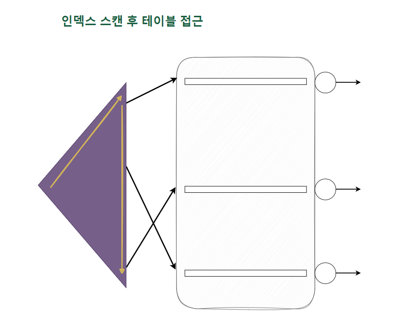
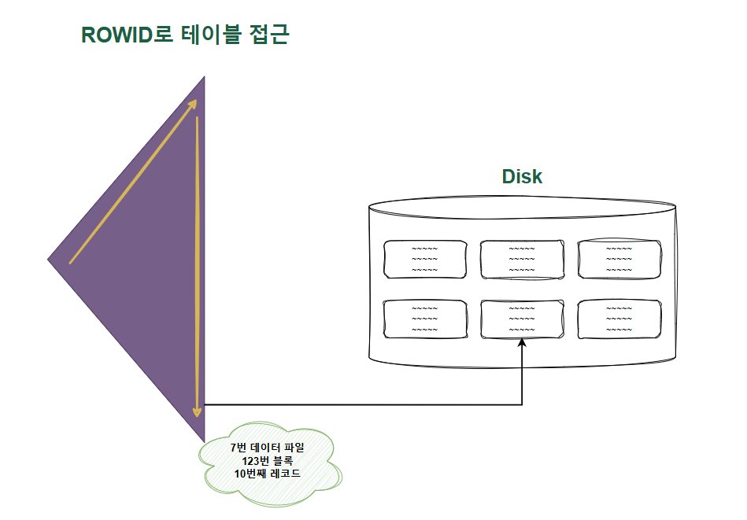
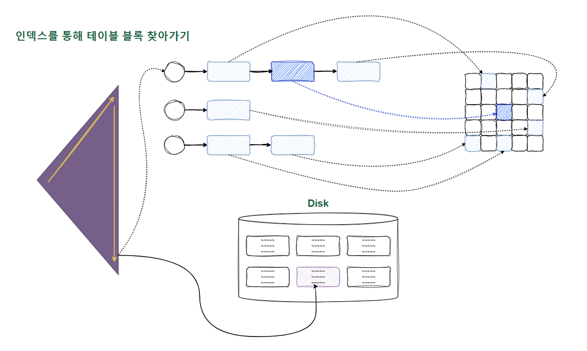
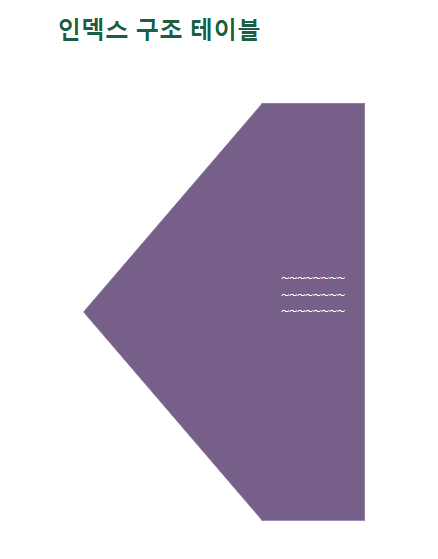
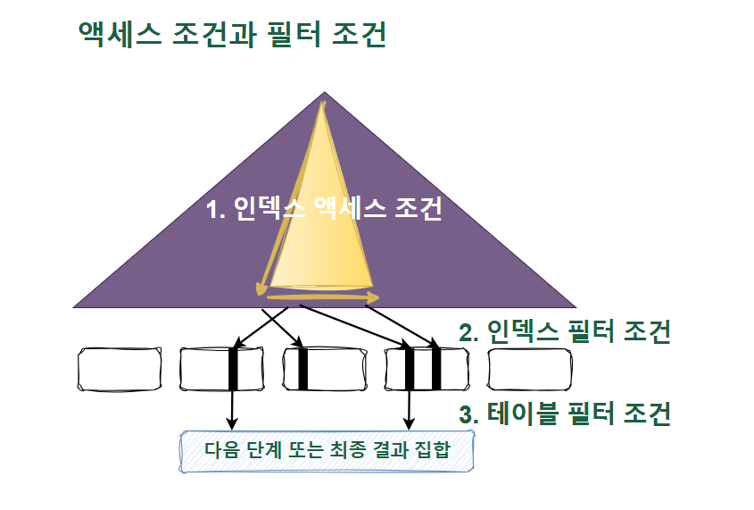
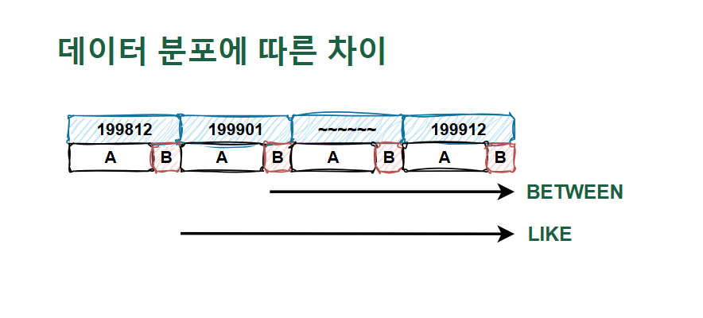
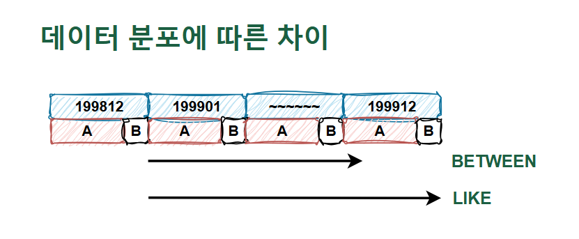

### 주제

인덱스 튜닝

### 세부 주제

조인, 소트 등 제외한 효율적인 인덱스 사용 방법

# 인덱스 튜닝

쿼리 튜닝 순서 및 흐름 정리

I/O는 비싸다. 특히 랜덤 I/O는 비싸다. 이를 줄이는 것이 중요하다.

1. **[인덱스 활용]**
    1. 인덱스 컬럼 추가
        1. 필터링의 순서를 바꿔줄 수 있다. 테이블 I/O 없이 필터링하고, 필요한 데이터만 I/O하는 것이다.
    2. 인덱스만 읽고 처리
        1. 커버링 인덱스를 사용하여 테이블 I/O를 없앤다.
2. **[부분 범위 처리 활용]**
    1. ‘정렬’이라는 특성을 잘 활용하여 부분 범위 처리를 가능토록 한다.
    2. 부분 범위 처리가 가능한 조건에서 Array Size를 잘 조정하여 ‘필요한 만큼만’ 읽는다.

## 테이블 액세스 최소화

<aside>
💡

SQL 튜닝은 랜덤 I/O와의 전쟁이다. 테이블 랜덤 액세스가 성능에 미치는 영향을 정리하고, 테이블 랜덤 액세스를 최소화하는 구체적인 방법들을 알아보겠다.

</aside>

### 1. 테이블 랜덤 액세스

**인덱스 ROWID는 물리적 주소? 논리적 주소?**

SQL이 참조하는 컬럼을 인덱스가 모두 포함하는 경우가 아니면, 인덱스를 스캔한 후에 반드시 테이블을 액세스한다.



여기서 **인덱스를 스캔하는 이유**는, **검색 조건**을 만족하는 소량의 데이터를 인덱스에서 빠르게 찾고, 테이블 레코드를 찾아가기 위한 **주소값인 ROWID**를 얻으려는 데 있다.

- **ROWID**

  ROWID는 물리적 주소를 직접 인코딩한 값이다.

    - Data Object Number (어떤 테이블/파티션인지)
    - Relative File Number (어느 데이터 파일인지)
    - Block Number (파일 내 어느 블록인지)
    - Row Number (블록 내 몇 번째 행인지)

  이 정보를 통해 블록에 직접 찾아가서 데이터를 읽어온다.

- 인덱스 ROWID는 물리적 주소보다 논리적 주소에 가까움
- ROWID는 데이터 파일 번호, 오브젝트 번호, 블록 번호 등 물리적 요소로 구성되어 있지만, 물리적으로 직접 연결되지 않고 아래 그림처럼 **테이블 레코드를 찾아가기 위한 논리적 주소 정보**를 담고 있기 때문
    - ROWID는 프로그래밍에서 사용하는 ‘포인터’의 개념이 아니며, 디스크 상의 테이블 레코드를 찾아가기 위한 [위치 정보](https://www.notion.so/DB-5-2b6596ebc0aa80c38041ddbcbc583801?pvs=21)를 담고 있는 것임
    - 포인터로 직접 연결된다면 매우 빠른 구조지만, 그렇지 않음!



**메인 메모리 DB와 비교**

<aside>
💡

메인 메모리 DB는 데이터를 모두 메모리에 로드해 놓고 메모리를 통해서만 I/O를 수행한다. 그런데, 잘 튜닝된 DBMS는 버퍼 캐시 히트율이 99% 이상인데도 메인 메모리 DB만큼 빠르지 않다.

</aside>

- 메인 메모리 DB는 인스턴스 기동 시 디스크에 저장된 데이터를 버퍼 캐시로 로딩하고 인덱스를 생성함
    - 이때 인덱스는 메모리 상의 주소 정보인 ‘포인터’를 가짐
    - 따라서 매우 빠르게 접근할 수 있음
- 오라클은 테이블 블록이 수시로 버퍼 캐시에서 밀려났다가 **다시 캐싱**되며, **그때마다 다른 공간에 캐싱**되기 때문에 **인덱스에서 포인터로 직접 연결할 수 없음**
    - 따라서 포인터가 아닌 **디스크 주소 정보**를 이용해 **해시 알고리즘으로 버퍼 블록을 찾아감**

**I/O 메커니즘 복습**

<aside>
💡

DBA는 디스크 상에서 블록을 찾기 위한 주소 정보다. 매번 디스크에서 블록을 읽을 수는 없기에, I/O 성능을 높이려면 버퍼 캐시를 활용해야 한다. 그래서 블록을 읽을 때 디스크에 가기 전에 버퍼 캐시부터 찾아본다.

</aside>

읽고자 하는 DBA를 해시 함수에 입력해서 해시 체인을 찾고 거기서 버퍼 헤더를 찾는다.

- 캐시에 적재할 때와 읽을 때 같은 해시 함수를 사용하므로 버퍼 헤더는 항상 같은 해시 체인에 연결됨
- 반면, 실제 데이터가 담긴 버퍼 블록은 매번 다른 위치에 캐싱됨
    - 그 메모리 주소값을 버퍼 헤더가 가지고 있음

정리하면, 해싱 알고리즘으로 버퍼 헤더를 찾고, 거기서 얻은 포인터로 버퍼 블록을 찾아간다.



모든 데이터가 캐싱돼 있더라도 테이블 레코드를 찾기 위해 매번 DBA 해싱과 래치 획득 과정을 반복해야 한다. 동시 액세스가 심할 때는 캐시 버퍼 체인 래치와 버퍼 락에 대한 경합까지 발생한다.

**참고** : [래치와 버퍼 락 그리고 트랜잭션 락](https://www.notion.so/2a4596ebc0aa80b18a5df3097da1f7a9?pvs=21)

**인덱스 ROWID는 우편 주소**

디스크 DB를 사용하는 일반적인 DBMS의 ROWID는 우편 주소, 메인 메모리 DB의 포인터는 전화번호에 비유할 수 있다.

전화 통신은 물리적인 연결이 있는 통신망 사용하므로 곧바로 상대방과 통화가 가능하다.

우편 통신은 봉투에 적힌 대로 우체부 아저씨가 **일일이 찾아다니는** 구조이므로 비교적 느리다.

```
우편 주소 : 서울특별시 종로구 삼청동 산 26 ...
ROWID : 7번 데이터 파일 123 블록 10번째 레코드
```

‘ROWID에 의한 테이블 액세스’는 오라클에서 하나의 레코드를 찾아가는 데 있어 가장 빠르다. 이 빠른 연산이 얼마나 고비용 연산인지 알아두자.

### 2. 인덱스 클러스터링 팩터

<aside>
💡

클러스터링 팩터는 ‘군집성 계수’ 정도로 번역 가능한데, 특정 컬럼을 기준으로 같은 값을 갖는 **데이터가 서로 모여있는 정도**를 의미한다. CF가 **좋은 컬럼**에 생성한 **인덱스**는 **검색 효율이 매우 좋다.**

</aside>

여기서 검색 효율이 좋다는 것은 테이블 액세스량에 비해 블록 I/O가 적게 발생함을 의미한다.

하지만, 인덱스 레코드마다 블록 단위 I/O를 한다면, CF가 달라도 블록 I/O 발생량에 차이가 없어야 하지 않나? 싶을 수 있다.

📢 **Buffer Pinning** : 래치 획득과 해시 체인 스캔 과정을 거쳐 어렵게 찾아간 테이블 블록에 대한 포인터(메모리 주소값)을 바로 해제하지 않고 일단 유지한다.

이 상태에서 다음 인덱스 레코드를 읽었는데, 마침 직전과 같은 테이블 블록이라면 **래치 획득과 해시 체인 스캔 과정을 생략**하고 바로 테이블 블록을 읽을 수 있다. 이는 **논리적인 블록 I/O 과정을 생략**할 수 있는 것이다.

블록 I/O는 매 접근 시 발생(논리 vs 물리(캐시 vs 디스크) 차이임)하는데, Buffer Pinning이 되어 있고, 이를 잘 활용하면 블록 I/O가 줄어든다는 것임!

### 3. 인덱스 손익분기점

<aside>
💡

인덱스 ROWID를 이용한 테이블 액세스는 생각보다 고비용 구조다. 따라서 읽어야 할 데이터가 일정량을 넘는 순간, 테이블 전체를 스캔하는 것보다 오히려 느려진다.
**Index Range Scan에 의한 테이블 액세스가 Table Full Scan보다 느려지는 지점**을 **‘인덱스 손익분기점’**이라고 한다.

</aside>

**[내 생각]**

기본적으로 인덱스를 통해 테이블에 접근하는 건 그냥 테이블 접근으로 바로 데이터를 읽어오는 것보다 당연히 비용이 높다. 인덱스 블록을 읽어야 하기 때문이다.

이에 추가로 Oracle과 MySQL를 함께 공부하며 이 두 DBMS에서 볼 수 있는 추가 비용이 있었다.

**Oracle**은 클러스터드 인덱스가 없기에, 인덱스 리프 노드에 PK가 아닌 데이터 주소를 가지고 있다. 이는 사실 물리적인 데이터 주소(포인터)가 아니라 ROWID라는 위치 정보이며, 이를 통해 실제 데이터로 접근해야 하기 때문에 포인터(직접 주소)보다 비용이 더 높다.

이렇게 구성한 이유는 데이터 블록이 캐시에 적재되고 삭제되길 반복하면서 그 위치가 계속 바뀌기 때문이다. 포인터를 가지고 있으면 이 바뀌는 주소를 찾아갈 수 없지만, ROWID의 위치 정보로는 찾아갈 수 있다.

**MySQL(InnoDB)**은 클러스터드 인덱스가 있기 때문에, 인덱스 리프 노드에 PK를 저장하고 있다. 이 PK를 통해 클러스터드 인덱스를 한 번 더 수직 탐색하기 때문에 추가적인 비용이 필요하다.

PK는 사용되는 상황이 매우 많기 때문에 이러한 비효율과 추가 공간이 필요함에도 큰 도움이 되곤 한다. 특히, 인덱스만으로 끝낼 수 있는 커버링 인덱스의 활용을 크게 향상시킬 수 있다.

---

<aside>
💡

인덱스를 이용해 테이블을 액세스할 때는 전체 중 몇 건을 추출하느냐에 따라 성능이 크게 달라진다. 이는 **테이블 랜덤 액세스** 때문으로, **인덱스 스캔량**이 늘어나는 것에도 영향을 받지만, 랜덤 액세스만큼 심하지는 않다.

</aside>

인덱스를 이용한 테이블 액세스가 Table Full Scan보다 느려지게 만드는 두 가지 핵심 요인

1. Table Full Scan은 **순차 접근**인 반면, 인덱스를 이용한 테이블 액세스는 **랜덤 접근**이다.
    1. **참고** : [**순차 접근 vs 랜덤 접근**](https://www.notion.so/vs-2a3596ebc0aa80debe07e5277fd705bf?pvs=21)
2. Table Full Scan은 **Multiblock I/O**인 반면, 인덱스를 이용한 테이블 액세스는 **Single Block I/O**다.
    1. **참고** : [**Single Block I/O vs Multiblock I/O**](https://www.notion.so/Single-Block-I-O-vs-Multiblock-I-O-2a3596ebc0aa80218993ebf4e20d29a3?pvs=21)

보통 인덱스 손익 분기점은 5~20% 수준으로 결정된다. 추가로, 앞에서 살펴본 CF에 따라서도 이 값이 크게 달라지는데, CF가 나쁘면 여러 번 반복 액세스하면서 논리적 I/O와 물리적 I/O가 늘기 때문이다.

인덱스 손익 분기점은 **OLTP 프로그램**과 DW/OLAP/**배치 프로그램** 튜닝의 특징을 구분 짓는 핵심 개념으로 알아두면 좋다!

**온라인 프로그램 튜닝 vs 배치 프로그램 튜닝 :**

**조인과 파티션 등 학습 후에 볼 것 / 손익 분기점과 관련 있음**

### 4. 인덱스 컬럼 추가

<aside>
💡

테이블 액세스 최소화를 위해 가장 일반적으로 사용하는 튜닝 기법은 인덱스에 컬럼을 추가하는 것이다.

</aside>

인덱스가 deptno + job으로 존재하는 상황에서 첫 번째 쿼리는 테이블을 접근해서 sal 값을 필터링해야 한다. 두 번째 쿼리처럼 기존에 사용하던 쿼리가 있을 수 있기 때문에 인덱스를 변경하기도 어려운 상황이다.

```
SELECT ~ FROM emp
WHERE deptno = 30
AND sal >= 2000
---
기존 쿼리
SELECT ~ FROM emp
WHERE deptno = 30
AND job = 'CLERK'
```

그렇다고 마구잡이로 인덱스를 추가하면 인덱스 관리 비용과 DML 부하에 따른 트랜잭션 성능 저하가 생길 수 있다. 이럴 때, 기존 인덱스에 컬럼을 추가하는 것만으로도 큰 효과를 얻을 수 있다.

`deptno + job + sal`

이렇게 생성한다면 **인덱스 스캔량은 줄지 않지만**, **테이블 랜덤 액세스 횟수를 줄여준다.**

**[생각]**

스캔 범위와 필터링에 대해 아리송하다. 스캔 범위가 좁으면 성능이 더 좋다는 것은 직관적으로 잘 다가오는데, 이를 필터링과 엮으면 엉키는 느낌이다.

스캔 범위는 말 그대로 인덱스 수평 탐색의 범위다.

필터링은 두 가지로 나눠서 이해했다.

1. **테이블에 접근**하여 데이터를 가져올지를 결정하기 위해 인덱스를 사용한 필터링
2. 테이블에 접근한 후 **이 데이터를 사용할지** 결정하기 위한 필터링

당연히 전자가 훨씬 좋다. 테이블에 접근하지 않고 인덱스에서 끝난다는 것이기 때문이다. 스캔 범위를 줄이면 이 ‘비교 작업(필터링)’조차 줄어들기 때문에 중요한 것이다.

### 5. 인덱스만 읽고 처리

<aside>
💡

위의 과정을 거쳐 테이블 랜덤 액세스가 아무리 많아도 필터 조건에 의해 버려지는 레코드가 거의 없다면 거기에 비효율은 없다. 여기서 어떻게 더 튜닝해야 할까?

</aside>

**커버링 인덱스**

쿼리나 인덱스에 문제가 있는 것이 아닌, 필요한 데이터의 절대적인 양이 많아서 느린 상황이다. 이럴 때 반드시 쿼리를 개선해야 한다면 쿼리에 필요한 모든 컬럼을 인덱스에 추가하여 테이블 액세스를 없애는 방법이 있다.

```sql
인덱스: (부서번호)
쿼리: SELECT 부서번호, SUM(수량) WHERE 부서번호 LIKE '12%' GROUP BY 부서번호
```

이 경우 ‘수량’ 컬럼을 인덱스에 추가한다면 커버링 인덱스를 사용할 수 있게 되어 테이블 접근을 아예 하지 않을 수 있다.

### 6. 인덱스 구조 테이블

<aside>
💡

인덱스를 이용한 테이블 액세스가 고비용이므로 랜덤 액세스가 아에 발생하지 않는 구조로 인덱스를 생성하는 방법이 있다. 이를 IOT(Index-Organized Table)이라고 한다.

</aside>



- 테이블을 찾아가기 위한 ROWID를 갖는 일반 인덱스와 달리 IOT는 그 자리에 테이블 데이터를 가짐
- 인덱스 리프 블록이 곧 데이터 블록!
- MySQL의 클러스터드 인덱스가 이러한 경우

IOT는 인위적으로 클러스터링 팩터를 좋게 만드는 방법 중 하나다. 레코드들이 정렬된 상태로 모여 있으므로 랜덤 액세스가 아닌 순차 접근으로 데이터에 접근한다. 따라서 BETWEEN이나 부등호 조건으로 넓은 범위를 읽을 때 유리하다.

### 7. 클러스터 테이블

<aside>
💡

클러스터 테이블에는 인덱스 클러스터와 해시 클러스터 두 가지가 있다.

</aside>

**인덱스 클러스터 테이블**

클러스터 키 값이 같은 레코드를 한 블록에 모아서 저장하는 구조다. 한 블록에 모두 담을 수 없을 때는 새로운 블록을 할당해서 클러스터 체인으로 연결한다.

‘클러스터드 인덱스’와 이름이 비슷해서 헷갈릴 수 있지만, 그건 IOT에 가깝다. 오라클 클러스터 테이블은 키 값이 같은 데이터를 같은 공간에 저장해 둘 뿐, 정렬하지는 않는다.

클러스터 인덱스도 B*Tree를 사용하지만, 테이블 레코드를 일일이 가리키지 않고, 해당 키 값을 저장하는 첫 번째 데이터 블록을 가리킨다는 점이 다르다. 따라서 클러스터 인덱스의 키 값은 항상 Unique하다.

- 클러스터 인덱스를 스캔하면서 값을 찾을 때는 랜덤 액세스가 값 당 한 번만 발생함
- 클러스터에 도달하면 순차 접근을 하므로 넓은 범위를 읽더라도 비효율이 없음

**해시 클러스터 테이블**

해시 클러스터는 인덱스를 사용하지 않고, 해시 알고리즘을 사용해 클러스터를 찾아간다는 점만 다르다.

## 부분 범위 처리 활용

<aside>
💡

테이블 랜덤 액세스로 인한 손익분기점의 한계를 극복하기 위한 방법이다. 인덱스로 액세스할 대상 레코드가 아무리 많아도 아주 빠른 응답 속도를 낼 수 있다.

</aside>

- **전체 범위 처리와 부분 범위 처리의 구분 기준**

  “결과를 만들기 위해 전체 데이터를 다 처리해야 하는가?”
  여기서 ‘결과’는 Result Set으로 대표되는 반환할 수 있는 결과를 말하는 듯 싶다.

  ‘처리’라는 건 I/O만이 아닌 ‘결과’를 생성하는 과정을 포함한다.

  대표적으로

    - I/O (디스크 / 버퍼 읽기)
    - 정렬
    - 집계 (GROUP BY, SUM 등)
    - 조인
    - 필터링

  등이 포함된다.

  핵심 판단 기준으로 “첫 번째 결과를 얻기 위해 전체를 처리해야 하는가?”를 생각해보면 좋다.

  이에 대한 대답이 Yes라면 전체 범위 처리, No라면 부분 범위 처리이다. 전체를 처리하지 않고 부분만 처리해도 첫 번째(필요한 순서의) 결과를 얻을 수 있기 때문에 부분 범위 처리로 볼 수 있다.


### 1. 부분 범위 처리

<aside>
💡

DBMS가 클라이언트에게 데이터를 전송할 때 일정량씩 나누어 전송한다. 전체 결과를 전송하지 않고 남아 있어도, 서버 프로세스는 클라이언트로부터 Fetch Call을 받기 전까지 그대로 멈춰 서서 기다린다.

</aside>

- **DB에서의 Call (Parse Call, Execute Call, Fetch Call)**

    <aside>
    💡

  세 가지 Call은 클라이언트(우리 프로그램) - 서버(DBMS 서버) 간 통신에서 **클라이언트의 Call 관점**이다.

    </aside>

  예시 코드

    ```java
    private void execute(Connection con) throws Exception {
    	Statement st = con.createStatement();
    	ResultSet rs = st.executeQuery("SELECT name FROM big_table);
    	
    	for(int i = 0; i < 100; i++) {
    		if(rs.next())
    			System.out.println(rs.getString());
    	}
    	rs.close();
    	st.close();
    }
    ```

    - **Execute Call과 Fetch Call의 구분**
        - Oracle, PostgreSQL 등은 커서 기반 DB임
        - JDBC 또한 이 개념 기반이다
        - Execute Call은 Parse Call로 인해 만들어진 실행 계획대로 쿼리를 실행한다
            - 실행이란 진짜 I/O보다는 커서 준비라고 보면 된다
            - 읽을(데이터) 곳 앞으로 커서를 옮겨놓는다고 보면 된다
            - **Execute Call의 정확한 동작**
                1. 커서 생성
                2. 스캔 시작 위치 설정
                    1. 인덱스 시작점
                    2. 테이블 첫 블록
                    3. 첫 행을 ‘찾을 준비’만 한다
                        1. 여기서 준비는 당연히 커서를 읽을 데이터 앞으로 옮겨놓는 작업이다
                    4. 실제 읽기는 Fetch에서 진행한다
        - Fetch Call은 Execute Call에서 설정한 커서 위치에서 읽기(I/O)를 수행한다
            - I/O 위치는 캐시 여부에 따라 메모리(버퍼), 디스크로 나뉠 수 있다
            - 한 번에 Array Size만큼 데이터를 읽는다(INSERT/UPDATE/DELETE는 결과 집합이 필요하지 않으니 ‘읽는다’는 표현이 맞음)
            - 클라이언트에게 전송하고, 커서 위치를 다음 읽을 곳으로 업데이트한다

      이 흐름대로 간다면 자연스레 Execute Call은 1회만 발생한다. 초기 쿼리 실행 시 커서를 생성하고 읽을 첫 데이터 앞으로 옮겨놓으면 더이상 필요하지 않기 때문이다.

    1. Parse Call
        1. SQL 파싱 및 실행 계획 생성 요청
        2. ex. 클라이언트(ex. 자바)에서 executeQuery(”SELECT …”) 코드 실행 시 발생
        3. 작업
            1. SQL 문법 검사, 실행 계획 생성, 권한 확인
    2. Execute Call
        1. SQL 실행 요청
        2. ex. executeUpdate(”UPDATE …”)
        3. 작업
            1. 실제 SQL 수행 (데이터 변경 / 커서 생성 후 첫 데이터로 커서 이동)
    3. Fetch Call
        1. 결과 데이터 가져오기 요청
        2. ex. rx.next()
        3. 작업
            1. 데이터 읽기 (Array Size만큼)
            2. 사용자에게 반환

- DBMS는 데이터를 모두 읽어서 한 번에 전송하지 않고, 먼저 읽는 데이터부터 일정량(Array Size)을 전송하고 멈춤
- 데이터를 전송하고 나면 서버 프로세스는 CPU를 OS에 반환하고 대기 큐에서 잠을 잠
- 다음 Fetch Call을 받으면 대기 큐에서 나와 **그 다음 데이터부터** 일정량을 읽어서 전송하고 또다시 잠을 잠
- 전체 일량을 줄이는 것과는 상관이 없지만, 일부 데이터만 먼저 보여지고자 할때 유용

이처럼 전체 쿼리 결과 집합을 쉼 없이 연속적으로 전송하지 않고, 사용자로부터 **Fetch Call이 있을 때**마다 **일정량씩 나누어 전송**하는 것을 이른바 **‘부분 범위 처리’**라고 한다.

- **오해**

  쿼리 수행 시 결과 집합을 버퍼 캐시에 모두 적재하고 나서 사용자에게 전송? ❌

  일정량(Array Size)만큼씩 읽고 반환 반복

  → Fetch Call과 sleep()으로 위 행위가 반복됨


**정렬 조건이 있을 때 부분 범위 처리**

만약 쿼리문에 ORDER BY가 있을 때 부분 범위 처리가 가능할까?

`SELECT name FROM big_table ORDER BY created`

- 위 쿼리의 경우 DB 서버는 모든 데이터를 다 읽고 created 순으로 정렬한 후 클라이언트에게 전송할 수 있음
    - 이는 ‘전체 범위 처리’임
- Sort Area와 Temp 테이블 스페이스까지 이용해 데이터 정렬을 마치고 나면 그때부터 일정량씩 나눠 클라이언트에게 데이터를 전송함

created 컬럼이 선두인 인덱스가 있다면 당연히 부분 범위 처리가 가능하다.

- 인덱스는 항상 정렬된 상태를 유지하기 때문

**Array Size 조정을 통한 Fetch Call 최소화**

그렇다면 필요한 데이터의 양에 따라 Array Size를 조절할 필요가 있다.

- 대량 데이터가 필요한 경우
    - 어차피 많은 데이터를 모두 전송해야 하므로 값을 크게 설정하는 것이 좋음
    - 전송해야 하는 총량이 변하지는 않지만, Fetch Call 횟수를 줄일 수 있음
    - **Fetch Call 횟수에 따른 장/단점**

      Fetch Call이 많다면 Array Size가 작고, Fetch Call이 적다면 Array Size가 많다.

      **1. Fetch Call이 많은 경우**

      **[장점]**

        - 첫 응답 속도 빠름
            - 부분 처리 효과를 크게 볼 수 있음
        - 메모리 사용량 감소
            - Fetch Call이 많다는 건 Array Size가 작다는 것이고, 그에 따라 데이터를 위한 메모리 사용량이 적어짐

      **[단점]**

        - 네트워크 왕복 횟수 증가
        - 컨텍스트 스위칭 증가
            - Fetch Call을 처리하면 sleep 상태로 전환되고, 다시 Fetch Call을 받는 과정이 반복되기 때문
        - DB 서버 CPU 낭비
            - 커서 상태 읽기, 다음 블록 찾기, 버퍼 Pin/UnPin, 네트워크 패킷 생성 등

      **2. Fetch Call이 적은 경우**

      **[장점]**

        - 전체 처리 시간 단축
            - Fetch 오버헤드와 네트워크 왕복 시간 등이 줄어들기 때문

      **[단점]**

        - 첫 응답 지연
            - 큰 Array Size만큼 모두 읽고 처리해야 하기 때문에 사용자의 체감 상 느림
        - 불필요한 I/O
            - 필요한 데이터의 수보다 많은 Array Size를 가지고 있다면 불필요한 I/O가 발생하게 됨
- 앞쪽 일부 데이터만 필요한 경우
    - Array Size 값을 작게 설정하는 것이 좋음
    - 불필요하게 많은 데이터를 전송하고 버리는 비효율을 줄이기 위함임

### 2. OLTP 환경에서 부분 범위 처리에 의한 성능 개선 원리

Sort 연산(정렬)이 필요한 경우 **부분 범위 처리**에 의한 성능 개선의 원리가 직관적으로 나타난다.

idx(게시판 구분 코드, 등록일시) 인덱스가 있는 경우와 없는 경우가 그러하다.

1. 인덱스가 없는 경우 (정확히는 후행 컬럼이 인덱스에서 빠진 경우)
    1. 게시판 구분 코드 = ‘A’인 컬럼으로 스캔 범위를 좁힌 건 동일하다.
    2. 하지만, 스캔 범위 내 모든 데이터를 읽기 위해 테이블 랜덤 I/O가 발생한다.
    3. 정렬이 되어 있지 않기 때문에, 정렬 처리를 먼저 한 후에야 결과 집합을 반환할 수 있다. 정렬 처리를 하려면 그만큼 데이터를 읽어야 하기 때문에 부분 범위 Fetch(결과 집합 반환)가 불가능하다.
2. 인덱스가 있는 경우 (후행 컬럼까지 포함된 경우)
    1. 게시판 구분 코드 단위로 데이터가 정렬되어 있다. 이 경우에서 ORDER BY (ASC, DESC 모두)가 있더라도 부분 범위 처리가 가능하다.
    2. 그 이유는 정순(혹은 역순)으로 원하는 정렬 방향으로 데이터를 읽고, Array Size만큼 바로 결과 집합을 반환하면 되기 때문이다.

전자가 부분 범위 처리가 불가능한 이유는 ‘정렬’이라는 일종의 ‘처리’ 작업이 필요하고, 이는 모든 데이터를 읽은 상태에서 가능하기 때문이다.

후자가 부분 범위 처리가 가능한 이유는 모든 데이터를 읽지 않고, 읽을 첫 데이터의 위치(커서)만 잡는다면 바로 Array Size만큼 읽어도 되기 때문이다. 그것이 사용자가 필요한 데이터이므로.

**멈출 수 있어야 의미 있는 부분 범위 처리**

<aside>
💡

이러쿵 저러쿵 결국 중요한 건 ‘**앞쪽 일부만 출력하고 멈출 수 있는가’**이다.

</aside>

- 5.3 인덱스를 이용한 소트 연산 생략에서 이어서 설명 ..

  **[책에서 ..]**

  클라이언트 프로그램이 DB 서버에 직접 접속하는 2-Tier 환경에서는 가능하지만, 클라이언트와 DB 사이에 WAS, AP 서버 등이 존재하는 n-Tier 아키텍처에서는 클라이언트가 특정 DB 커넥션을 독점할 수 없다. 단위 작업을 마치면 DB 커넥션을 곧바로 커넥션 풀에 반환해야 하므로 그 전에 SQL 조회 결과를 클라이언트에게 ‘모두’ 전송하고 커서를 닫아야 한다. 따라서 결과 집합을 조금씩 나눠 전송하도록 구현하기 어렵다.

  그렇다면 부분 범위 처리는 n-Tier 환경에서 의미 없는 개념일까? 그렇지 않다. 부분 범위 처리는 n-Tier 환경에서도 여전히 유효하다. 자세한 내용은 5장 3절(인덱스를 이용한 소트 연산 생략)에서 설명한다.


### **) 오라클 배치 I/O 기능

<aside>
💡

배치 I/O는 읽는 블록마다 건건이 I/O Call을 발생시키는 비효율을 줄이기 위해 고안한 기능이다. 인덱스를 이용해 테이블을 액세스하다가 버퍼 캐시에서 블록을 찾지 못하면 일반적으로 디스크 블록을 바로 읽는데, 이 기능이 작동하면 테이블 블록에 대한 디스크 I/O Call을 미뤘다가 읽을 블록이 일정량 쌓이면 한 번에 처리한다.

</aside>

**데이터 정렬 이슈**

배치 I/O 기능이 작동하면 인덱스를 이용해서 출력하는 데이터 정렬 순서가 매번 다를 수 있다.

- 테이블 블록을 모두 버퍼 캐시에서 찾을 때는 기존처럼 인덱스 키값 순으로 데이터가 출력됨
- 하지만, 배치 I/O가 작동할 때는 데이터 출력 순서가 인덱스 정렬 순서와 다를 수 있음

성능을 올려주는 좋은 기능을 안쓰는 경우?

- ‘필요한’ ORDER BY를 ‘자동 ORDER BY’를 믿고 기재하지 않는 경우
    - 정렬이 필요한데 order by를 기재하지 않았기에, 옵티마이저는 batch i/o로 실행 계획을 수립하지만, 실제로는 정렬이 필요하므로 이 기능을 안 쓰는 경우가 있음..

## 인덱스 스캔 효율화

### 1. 인덱스 탐색

<aside>
💡

인덱스의 각 레코드는 하위 주소를 가리키는 블록 주소를 갖는다. 자신이 가리키는 주소로 찾아간 블록에는 자신의 키 값보다 크거나 같은 값을 갖는 레코드가 저장되어 있다.

</aside>

인덱스를 이용해 데이터 레코드에 접근할 때는 수직적 탐색으로 시작점을 찾고, 수평적 탐색으로 조건에 해당하는 데이터 레코드를 읽는다. 시작점을 정할 때는 루트 블록부터 인덱스 키 값을 기준으로 하위 블록으로 내려간다.

- 블록에서 시작점에 해당하는 블록을 찾더라도 해당 블록으로 내려가면 안 됨
- 그 블록에는 키 값보다 크거나 같은 값들만 있기 때문임
- 처음 만난 크거나 같은 값 직전 블록으로 가야 함
- 가리키는 블록으로 내려가더라도 조건을 만족하는 데이터를 만날 수 있지만, 시작점은 아님

수직적 탐색에 도움이 되는가

- 시작점 축소(선정)에 도움이 되는가

스캔량을 줄이는 데 도움이 되는가

- 시작점을 결정하는 데 도움은 안 되었더라도, 스캔을 멈추는 데 중요한 역할을 할 수 있음
- 이는 스캔량을 줄이는 데 도움이 되는 것임

### 2. 인덱스 스캔 효율성

<aside>
💡

인덱스 선행 컬럼이 조건절에 없거나 동등 조건이 아니면 인덱스 스캔 과정에 비효율이 발생한다.

</aside>

**선두 컬럼과 선행 컬럼**

- 인덱스 구성 상 맨 앞에 있는 컬럼
- 상대적으로 앞쪽에 놓인 컬럼

### 3. 액세스 조건과 필터 조건

<aside>
💡

인덱스를 스캔하는 단계에 처리하는 조건절은 **액세스 조건**과 **필터 조건**으로 나뉜다.

</aside>



**인덱스 액세스 조건**

- **인덱스 스캔 범위를 결정**하는 조건절
- 인덱스 **수직적 탐색**을 통해 **스캔 시작점을 결정**하는 데 영향을 미치고, 인덱스 리프 블록을 스캔하다가 **어디서 멈출지를 결정**하는 데 영향을 미치는 조건절

**인덱스 필터 조건**

- **테이블로 액세스**할지를 **결정**하는 조건절

**테이블 필터 조건**

- **쿼리 수행 다음 단계로 전달**하거나 **최종 결과 집합에 포함**할지를 결정함

인덱스를 이용하든, 테이블을 Full Scan하든 테이블 액세스 단계에서 처리되는 조건절은 모두 필터 조건이다.

**옵티마이저의 비용 계산 원리**

- 인덱스 수직 탐색 비용 + 인덱스 수평 탐색 비용 + 테이블 랜덤 액세스 비용

### 4. 비교 연산자 종류와 컬럼 순서에 따른 군집성

<aside>
💡

인덱스에는 ‘같은 값’을 갖는 레코드들이 서로 군집해 있다.

같은 값을 찾을 때는 ‘=’ 연산자를 사용하므로, 인덱스 컬럼을 누락없이 ‘=’ 연산자로 조회하면 조건절을 만족하는 레코드는 모두 모여 있다.

반대로, 누락하거나 ‘=’ 조건이 아닌 연산자로 조회하면 조건절을 만족하는 레코드가 서로 흩어진 상태가 된다.

</aside>

ex. idx(c1, c2, c3, c4)

**Case 1 :** c1, c2, c3, c4 모두 ‘=’ 연산자 사용

- 조건을 만족하는 레코드들이 모두 연속해서 모여 있음

**Case 2 :** c1, c2, c3 ‘=’ / c4 ‘≥’ 연산자 사용

- 선행 컬럼은 모두 ‘=’ 연산자이고, 마지막 컬럼만 범위 검색 조건일 때도 모여 있음

**Case 3 :** c1, c2, c4 ‘=’ / c3 범위 검색 조건 사용

- c1~c3까지 세 조건을 만족하는 인덱스 레코드는 서로 모여 있음
- 하지만, c4 조건까지 만족하는 레코드는 흩어져 있음

**Case 4 :** c2가 범위 검색 조건인 경우

- c1~c2까지 두 조건을 만족하는 인덱스 레코드는 서로 모여 있음
- c3와 c4 조건까지 만족하는 레코드는 흩어져 있음

**[규칙 !]**

- **선행 컬럼이 모두 ‘=’ 조건인 상태**에서 **첫 번째 나타나는 범위 검색 조건까지**만 만족하는 인덱스 레코드는 **모두 연속해서 모여** 있지만, **그 이하 조건**까지 만족하는 레코드는 **비교 연산자 종류에 상관없이 흩어짐**

**Case 5 :** c1이 범위 검색 조건인 경우

- 조건 c1을 만족하는 레코드는 서로 모여 있고, 나머지 조건까지 만족하는 레코드는 비교 연산자 종류에 상관없이 모두 흩어져 있음
- 이 경우 c2, c3, c4가 시작점, 끝점의 범위를 줄여주는 데 도움이 되긴 하나, 매우 미미한 수준임

**인덱스 스캔 범위를 결정하는 조건절**이 **인덱스 액세스 조건**이다. **선행 컬럼이 모두 ‘=’ 조건인 상태에서 첫 번째 나타나는 범위 검색 조건**이 **인덱스 스캔 범위를 결정**한다. 따라서 이들 조건이 **인덱스 액세스 조건**이다.

인덱스의 나머지 컬럼 조건은 모두 **인덱스 필터 조건**이 된다.

### 5. 인덱스 선행 컬럼이 등치(=) 조건이 아닐 때 생기는 비효율

<aside>
💡

인덱스 스캔 효율성은 인덱스 컬럼을 모두 등치(=) 조건으로 사용할 때가 가장 좋다. 리프 블록을 스캔하면서 읽은 레코드는 하나도 걸러지지 않고 모두 테이블 액세스로 이어지므로 **인덱스 스캔 단계에서의 비효율**은 없다.

</aside>

- 인덱스 컬럼 중 일부가 조건절에 없거나 등치 조건이 아니더라도 그 컬림이 뒤쪽 컬럼이라면 비효율이 없음
- 반면, 선행 컬럼이 조건절에 없거나 등치 조건이 아닌 범위 검색 조건이라면 인덱스를 스캔하는 단계에서 비효율이 생김

인덱스 선행 컬럼이 모두 ‘=’ 조건일 때 필요한 범위만 스캔하고 멈출 수 있는 것은 조건을 만족하는 레코드가 모두 한 데 모여 있기 때문이다.

### 6. BETWEEN을 IN-List로 전환

운영 중에 인덱스 구성을 바꾸기는 쉽지 않다. 그럴 때는 쿼리를 조금 수정해보면 좋다.

```java
BETWEEN a 1 AND 3
--- IN 절로 변경
BETWEEN a IN (1, 2, 3)
```

선두 컬럼에 BETWEEN이 있으면 불필요한 스캔이 많아지지만, IN절로 바꿔서 필요한 부분만 읽는 방식으로 쿼리를 수행하도록 할 수 있다.

**IN-List로 변경한다는 것**

인덱스를 세 번 탐색한다는 것이다. 위 조건절로 변경하면 RANGE SCAN을 세 번 수행한다. 각각의 조건은 = 1, = 2, = 3으로 변경되어 UNION ALL로 합쳐진다.

- 모든 컬럼이 ‘=’ 조건으로 변경되는 점에 주목할 것
- 아래에서 볼 것인 Index Skip Scan 방식으로  유도해도 비슷한 효과를 얻을 수 있음

**전환 시 주의 사항**

- IN-List의 항목 개수가 많아질수록 당연히 좋지 않음 ..
    - **수직적 탐색**이 많이 발생하기 때문
    - 리프 블록을 많이 스캔하는 비효율보다 브랜치 블록을 반복 탐색하는 비효율이 더 클 수 있음
- **선택되는 레코드들이 멀리 떨어져 있을 때**만 유용함
    - I/O는 블록 단위라는 것 잊지 말 것
    - 가까이 있으면 오히려 적은 블럭을 읽어도 되지만, 변환 시 수직 탐색이 추가되어 오히려 더 많은 블록 I/O가 발생할 수 있음

수직적 탐색 비용과 데이터 분포를 잘 따져보고 BETWEEN → IN-List 변환 최적화를 진행할 것!

### 7. Index Skip Scan 활용

<aside>
💡

위와 같은 상황에서 Index Skip Scan을 활용하면 굳이 조건절을 바꾸지 않고도 같은 효과를 낼 수 있다.

</aside>

**선행 컬럼 BETWEEN의 IN-List 최적화 vs Index Skip Scan 최적화**

- IN-List : IN절 안에 있는 것만 보면 됨
- Index Skip Scan : 다 봐야 함
    - 책에서의 예시는 BETWEEN 범위가 ‘전체’로 같았지만, 분명 특정 범위만 볼 것임
    - IN 절에 그걸 기입하고 그것만 볼 것임
    - Index Skip Scan은 모두 보기 때문에 Distinct Value의 수가 중요함
    - IN-List는 상관 없고 IN 절 안에 있는 요소들만 봄

### 8. IN 조건은 ‘=’인가

<aside>
💡

IN 조건은 ‘=’이 아니다. IN 조건이 ‘=’이 되려면 IN-List Iterator 방식으로 풀리는 경우이다. 그렇지 않으면 IN 조건은 **필터 조건**이다.

</aside>

**[예시]**

PK : 상품 ID / IDX : 상품 ID + 상품구분코드

```sql
SELECT * FROM 상품
WHERE 상품 ID = :prod_id
AND 상품구분코드 IN (’GX’, ‘KR’)
```

- 위 경우 상품구분코드 컬럼은 **필터 조건**으로 사용됨
- **IN-List Iterator 방식**이라면 **수직 탐색** 두 번으로 같은 블록 I/O
    - **액세스 조건**으로 사용 됨
- **필터 조건**으로 사용한다면 한 번의 수직 탐색으로 해당 블록에서 필터링 (비교적 긴 **수평 탐색**)
    - 상품 ID가 Unique하다는 점에 주목
    - 필터 조건으로 사용됨

필터 조건 방식은 IN-List Iterator 방식에 비해 선행 컬럼의 카디널리티가 더 높을 때 효율적임

**수직 탐색을 많이 할 것인가 vs 수평 탐색을 길게 할 것인가**

### 9. BETWEEN과 LIKE 스캔 범위 비교

<aside>
💡

날짜 컬럼에 대해 범위 조건을 설정할 때, LIKE ‘1999%’를 사용하는 경우가 많다. 하지만, BETWEEN ‘199901’ and ‘199912’가 더 정확한 표현식이다.

</aside>

- 둘 다 범위 검색 조건이지만, 데이터 분포와 조건절 값에 따라 인덱스 스캔량이 다를 수 있음



- 두 방식은 시작점이 다름
- 우리는 199901부터 시작인 걸 알지만 199900도 있는지 확인해야 하기 때문



- B보다 앞에 오는 A를 읽을 때에도 마찬가지로 LIKE 조건이 더 많이 읽음
- 199913을 확인하기 위해 B를 읽고 다음 값까지 읽어본 후 멈출 수 있기 때문

### 10. 범위 검색 조건을 남용할 때 생기는 비효율

IDX (c1, c2, c3)

c1은 필수, c2는 선택, c3는 일부 검색으로 요청이 들어올 수 있을 때, 두 가지 경우가 있다.

```sql
쿼리 1
SELECT ... FROM ...
WHERE C1 = ?
AND C2 = ?
AND C3 LIKE '%'
----
쿼리 2
SELECT ... FROM ...
WHERE C1 = ?
AND C3 LIKE '%'
```

- 이렇게 쿼리를 작성하면 C2의 존재 여부에 따라 효율적으로 스캔할 수 있음
- 쿼리 1은 선행 컬럼의 동등 조건을 잘 만족했고, 쿼리 2는 어쩔 수 없이 C1으로 범위를 한정함

하지만, 쿼리를 편하게 짜고자 C2에 범위 검색을 사용한다면 비효율이 발생한다.

```sql
SELECT ... FROM ...
WHERE C1 = ?
AND C2 LIKE '%'
AND C3 LIKE '%'
```

- 이 경우 C2가 없을 때에는 첫 번째 케이스와 같지만,
- C2가 있을 때에도 범위 검색을 하게 되므로 비효율이 발생함
    - 선행 컬럼의 동등 조건이 C1 - C2까지만 유지되기 때문
    - C3의 선행 컬럼은 범위 검색이므로 혜택을 받지 못함

결론: **옵션 조건**을 고려하여 나올 수 있는 모든 경우만큼 SQL을 작성하면 쿼리에서 사용하는 인덱스 스캔의 비효율을 줄일 수 있다.

### 11. 다양한 옵션 조건 처리 방식의 장단점 비교

**OR 조건 활용**

`WHERE (:cust_id IS NULL OR 고객ID = :cust_id) …`

- IDX(고객 ID, 거래일자)로 인덱스를 구성해도 이를 사용할 수 없음
    - `:cust_id IS NULL OR 고객ID = :cust_id`은 바인드 변수로 인해 옵티마이저에게 “? IS NULL OR 고객 ID = ?”로 해석됨
    - 이 쿼리를 기준으로 파싱(실행 계획 생성)을 하므로, 이 시점에서 스캔 범위를 결정해야 함
    - ?에 뭐가 올 지 모르므로 풀 스캔을 사용할 가능성이 높음
- 인덱스 선두 컬럼에 대한 옵션 조건에 OR 조건을 사용하면 안 됨

- IDX(거래일자, 고객 ID)로 인덱스를 구성하면 사용할 수는 있음
- 하지만, 고객 ID를 **필터 조건으로 사용**함
    - 심지어, 테이블 **액세스 단계에서 필터링**을 진행함

모든 옵션 조건이라고 OR 사용을 주의할 필요는 없다. 인덱스에 포함되지 않은 컬럼에 대한 옵션 조건은 어차피 테이블에서 필터링을 해야 하므로 OR 조건을 사용해도 무방하다. 중요한 건 **옵션 조건이 인덱스에 포함되어 있는 컬럼**일 때이다.

**정리**

- 인덱스 액세스 조건으로 사용 불가
- 인덱스 필터 조건으로도 사용 불가
- 테이블 필터 조건으로만 사용 가능

**LIKE/BETWEEN 조건 활용**

변별력이 좋은 필수 조건을 선행 컬럼으로, 후행 컬럼의 비교 조건으로 LIKE/BETWEEN을 사용하면 인덱스 필터 조건으로 사용되더라도 충분히 좋을 수 있다.

하지만, 변별력이 좋지 않은 경우에는 곤란하다.

- 필수 조건만 요청할 때는 Table Full Scan이 유리함
- 하지만, 옵티마이저는 옵션 조건이 있는 경우를 기준으로 Index Range Scan을 선택함

**이 외에도 LIKE/BETWEEN 패턴 사용 시 점검 사항**

1. 인덱스 선두 컬럼
2. NULL 허용 컬럼
3. 숫자형 컬럼
4. 가변 길이 컬럼