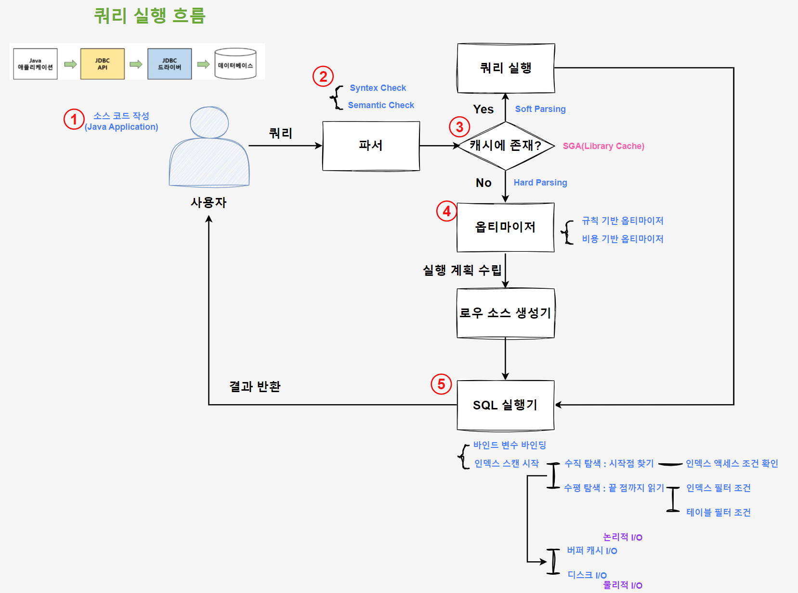

# 총 정리

## 쿼리 진행 흐름



### 1. 소스 코드 작성

자바 개발자 기준 아래와 같이 코드를 작성하여 DB 서버로 요청을 보낸다.

```java
Connection conn = DriverManager.getConnection(url, user, password); // 1. connection 생성
Statement stmt = conn.createStatement(); // 2. statement 생성
ResultSet rs = stmt.executeQuery(sql); // 3. Query 실행
while ()
	rs.next(); // 4. 결과 처리
```

**JDBC를 사용한 DB 접근**

1. Connection 생성
    1. Connection 객체 : DB 서버와의 물리적 연결(세션)이며, 이 객체로 모든 DB 작업 수행
2. Statement 생성
    1. Statement : 데이터베이스에 SQL 문을 전달하고, 그 실행 결과를 받아오는 객체
    2. Connection이 만들어 줌
3. Query 실행
    1. Parse Call (DB가 SQL 파싱)
    2. Execute Call (DB가 쿼리 실행, 커서 준비)
4. 결과 처리 (SELECT, ResultSet 객체에서 데이터 조회)
    1. `rs.next();`
    2. Fetch Call
    - 동작

      **[첫 호출]**

        1. Fetch Call (Java → DB)
        2. DB : Array Size만큼 데이터 읽기
        3. ResultSet 버퍼에 저장
        4. 첫 번째 행 반환

      **[첫 호출 이후 ~ Array Size만큼]**

        1. 내부 버퍼에서 데이터 꺼냄 (Fetch Call 발생 X)
        2. 행 반환

      **[첫 호출 + Array Size번 다음 요청]**

        1. 버퍼 확인 → 버퍼가 비어 있음
        2. Fetch Call … (첫 호출처럼 동작)

5. 리소스 정리
    1. Result Set - Statement - Connection .close() 호출

### 2. 파서

- Syntax 체크 : **문법적 오류**가 없는지 확인. ex> 사용할 수 없는 키워드 사용(SLCLET) 등
- semantic 체크 : **의미상 오류**가 없는지 확인. ex> 존재하지 않는 테이블 혹은 컬럼 사용 등

### 3. 캐시 확인 (실행 계획)

해당 쿼리를 키로, 라이브러리 캐시를 확인하여 존재하는지 확인한다.

- **하드 파싱**은 **최적화 및 로우 소스 생성 과정**을 거치기 때문에 CPU 사용이 높은 작업임
- 반면, **소프트 파싱**은 캐시에 있다면 최적화 및 로우 소스 생성 과정을 거치지 않음

### 4. 옵티마이저

- 옵티마이저가 **통계 정보 수집**
    - 테이블, 인덱스 통계 및 컬럼 분포도, 히스토그램 등
- 실행 계획 후보 생성 후 비용 계산
    - Disk I/O, CPU 등의 비용을 통계 정보를 바탕으로 계산
- 수립한 실행 계획을 라이브러리 캐시에 저장

### 5. SQL 실행기

**5-1. 바인드 변수 바인딩**

preparedStatement 사용 시 바인드 변수 형태로 쿼리를 보낸다.

- 간혹 쿼리 로그에서 ‘?’로 보이는 것이 바인드 변수
- 이 시점에 바인딩 한다는 건, 들어오는 컬럼에 따라 더 좋은 인덱스를 탈 수 있음에도 실행 계획대로 타야 한다는 것
- 쿼리는 다 같은데, 파라미터만 다르게 오는 경우 하드 파싱 과정을 거치지 않을 수 있어서 좋음

**5-2. 인덱스 스캔**

스캔 시작 지점을 찾는 **수직적 탐색**과 스캔 범위를 나타내는 **수평적 탐색**으로 나눌 수 있다.

- **수직적 탐색**
    - **인덱스 액세스 조건**에 따라 인덱스 스캔 시작 점을 찾음
    - 루트 블록부터 B Tree를 타고 내려오는데, 자신보다 크거나 같은 첫 레코드의 이전 레코드가 가리키는 자식 블록으로 내려감
- **수평적 탐색**
    - 인덱스 스캔을 수행하는 부분
    - 필터 조건에 따라 인덱스만 스캔할 수도, 테이블에 접근할 수도 있음
        - **인덱스 필터 조건** : 인덱스를 통해 테이블 접근 여부를 결정함
            - 필요 없는 조건은 인덱스로 판별하여 테이블에 접근하지 않고 걸러낼 수 있다는 것
        - **테이블 필터 조건** : 테이블에 접근해야 비로소 필요한 데이터인지 판별할 수 있음
            - 필요한 데이터인지 알기 위해 반드시 테이블에 접근해야 함

수직, 수평 탐색을 포함해서 인덱스 블록 접근 및 테이블 접근 시에도 캐시(버퍼 캐시)를 확인한다

- 논리적 I/O : 디스크를 거치지 않고 버퍼 캐시에 I/O하는 것
- 물리적 I/O : 필요한 테이터 블록이 캐시에 존재하지 않아, 디스크 I/O하는 것

## 트랜잭션

<aside>
💡

쿼리가 실행될 때에는 반드시 트랜잭션 내에서 실행되어야 한다. auto commit 설정값에 따라 자동/수동 여부가 결정된다.

</aside>

### 암묵적 트랜잭션

- 쿼리에 트랜잭션을 명시하지 않아도, 자동으로 트랜잭션이 생성됨
- auto commit: true인 상태로, 하나의 쿼리마다 하나의 트랜잭션이 발생함

### 명시적 트랜잭션

- 쿼리를 트랜잭션 구문으로 감싸서 사용하는 방식
- auto commit: false인 상태로, 여러 쿼리를 하나의 트랜잭션으로 묶을 수 있음

### 트랜잭션 격리수준

트랜잭션 간 격리 정도에 따라 격리 수준을 나눌 수 있다. 낮은 수준일수록 부정합 문제가 강하게 발생한다.

|  | DIRTY READ | NON-REPEATABLE READ | PHANTOM READ |
| --- | --- | --- | --- |
| READ UNCOMMITED | O | O | O |
| READ COMMITTED | X | O | O |
| REPEATABLE READ | X | X | O (InnoDB는 X) |
| SERIALIZABLE | X | X | X |
- READ UNCOMMITTED
    - 각 트랜잭션의 변경 내용이 COMMIT이나 ROLLBACK 여부에 관계없이 다른 트랜잭션에서 보임
- READ COMMITTED
    - Oracle에서 기본으로 사용되는 격리 수준으로, 어떤 트랜잭션에서 데이터를 변경했더라도 COMMIT이 완료된 데이터만 다른 트랜잭션에서 조회할 수 있음
- REPEATABLE READ
    - MySQL의 InnoDB에서 기본으로 사용되는 격리 수준으로, 앞에서 살펴본 NON-REPEATABLE READ 정합성 문제가 발생하지 않음
- SERIALIZABLE
    - 가장 단순하면서, 엄격한 격리 수준으로, 부정합 문제가 발생하지 않음

## 잠금

여러 트랜잭션 간 공유 데이터 보호를 위해 잠금을 사용한다.

읽기가 많은 서비스에서 읽기 시 잠금을 건다면 성능 저하가 심하기 때문에 잠금 없는 일관된 읽기를 MVCC 기술로 지원하는 DBMS가 많다.

### 테이블 락

: 현재 트랜잭션이 갱신 중인 **테이블 구조**를 다른 트랜잭션이 변경하지 못하게 막기 위해 사용하는 락으로, (DML로는)**테이블 전체에 락을 거는 것이 아니라** **해당 테이블에서 현재 어떤 작업을 수행 중인지 알리는** 일종의 **푯말**이라고 볼 수 있다.

<aside>
💡

**테이블 락**은 ‘의도’를 표시하는 **IS, IX 락**과 실제 테이블에 잠금을 거는 **S, X 락** 모드, 모두 표시하는 **SIX 락** 모드가 존재한다.

</aside>

- DML 로우 락을 설정하기에 앞서 테이블 락을 먼저 설정함
- **대부분의 DML은 테이블을 잠그지 않음**(S, X) (DDL, 명시적 테이블 락 등으로 잠근다)

### 로우 락

: 로우 락은 **두 개의 동시 트랜잭션이 같은 로우를 변경하는 것을 방지**한다. 따라서 하나의 로우를 변경하려면 로우 락을 먼저 설정해야 한다.

<aside>
💡

**로우 락**은 로우 자체를 잠그는 락을 말하며, **S락과 X락** 두 가지 모드가 존재한다.

</aside>