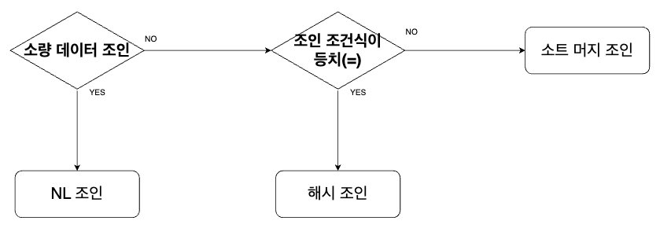

# 6주차 - 조인 / 서브 쿼리 튜닝

# 조인 튜닝

---

## 01. NL 조인

<aside>
💡

NL 조인이란?

**Nested Loops** 조인으로 두 테이블이 조인할 때 중첩 루프문의 수행 구조를 사용한다. 양쪽 테이블의 인덱스를 이용하는 조인이다.

</aside>

- **Outer**와 **Inner** 양쪽 테이블 모두 인덱스 이용
- 랜덤 엑세스 방식으로 데이터를 읽음.
- NL 조인 기법은 조인이 성공하면 바로 결과값을 사용자에게 보여준다 → 온라인 프로그램에 적합.
- **Outer** 테이블과 **Inner** 테이블의 구분
    
    **Outer Table (Driving Table)**
    
    - 조인 처리 과정에서 먼저 접근하는 테이블
    - 조인 실행의 시작점이자 옵티마이저는 레코드를 하나씩 읽으면서 조인 조건을 만족하는 **Inner** 테이블의 레코드를 찾음.
    - 옵티마이저는 처리 범위가 더 적은 테이블을 **Outer Table**로 선택하는 경향.
    
    **Inner Table (Driven Table)**
    
    - 조인 처리 과정에서 **Outer** 테이블의 레코드와 비교하기 위해 나중에 접근하는 테이블
    

### 1) 조인 프로세싱

```sql
SELECT /* ordered use_nl(e) */ E.EMPNO, E.ENAME, D.DNAME, E.JOB, E.SAL
FROM
			DEPT D, EMP E
WHERE
			D.DEPTNO = E.DEPTNO ------ ①
			AND
			D.LOC = 'SEOUL'----------- ②
			AND
			D.GB = '2'---------------- ③
			AND
			E.SAL >= 1500------------- ④
ORDER BY
			SAL DESC;
			
[ 사용 인덱스 ]
DEPT_LOC_IDX, EMP_DEPTNO_IDX

[ 조건 비교 순서 ]
2 -> 3 -> 1 -> 4
```

.png)

### 2) NL 조인 계획 실행 제어

**실행 계획**

```sql
SELECT STATEMENT Optimizer=ALL_ROWS
	NESTED LOOPS
		TABLE ACCESS (BY INDEX ROWID) OF '사원' (TABLE)
			INDEX (RANGE SCAN) OF '사원_X1' (INDEX)
		TABLE ACCESS (BY INDEX ROWID) OF '고객' (TABLE)
			INDEX (RANGE SCAN) OF '고객_X1' (INDEX)
			

[ 해석 ]
- 사원 테이블 기준으로 고객 테이블과 NL 조인
- 각 테이블 액세스 시 인덱스를 이용
```

**힌트 사용법**

1. 2개 테이블 NL 조인

```sql
SELECT /* ordered use_nl(c) */
	e.사원명, c.고객명, c.전화번호
FROM
	사원 e, 고객 c
WHERE
	e.입사일자 >= '19960101'
AND
	c.관리사원번호 = e.사원번호;

=> 사원 테이블(Driving) 기준으로 고객 테이블(Driven)과 NL 방식 조인
```

1. 3개이상 테이블 NL 조인

```sql
SELECT /*+ ordered use_nl(B) use_nl(C) use_hash(D) */
FROM A, B, C, D
WHERE ...

=> A->B->C->D 순으로 조인, B와 조인할 떄와 C와 조인할 때는 NL 방식, D와 조인할 때는 해싱방식 사용
```

1. 옵티마이저에게 맡기기

```sql
SELECT /*+ use_nl(A, B, C, D) */*
FROM A, B, C, D
WHERE ...

```

### 3) NL 조인 튜닝 포인트

**[ 쿼리문 ]**

```sql
SELECT /*+ ordered use_nl(c), index(e), index(c) */
				e.사원번호, e.사원명, e.입사일자
				c.고객번호, c.고객명, c.전화번호, c.최종주문금액
FROM
			사원 e, 고객 c
WHERE
			c.관리사원번호 = e.고객번호
			AND
			e.입사일자  >= '19960101'
			AND
			e.부서코드 >= 'Z123'
			AND
			c.최종주문금액 >= 20000;
```

1. 선행 테이블의 엑세스
    
    .png)
    
    - **사원_X1** 인덱스를 읽고 사원 테이블 엑세스
    - **사원_X1**에서 필터링한 블록 **`3,13,21,23,25`**를 사원에서 읽지만, **`21,23`**은 **`부서코드=’Z123’`**에 부합하지 않아 떨어진다.
    - 만약, **`21,23`**처럼 떨어지는 비율이 높다면 **`(’입사일자’, ‘부서코드’)`**로 인덱스를 다시 설정.
2. 선행테이블의 필터링 결과 건수
    
    %20복사본.png)
    
    - 후행 테이블 인덱스를 탐색하는 과정, **`조인 엑세스 횟수`**가 많을수록 **`성능은 떨어짐`**.
    - 조인 엑세스 횟수 ⇒ Outer 테이블 필터링한 결과 건수에 의해 결정.
3. 후행 테이블의 테이블 엑세스
    
    %20복사본%202.png)
    
    - 후행 테이블 조건이 필터링 되는 부분에서 테이블 엑세스가 많으면 인덱스 추가 고려.
    - **`선행 테이블`** 또는 **`선행 테이블의 첫 인덱스 스캔`** 결과 ⇒ 전체 일량 결정.
    
    <aside>
    💡
    
    [ 결론 ]
    
    1. NL 조인 튜닝 포인트에서 각 단계별로 수행 일량 분석
    2. 과도한 랜덤 엑세스 발생 지점 파악
    3. 조인 순서를 변경해서 랜덤 엑세스 발생량 줄일 수 있는 지, 더 효과적인 다른 인덱스 있는지 검토
    4. 인덱스 추가 혹은 삭제도 고려
    5. 위의 사항 수행해보고 NL 조인으로 성능 뽑기(?) 어렵다고 판단 ⇒ 소트 머지 조인 혹은 해시 조인 검토
    </aside>
    

### 4) NL 조인 특징

- 랜덤 액세스 위주 조인 방식.(레코드 하나를 읽을 때 블록을 통째로 읽는 방식)
    - 메모리 버퍼에서 빠르게 읽더라도 비효율 존재
    - 대량의 데이터 조인 시 불리
- 조인을 한 레코드씩 진행
    - 아무리 큰 테이블을 조인하더라도 매우 빠른 응답 속도.
    - 부분범위 처리가 가능한 환경에서만.
- 인덱스 구성 전략 중요
- **OLTP(온라인 트랜잭션 처리 시스템)**에 적합.

## 02. 소트 머지 조인

<aside>
💡

**SGA vs PGA**

**[ SGA (System Global Area) ]**

- 캐시된 데이터 여러 프로세스간 공유 가능
- 동시에 엑세스 불가 ⇒ 동시에 액세스하려는 프로세스간 액세스 직렬화하기 위한 Lock 시스템(Latch)
- 블록을 읽을 때도 버퍼 Lock를 획득해야 함.

**[ PGA (Process/Program Private Global Area) ]**

- 프로세스에 종속적인 고유 데이터를 저장하는 용도
- 다른 프로세스와 공유하지 않는 독립적 메모리 공간 ⇒ 래치 매커니즘 필요없음.
- SGA 버퍼캐시에서 읽는 것보다 더 빠르다.
</aside>

- 조인 칼럼의 인덱스가 존재하지 않을 경우에도 사용할 수 있음.
- 주로 ***Full Table Scan*** 방식

### 1) 기본 매커니즘

```sql
SELECT /*+ ordered use_merge(c) */
				e.사원번호, e.사원명, e.입사일자
				c.고객번호, c.고객명, c.전화번호, c.최종금액
FROM
			사원 e, 고객 c
WHERE
			c.관리사원번호 = e.사원번호
AND
			e.입사일자 >= '19960101'
AND
			e.부서코드 = 'Z123'
AND
			c.최종주문금액 >= 20000
```

---

***[ Sort ]***

```sql
SELECT 
			사원번호, 사원명, 입사일자
FROM
			사원
WHERE
			입사일자 >= '19960101'
AND
			부서코드 = 'Z123'
ORDER BY 사원번호
```

1. 조건에 해당하는 사원 데이터 읽어 **사원번호 순** **정렬**
2. 정렬된 결과 집합 → PGA에 할당된 Sort Area에 저장. (결과가 PGA에 담기에 큰 경우에는 Temp 테이블스페이스 저장)

```sql
SELECT
		  고객번호, 고객명, 전화번호, 최종주문일시, 관리사번호
FROM
			고객 c
WHERE
			최종주문금액 >= 20000
ORDER BY
			관리사원번호
```

1. 조인컬럼인 관리사번호 순 정렬
2. 정렬된 결과 집합 ⇒ PGA에 할당된 Sort Area에 저장.(결과가 PGA에 담기에 큰 경우에는 Temp 테이블스페이스 저장)

---

***[ Merge ]***

```sql
begin
	for outer in (select * from PGA에_정렬된_사원)
	loop  -- outer 루프
		for inner in (select * from PGA에_정렬된_고객
									where 관리사원번호 = outer.사원번호)
		loop -- inner 루프
			dbms_output.put_line( ,,,, );
		end loop;
	end loop;
end;
```

1. PGA에 저장된 사원 데이터 스캔후 PGA에 저장한 고객 데이터와 조인

### 2) 소트 머지 조인이 빠른 이유

<aside>
💡

NL 조인은 인덱스를 이용한 조인 방식으로 조인 과정에서 액세스하는 모든 블록을 랜덤 액세스 방식으로 DB 버퍼캐시를 경유해서 읽음.

인덱스,테이블이든지 모든 블록에 대해 래피 획득 및 캐시버퍼 체인 스캔 과정 발생.

</aside>

- PGA는 각 프로세스에 대해 독립적인 메모리 공간으로 래치 획득 과정이 없음.
- 조인 컬럼에 대한 인덱스 유무에 크게 영향을 받지 않음.
- 단점
    - 양쪽 테이블로부터 조인 대상 집합을 읽을 때는 DB버퍼 캐시 경유
    - **버퍼 캐시 탐색 비용 + 랜덤 액세스** 부하는 피할 수 없는 문제.

## 03.해시 조인

### 1)기본 매커니즘

- 2단계로 진행
    1. Build 단계 : 작은 쪽 테이블을 읽어 해시 테이블 생성
    2. Probe 단계 : 큰 쪽 테이블을 읽어 해시 테이블 탐색 후 조인

```sql
SELECT /*+ ordered use_hash(c) */
			e.사원번호, e.사원명, e.입사일자,
			c.고객번호, c.고객명, c.전화번호, c.최종주문금액
FROM
			사원 e, 고객 c
WHERE
			c.관리사원번호 = e.사원번호
			AND
			e.입사일자 >= '19960101'
			AND
			e.부서코드 = 'Z123'
			AND
			c.최종주문금액 >= 20000
```

---

***[ Build]***

```sql
SELECT
			사원번호, 사원명, 입사일자
FROM
			사원
WHERE
			입ㅂ사일자 >= '19660101'
			AND
			부서코드 = 'Z123';
```

1. 조건에 해당하는 사원 데이터를 읽어 해시 테이블 생성 (해시 테이블 키 값 : 조인컬럼인 `사원번호`)
    1. 사원번호 해시 함수에 입력
    2. 해시체인 탐색
    3. 해시 체인에 데이터 연결
2. 해시 테이블은 PGA에 할당된 Hash Area에 저장 ⇒ 저장 공간 부족 OR 저장할 데이터 너무 크면 Temp 테이블스페이스 저장.

***[ Probe ]***

```sql
SELECT 
			고객번호, 고객명, 전화번호, 최종주문금액, 관리사원번호
FROM
			고객
WHERE
			최종주ㅜ문 금액 >= 20000
```

1. 관리사원번호 ⇒ 해시함수 입력
2. 해시함수에서 반환된 값으로 해시체인 탐색
3. 해시 체인 스캔 ⇒ 같은 사원번호 조회

### 2)해시조인이 빠른 이유

- 조인 프로세싱 = NL 조인 프로세싱
- 해시 테이블을 PGA 영역에 할당하기 떄문에 빠르다.
- 해시 조인은 래치 획득 과정 없이 PGA에서 데이터를 탐색, 조인
- 조인 과정에서 발생하는 랜덤 액세스 부하❌

<aside>
💡

조인하는 키값만 해시테이블에 저장?

❌ 해시테이블에 조인하는 키값만 저장하면 조인 성공 후 조인 키값 이외의 정보를 읽기 위해서는 `ROWID`로 다시 테이블 블록을 액세스 ⇒ 해시조인의 장점이 없어진다.

따라서, 해시조인은 **`조인키+SQL에 사용한 모든 컬럼`** 저장.

</aside>

### 2) 대용량 Build Input 처리

```sql
[ 문제 ]
아래 사진과 같이 대용량 테이블 T1, T2가 존재하여 인메모리 해시조인이 불가한 상황.
```

.png)

Step 1. 파티션 단계

1. 조인하는 양쪽 집합의 조인컬럼에 대해서 해시함수 적용
2. 반환된 해시 값에 따라 동적 파티셔닝 ← 여러 개의 작은 서브 집합으로 분할

⇒ 양쪽 테이블 (T1, T2)를 읽어 디스크 Temp에 저장하므로 인메모리 해시 조인보다 성능 떨어짐.

.png)

Step 2.조인 단계

1. 각 파티션 짝에 대해 조인 수행. (Build Input과 Probe Input 독립 결정) ⇒ 파티션별로 작은 쪽을 Build Input으로 선택 후 테이블 생성
2. 반대쪽 파티션 로우를 하나씩 읽으며 해시테이블 탐색.

### 3) 해시 조인 실행계획 제어

```sql
[ 해시 조인 실행계획 해석 ]

SELECT STATEMENT Optimizer=ALL_ROWS
	HASH JOIN
		TABLE ACCESS (BY INDEX ROWID) OF '사원' (TABLE)
			INDEX (RANGE SCAN) OF '사원_X1' (INDEX)
		TABLE ACCESS (BY INDEX ROWID) OF '고객' (TABLE)
			INDEX (RANGE SCAN) OF '고객_N1' (INDEX)
			
=> '사원'로 해시 테이블을 생성하고 '고객'테이블에서 읽은 조인 키 값으로 해시 테이블 탐색하면서 조인.
```

***Build Input 테이블을 직접 선택하는 방법***

1. **use_hash**

```sql
SELECT /*+ leading(e) use_hash(c) */
				e.사원번호, e.사원명, e.입사일자,
				c.고객번호, c.고객명, c.전화번호, c.최종주문금액,
FROM
				사원 e, 고객 c
WHERE
				c.관리자사원번호 = e.사원번호
				AND
				e.입사일자 >= '19660101'
				AND
				e.부서코드 = 'Z123'
				AND
				c.최종주문금액 >= 20000;
```

1. **ordred use_hash(c)**

```sql
SELECT /*+ leading(e) ordered use_hash(c) */
				e.사원번호, e.사원명, e.입사일자,
				c.고객번호, c.고객명, c.전화번호, c.최종주문금액,
FROM
				사원 e, 고객 c
WHERE
				c.관리자사원번호 = e.사원번호
				AND
				e.입사일자 >= '19660101'
				AND
				e.부서코드 = 'Z123'
				AND
				c.최종주문금액 >= 20000;
```

1. **swap_join_inputs**

```sql
SELECT /*+ use_hash(c) swap_join_inputs(e)*/
				e.사원번호, e.사원명, e.입사일자,
				c.고객번호, c.고객명, c.전화번호, c.최종주문금액,
FROM
				사원 e, 고객 c
WHERE
				c.관리자사원번호 = e.사원번호
				AND
				e.입사일자 >= '19660101'
				AND
				e.부서코드 = 'Z123'
				AND
				c.최종주문금액 >= 20000;
```

***3개 이상의 테이블 해시 조인***

**Case 1.**


```sql
SELECT *
FROM A, B, C
WHERE 
			A.key = B.key
	AND
			B.key = C.key
```

**Case 2.**


```sql
SELECT *
FROM A, B, C
WHERE 
			A.key = B.key
	AND
			A.key = C.key;
```

Case2를 아래와 같은 사진으로 수정하자.


조인 순서에 따라서 **`leading`** 힌트를 지정해준다.

```sql
SELECT /*+ leading(T1, T2, T3) use_hash(T2) use_hash(T3) */ *
FROM
			T1, T2, T3
WHERE
			T1.key = T2.key
	AND
			T2.key = T3.key
```

- leading 힌트 첫 번째 파라미터(T1)은 무조건 **Build Input**으로 선택됨.

⇒ 위와 같은 힌트 지정 시 나올 수 있는 실행계획.

```sql
[ 패턴1 ]
SELECT STATEMENT Optimizer=ALL_ROWS
	HASH JOIN
		HASH JOIN
			TABLE ACCESS (FULL) OF 'T1' (TABLE)
			TABLE ACCESS (FULL) OF 'T2' (TABLE)
		TABLE ACCESS (FULL) OF 'T3' (TABLE)
```

```sql
[ 패턴2 ]
SELECT STATEMENT Optimizer=ALL_ROWS
	HASH JOIN
		TABLE ACCESS (FULL) OF 'T3' (TABLE)
		HASH JOIN
			TABLE ACCESS (FULL) OF 'T1' (TABLE)
			TABLE ACCESS (FULL) OF 'T2' (TABLE)
```

**상황 1.  T1과 T2 순서를 바꾸기**

```sql
SELECT /*+ leading(T1,T2,T3) **swap_join_inputs(T2)** */
```

```sql
[ 패턴1 ]
SELECT STATEMENT Optimizer=ALL_ROWS
	HASH JOIN
		HASH JOIN
			TABLE ACCESS (FULL) OF 'T2' (TABLE)
			TABLE ACCESS (FULL) OF 'T1' (TABLE)
		TABLE ACCESS (FULL) OF 'T3' (TABLE)
```

```sql
[ 패턴2 ]
SELECT STATEMENT Optimizer=ALL_ROWS
	HASH JOIN
		TABLE ACCESS (FULL) OF 'T3' (TABLE)
		HASH JOIN
			TABLE ACCESS (FULL) OF 'T2' (TABLE)
			TABLE ACCESS (FULL) OF 'T1' (TABLE)
```

**상황2. 패턴1 → 패턴2 변경**

```sql
SELECT /*+ leading(T1,T2,T3) swap_join_inputs(T3) */
=> T1과 T2 조인한 결과집합을 Build Input으로 선택하고 싶을 때
```

```sql
SELECT /*+ leaging(T1,T2,T3) no_swap_join_inpus(T3) */
```

⇒ T1과 T2 조인한 결과집합을 Build Input으로 선택하는 것이 아닌 Probe Input으로 선택.

**상황3. T3를 먼저 읽는 경우**

```sql
SELECT /*+ leading(T3, T2, T1) use_hash(T2) use_hash(T3) */ *
FROM
			T1, T2, T3
WHERE
			T1.key = T2.key
	AND
			T2.key = T3.key
```

### 3) 조인 메서드 선택 기준



| 소량 데이터 | 대량 데이터 |
| --- | --- |
| NL 조인 기준 최적화 진행 ⇒ 랜덤 액새스 ⬇️ | NL 조인 기준 최적화 진행 ⇒ 랜덤 액새스 ⬆️ |
1. 최적화한 NL 조인 성능 = 해시 조인 성능 ⇒ NL조인
2. 해시조인 성능 > NL 조인 성능 ⇒ NL 조인
3. 해시조인 성능 >>>>> NL 조인 성능 ⇒ 해시 조인

→ 해시조인 테이블은 단 1개의 쿼리만을 위해 생성하고 조인하면 사라지는 휘발성 자료구조 ⇒ CPU와 메모리 사용률⬆️ + 여러 래치 경합 발생

***해시 조인을 사용할 수 있는 조건***

1. 수행 빈도 ⬇️
2. 쿼리 수행 시간 ⬆️
3. 대량의 데이터 조인

## 04.서브쿼리 조인

### 1) 서브쿼리 변환이 필요한 이유

<aside>
💡

**쿼리변환?**

옵티마이저가 SQL를 분석하여 의미적으로 동일 + 더 나은 성능이 기대되는 형태로 재작성하는 것.

</aside>

- 옵티마이저는 쿼리 블록 단위로 최적화 수행

***서브쿼리의 종류***

- **인라인 뷰** : FROM절에 사용한 서브쿼리
- **중첩된 서브쿼리** : WHERE절에 사용한 서브쿼리
- **스칼라 서브쿼리** : 한 레코드당 정확히 하나의 값을 반환하는 서브쿼리.

### 2) 서브쿼리와 조인

- 서브쿼리는 메인쿼리에 종속 ⇒ 서브쿼리 단독 실행 불가능.
- 메인쿼리 건수만큼 값을 받아 반복적 필터링 진행

***필터 오퍼레이션 : 서브쿼리를 필터 방식으로 처리할 때의 실행계획***

```sql
[ 쿼리 ]

SELECT c.고객번호, c.고객명
FROM
		고객 c
WHERE
		c.가입일시 >= trunc(add_months(sysdate,-1), 'mm')
		AND
		exists (
						SELECT **/*+ no_unnest */** 'X'
						FROM
								  거래
						WHERE
									고객번호 = c.고객번호
									AND
									거래일시 >= trunc(sysdate,'mm') )
```

```sql
[ 실행계획 ]

SELECT STATEMENT Optimizer=ALL_ROWS (Cost=289 Card=1 Bytes=39)
	FILTER
		TABLE ACCESS (BY INDEX ROWID) OF '고객' (TABLE) (Cost=4, Card=190...)
			INDEX (RANGE SCAN) OF '고객_X01' (INDEX) (Cost=2, Card=190)
		INDEX (RANGE SCAN) OF '거래_X01' (INDEX) (Cost=3 Card=4k Bytes=92K)
```

- **메인 쿼리(고객)**의 한 로우가 **서브쿼리(거래)**의 한 로우와 조인 성공 시 진행 멈춤, 메인쿼리는 다음 로우 계속 처리
- 필터 처리한 결과(서브쿼리에 입력 값에 따른 반환 값)을 캐싱 ← 서브쿼리 동작 전 캐시 먼저 확인
- 쿼리 시작 시 PGA 메모리에 공간 할당 → 쿼리 수행하면서 공간 채움 → 쿼리 종료 시 공간 반환
- 서브쿼리는 메인쿼리에 종속되므로 **조인 순서** 고정.

***서브쿼리 Unnesting : 메인과 서브쿼리 간의 계층구조를 풀어 서로 같은 레벨로 만듦.***

```sql
[ 쿼리 ]

SELECT c.고객번호, c.고객명
FROM
		고객 c
WHERE
		c.가입일시 >= trunc(add_months(sysdate,-1), 'mm')
		AND
		exists (
						SELECT **/*+ unnest nl_sj */** 'X' ---> NL 세미조인 방식
						FROM
								  거래
						WHERE
									고객번호 = c.고객번호
									AND
									거래일시 >= trunc(sysdate,'mm') )
```

```sql
[ 실행계획 ]

SELECT STATEMENT Optimizer=ALL_ROWS (Cost=384 Card=190 Bytes=11k)
	NESTED LOOPS (SEMI) (Cost=384 Card=190 Bytes=11K)
		TABLE ACCESS (BY INDEX ROWID) OF '고객' (TABLE) (Cost=4, Card=190...)
			INDEX (RANGE SCAN) OF '고객_X01' (INDEX) (Cost=2, Card=190)
		INDEX (RANGE SCAN) OF '거래_X01' (INDEX) (Cost=3 Card=427k Bytes=9M)
```

- Unnesting을 하면 일반 조인문처럼 다양한 최적화 기법 사용 가능.
- 필터 방식은 항상 메인쿼리가 드라이빙 집합 But!!! **Unnesting**된 **서브쿼리는** 메인 쿼리보다 먼저 처리 가능!
- Unnesting된 서브쿼리가 드라이빙되도록 leading 힌트 사용
    
    ```sql
    [ 쿼리 ]
    
    SELECT **/*+ leading(거래@subq) use_nl(c) */** c.고객번호, c.고객명
    FROM
    		고객 c
    WHERE
    		c.가입일시 >= trunc(add_months(sysdate,-1), 'mm')
    		AND
    		exists (
    						SELECT **/*+ qb_name(subq) unnest */** 'X' ---> NL 세미조인 방식
    						FROM
    								  거래
    						WHERE
    									고객번호 = c.고객번호
    									AND
    									거래일시 >= trunc(sysdate,'mm') )
    ```
    

<aside>
💡

**ROWNUM - 양날의 검**

조건 절을 만족하는 레코드를 지정한 개수(n)만큼 조회하면 조건 필터링 더 진행하지 않고 중지.

SELECT 
              글번호, 제목, 작성자, 등록일시
FROM 
               게시판
WHERE 
              게시판구분 = ‘공지’
              AND 

              등록일시 ≥ trunc(sysdate-1)
              AND 

            rownum ≤ :n;

**BUT!**

exists와 같이 매칭되는 데이터 존재 여부를 확인(조건절 만족하는 레코드 만나면 즉시 조회 중단)괴 rownum를 같이 쓰는 건 의미가 중복 ⇒ 성능 문제 발생.

PLUS+
rownum + 서브쿼리에 힌트 사용 ⇒ 옵티마이저가 힌트를 전혀 이용하지 못함 ⇒ 서브쿼리에 rownum쓰는것은 신중하게.

</aside>

***서브쿼리 Pushing : 서브쿼리 필터링을 가능한  앞 단계에서 처리하도록 강제하는 기능.***

- **`push_subq / no_push_subq`** 힌트로 제어
- Unnesting 되지 않은 서브쿼리에만 동작.
- push_subq 힌트는 항상 no_unnset 힌트와 같이 기술.

### 3) 뷰와 조인


- 고객 테이블에서 ‘전월 이후 가입한 고객’ 필터링 조건은 인라인 뷰 바깥에 위치
- 인라인 뷰 안에서는 ***당월 거래한 모든 고객의 거래 데이터***를 읽어야 함.


- merge 힌트를 이용해 뷰를 메인 쿼리와 Merge
- 고객 테이블을 먼저 읽음 → 인덱스 이용하여 전월 이후 가입한 고객만 읽음 → 거래테이블과 조인할 때는 해당 고객들에 대한 당월 거래만 읽음

***조인 조건 Pushdown : 메인 쿼리를 실행하면서 조인 조건절 값을 뷰 안으로 밀어 넣는 기능.***

- 힌트 : ***no_merge push_pred***
- 실행 계획에서 ***VIEW PUSHED PREDICATE***으로 작동 여부 확인.
- 전월 이후 가입한 고객을 대상으로 건마다 당월 거래 데이터만을 읽음 → 조인 후 **`Group By`** 수행 (부분 처리 가능)

### 4) 스칼라 서브쿼리 조인

***재귀적으로 실행되는 구조***

```sql
create or replace function GET_DNAME(p_deptno number) return varchar2
is
    l_dname dept.dname%TYPE;
begin
    select dname into l_dname from dept where deptno = p_deptno;
    return l_dname;
exception
    where others then
    return null;
end;
```

- SELECT 쿼리를 메인쿼리 건수만큼 재귀적으로 반복.

***재귀적으로 실행되지 않는 구조***

```sql
SELECT EMPNO, ENAME, SAL, HIREDATE
      , (SELECT D.DNAME, FROM DEPT D WHERE D.DEPTNO = E.DEPTNO) AS DNAME
  FROM EMP E
 WHERE SAL >= 2000
```

- 위의 함수와 달리 재귀적으로 수행되지 않는다.
- 컨텍스트 스위칭 없이 메인쿼리와 서브쿼리를 하나처럼 실행.
- Outer 조인문처럼 NL 조인 방식으로 실행
- 차이첨 ⇒ 스칼라 처리과정에서 캐싱 작용 발생

***스칼라 서브쿼리 캐싱 효과***

- 조인 횟수의 최소화를 위해 입력 값과 출력 값을 내부 캐시에 저장.
- 캐시에서 찾지 못하는 경우에만 조인 수행 ⇒ 수행 결과 캐시에 저장.
- 캐싱 과정 (캐싱은 쿼리 단위로 일어남.)
    1. 쿼리 시작 시 PGA 메모리 공간 할당
    2. 쿼리 수행 후 공간 채움
    3. 쿼리 종료 후 공간 반납

```sql
SELECT empno, ename, sal, hiredate
				,(SELECT GET_DNAME(e.deptno) FROM dual) dname
FROM.  emp e
WHERE  sal >= 2000
```

- SELECT-LIST에 사용한 함수는 메인쿼리 결과 건수만큼 반복 실행
- 스칼라 서브쿼리 사용 ⇒ 캐싱 효과 ⇒ 호출 횟수 최소화.

***스칼라 서브쿼리 캐싱 부작용***

- 스칼라 서브쿼리 캐싱 효과는 입력 값의 종류가 소수여서 해시 충돌 가능성이 작을 때 효과 존재.
- 반대로 입력 값의 종류가 많은 경우, 캐시를 매번 확인하는 비용으로 인해 오히려 성능이 저하되고 CPU 사용률만 높아짐.

***서브쿼리로 두 개이상의 값을 반환 받고 싶을 때***

- 스칼라 서브쿼리는 2개 이상의 값을 반환할 수 없다는 제약 존재.

```sql
SELECT c.고객번호, c.고객명
       , (SELECT avg(거래금액), min(거래금액), max(거래금액)
       FROM 거래
       WHERE 거래일시 >= TRUNC(SYSDATE, 'mm')
       AND.  고객번호 = c.고객번호
FROM.  고객 c
WHERE. c.가입일시 >= TRUNC(add_months(SYSDATE,-1), 'mm');
```

⇒ 구하는 값들을 모두 문자열로 결합하고, 바깥쪽 엑세스 쿼리에 substr 함수로 다시 분리.

```sql
SELECT c.고객번호, c.고객명
			 , to_number(substr(거래금액, 1, 10)) 평균거래금액
			 , to_number(substr(거래금액, 11, 10)) 최소거래금액
			 , to_number(substr(거래금액, 21))     최대거래금액
FROM (
       SELECT c.고객번호, c.고객명
				       , (SELECT lpad( avg(거래금액),10) || lpad(min(거래금액),10) || max(거래금액)
       FROM 거래
       WHERE 거래일시 >= TRUNC(SYSDATE, 'mm')
       AND.  고객번호 = c.고객번호
FROM.  고객 c
WHERE. c.가입일시 >= TRUNC(add_months(SYSDATE,-1), 'mm')
);
```

⇒ 인라인 뷰 사용

```sql
SELECT c.고객번호, c.고객명, t.평균거래, t.최대거래
FROM   고객 c,
      (
       SELECT 고객번호, avg(거래금액) 평균거래
              , min(거래금액) 최소거래, max(거래금액) 최대거래
       FROM 거래
       WHERE 거래일시 >= TRUNC(SYSDATE, 'mm')
       GROUP BY 고객번호) t
WHERE. c.가입일시 >= TRUNC(add_months(SYSDATE,-1), 'mm')
AND.   t.고객번호(+) = c.고객번호
```

***스칼라 서브쿼리 Unnesting***

- *optimizer_unnest_scalar_sq : true 설정 ⇒ 스칼라 서브쿼리를 Unnesting 할 지 여부 옵티마이저가 결정.*
