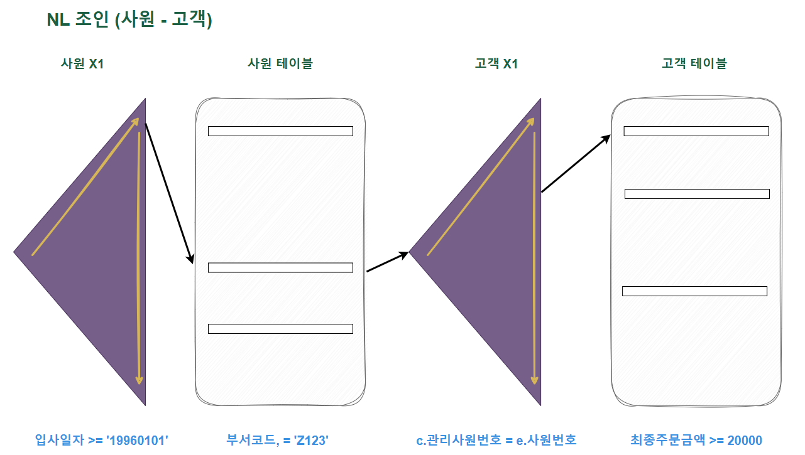
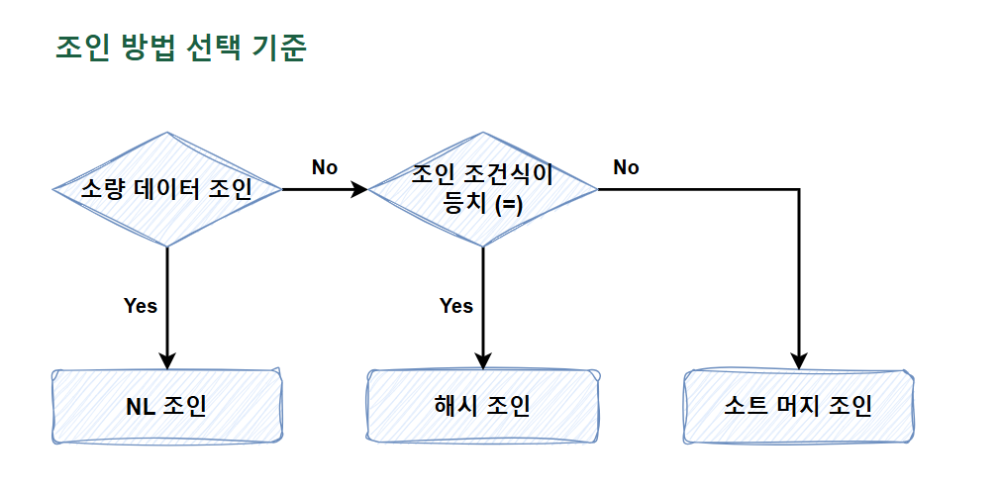

### 주제

쿼리 최적화 - 조인

### 세부 주제

Outer/Inner 테이블, Driving/Driven 테이블

Nested Loop, sort_merge, hash join

Subquery Unnesting, 상관 서브 쿼리

### 알아볼 것

1. **~~(4.1 학습 후 볼 것 NL 조인과 수행 빈도 / P.234~)~~**
2. 다중 조인(3중 조인 이상)에서의 드라이빙, 드리븐, 인덱스 및 최적화
3. Real MySQL 9장 옵티마이저, 고급 최적화 등 / MySQL 버전으로도 공부
- 서브쿼리를 포함한 SQL은 실행 계획이 몇 개?

  본적으로 서브쿼리마다 별도의 쿼리 블록이 생기고 실행계획에 표시됩니다.
  다만 옵티마이저가 변환을 수행하면 달라집니다. Unnesting이나 뷰 머징이 적용되면 서브쿼리가 메인 쿼리와 합쳐져서 하나의 조인 형태로 실행계획이 단순해집니다. 변환이 안 되면 서브쿼리 블록이 그대로 남아서 별도 단계로 표시되고, 메인 쿼리 행마다 반복 실행될 수 있습니다.
  그래서 실행계획에서 서브쿼리가 조인으로 풀렸는지, 별도 블록으로 남았는지 확인하는 게 튜닝 포인트입니다.

1. 드라이빙 테이블이 작은 것이 좋은 이유
2. 조인 순서 결정
3. 스칼라 서브쿼리
4. (뷰) 머지 vs 서브쿼리 Unnesting

**복기 문제?**

Q1. 조인은 성능이 안좋다? 그 반대의 경우(좋은 경우)는?

Q2. 조인 시 선행 테이블 선택 기준은?

---

# 조인 튜닝

**여기 각 조인 그림 있음**

https://velog.io/@eunhye_/SQL-%EC%A1%B0%EC%9D%B8Join-%EC%88%98%ED%96%89-%EC%9B%90%EB%A6%AC

## NL 조인

<aside>
💡

조인의 기본은 **NL 조인**이다. **NL 조인**은 **인덱스를 이용한 조인**이므로, 튜닝 원리도 그대로 적용할 수 있다. **다른 조인 방식과의 차이**는 **조인**할 때 **어떤 자료구조를 사용하느냐의 차이**이다.

</aside>

### 키워드

- Outer/Inner 테이블 (Driving/Driven 테이블)
- Random Access, 인덱스 활용
- 조인 순서, 조인 컬럼 인덱싱
- Prefetch, Batching

### 1. 기본 메커니즘

```sql
SELECT e.사원명, c.고객명, c.전화번호
FROM 사원 e, 고객 c
WHERE e.입사일자 >= '19960101'
AND c.관리사원번호 = e.사원번호
```

- 사원 테이블로부터 ‘19960101’ 이후 입사한 사원을 찾고,
- **‘건건이’** 고객 테이블에서 사원번호가 일치하는 레코드를 찾는 것
- 이것이 Nested Loop 조인이 사용하는 알고리즘

```java
for (int i = 0; i < 100; i++) { -- Outer Loop
    for (int j = 0; j < 100; j++) { -- Inner Loop
        // Do ...
		}
}
```

- NL 조인은 위 중첩 루프문과 같은 수행 구조를 사용함

```sql
begin
	for outer in (select 사원번호, 사원명 from 사원 where 입사일자 >= '19960101')
	loop     -- outer 루프
		for inner in (select 고객명, 전화번호 from 고객 where 관리사원번호 = outer.사원번호)
		loop     -- inner 루프
		...
		end loop;
	end loop;
end;
```

- 일반적으로 NL 조인은 Outer와 Inner 양쪽 테이블 모두 인덱스를 이용함
- **Outer 쪽 테이블**은 사이즈가 크지 않으면 **인덱스를 사용하지 않을 수 있음**
    - Full Table Scan이 한 번만 진행될 수 있기 때문
- **Inner 쪽 테이블**은 **인덱스를 사용해야** 함
    - 고객 데이터를 검색할 때 인덱스를 사용하지 않으면, Outer 루프에서 읽은 건수만큼 Full Table Scan을 반복하기 때문

결국, **NL 조인**은 **‘인덱스를 이용한 조인 방식’**이라고 할 수 있다.

**[흐름]**

Outer Table : 사원 / Inner Table : 고객

조건 만족 사원 idx column1 → 사원 table → 조건 만족 고객 idx column1 → 고객 테이블

조건 만족 사원 idx column1 → 사원 table → 조건 만족 고객 idx column2 → 고객 테이블

조건 만족 사원 idx column1 → 사원 table → 조건 만족 고객 idx column3 → 고객 테이블 (column4는 조건 미충족)

조건 만족 사원 idx column2 → 사원 table → 조건 만족 고객 idx column1 → 고객 테이블

조건 만족 사원 idx column2 → 사원 table → 조건 만족 고객 idx column2 → 고객 테이블

… 반복!!

**소트 머지 조인과 해시 조인도** 각각 Sort Area와 Hash Area에 가공해 둔 데이터를 이용한다는 점만 다를 뿐, **기본적인 조인 프로세싱은 다르지 않다.**

### 2. NL 조인 수행 과정 분석

```sql
SELECT ~~
from 사원 e, 고객 c
WHERE c.관리사원번호 = e.사원번호  ---- 1
AND e.입사일자 >= '19960101'      ---- 2
AND e.부서코드 = 'Z123'           ---- 3
AND c.최종주문금액 >= 20000        ---- 4

----
사원 pk : 사원번호
사원 x1 = 입사일자
고객 pk : 고객번호
고객 x1 : 관리사원번호
고객 x2 : 최종주문금액
```

사용되는 인덱스 : 사원 x1, 고객 x1

조건절 비교 순서 : 2 → 3 → 1 → 4



### 3. NL 조인 튜닝 포인트

**첫 번째 튜닝 포인트**

사원 X1 인덱스를 읽고 나서 **사원 테이블을 액세스하는 부분**이다.

- 여기서는 단일 컬럼 인덱스를 ‘≥’ 조건으로 스캔했으므로 비효율 없이 읽고, 그만큼만 테이블 랜덤 액세스가 발생함
- 만약 사원 테이블로 아주 많은 양의 랜덤 액세스가 발생했고, 테이블에서 부서코드 = ‘Z123’ 조건에 의해 필터링되는 비율이 높다면?
    - **사원 X1 인덱스**에 부서코드 **컬럼을 추가**하는 방안을 고려해야 함

**두 번째 튜닝 포인트**

고객 X1 **인덱스를 탐색하는 부분**이다.

- 고객 X1 인덱스를 탐색하는 횟수, 즉, **조인 액세스 횟수**가 **많을수록 성능이 느려짐**
- **조인 액세스 횟수**는 **Outer 테이블**인 사원을 읽고 **필터링한 결과 건수에 의해 결정**됨

**세 번째 튜닝 포인트**

고객 X1 인덱스를 읽고 나서 **고객 테이블을 액세스하는 부분**이다.

- 여기서도 첫 번째와 같이 ‘최종주문금액 ≥ 20000’ 조건에 의해 **필터링되는 비율이 높다면?**
    - 고객 X1 인덱스에 최종주문금액 컬럼을 추가하는 방안을 고려해야 함

**마지막 튜닝 포인트**

**맨 처음 액세스**하는 사원 X1 **인덱스에서 얻은 결과 건수**에 의해 **전체 일량이 좌우**된다.

- 사원 X1 인덱스를 스캔하면서 추출한 레코드가 많으면?
    - 사원 테이블로 랜덤 액세스하는 횟수
    - 고객 X1 인덱스를 탐색하는 횟수
    - 고객 테이블로 랜덤 액세스하는 횟수
    - 위의 경우들이 전반적으로 많아짐

**올바른 조인 메소드 선택**

OLTP 시스템에서 튜닝할 때는 일차적으로 NL 조인부터 고려하는 것이 올바른 순서다.

- NL 조인 튜닝 포인트에 따라 각 단계의 수행 일량을 분석해서 과도한 랜덤 액세스가 발생하는 지점 우선 파악
    - 조인 순서를 변경해서 랜덤 액세스 발생량을 줄일 수 있는지
    - 더 효과적인 인덱스가 있는지
    - 등을 검토
- 필요하다면 인덱스 추가 또는 구성 변경을 고려함
- 여러 방안 검토 후 NL 조인으로 좋은 성능을 내기 어렵다면?
    - 소트 머지 조인이나 해시 조인 검토

### 4. NL 조인 특징 요약

1. **랜덤 액세스 위주**의 조인 방식이다.
    1. 인덱스 구성이 좋아도 대량 데이터 조인 시 NL 조인이 불리한 이유
2. 조인을 **한 레코드씩 순차적으로 진행**한다.
    1. 1번 이유로 대량 데이터 처리 시 치명적이지만, 한 레코드씩 접근하므로 **매우 빠른 응답 속도**를 낼 수 있음
    2. 부분 범위 처리가 가능한 상황에서 그러함
    3. **순차적으로 진행**하므로 **먼저 액세스되는 테이블 처리 범위에 의해 전체 일량이 결정**됨
3. 다른 조인 방식과 비교하여 **인덱스 구성 전략이 특히 중요**하다.
    1. **조인 컬럼**에 대한 **인덱스**가 있느냐 없느냐, 있다면 **그 구성**에 따라 **조인 효율**이 크게 달라짐

**NL 조인**은 **소량 데이터**를 주로 처리하거나 **부분 범위 처리가 가능한 OLTP 시스템**에 적합한 조인 방식이다.

### 5. NL 조인 튜닝 실습

1. 인덱스 스캔 이후 **테이블 접근**했는데, **필터링되는 컬럼이 많다?**
    1. **인덱스**에 테이블 **필터 조건 컬럼 추가** 고려
2. 레코드에 비해 **읽은 블록이 많다?**
    1. 사원 X1 인덱스 컬럼 순서를 조정해 (부서코드 + 입사일자) 순으로 구성
3. Driving Table을 읽는 부분에서는 비효율이 없을 때. 하지만, 일량은 많다. 문제는 사원 테이블을 읽고 나서 고객 테이블과 조인하는 횟수가 너무 많을 때 발생한다.
    1. 2780번 조인 시도를 했지만, 최종적으로 조인에 성공한 결과 집합은 다섯 건일 때
    2. 이 경우 조인 순서 변경을 고려해 볼 수 있음
        1. 최종주문금액 조건절에 부합하는 레코드가 적다면 튜닝에 성공할 가능성이 있음
        2. 반대의 결과가 나올 수 있음
            1. Driven Table에서 FK 인덱스로 조회했기 때문에 5건이 나왔을 경우인데, 최종주문금액 단독으로 조회하면 데이터량이 오히려 더 많이 나올 수 있음

### 6. NL 조인 확장 메커니즘

<aside>
💡

오라클은 NL 조인 성능을 높이기 위해 테이블 Prefetch, 배치 I/O 기능을 도입했다.

</aside>

**테이블 Prefetch**

- **인덱스를 이용해 테이블을 액세스**하다가 **디스크 I/O가 필요**해지면 이어서 **곧 읽게 될 블록**까지 **미리 읽어**서 **버퍼 캐시에 적재**하는 기능

**배치 I/O**

- **디스크 I/O Call을 미뤘**다가 **읽을 블록**이 **일정량 쌓이면 한꺼번에 처리**하는 기능

두 기능 모두 **읽는 블록마다 건건이 I/O Call을 발생**시키는 **비효율**을 **줄이기 위해 고안**되었다.

**NL 조인 자가 진단**

```sql
SELECT *
FROM PRA_HST_STC a, ODM_TRMS b
WHERE a.SALE_ORG_ID = :sale_org_id
  AND a.STRD_GRP_ID = b.STRD_GRP_ID
  AND a.STRD_ID = b.STRD_ID
  AND b.TRMS_DT = :trms_dt
ORDER BY a.STC_DT DESC
--- 
IDX : PRA_HST_STC_M1 (SALE_ORG_ID + STRD_GRP_ID + STRD_ID + STC_DT)
```

조인 컬럼은 Driven Table에 인덱스를 걸어주자!

## 소트 머지 조인

<aside>
💡

**조인 컬럼에 인덱스**가 **없을 때**, **대량 데이터 조인**이어서 **인덱스가 효과적이지 않을 때**, 옵티마이저는 **NL 조인 대신 소트 머지 조인이나 해시 조인을 사용**한다.

</aside>

### 키워드

- SGA vs PGA
- 양쪽 정렬 후 매칭
- 조인 컬럼 인덱스 활용 시 정렬 생략
- 대량 데이터 조인, 등치/비등치 조인

### 1. SGA vs PGA

**SGA**

- 공유 메모리 영역인 SGA에 캐시된 데이터는 여러 프로세스가 공유할 수 있음
- 하지만, 동시에 액세스는 불가능함
    - 이를 직렬화하기 위한 락 메커니즘으로 래치가 존재함
    - 버퍼 캐시에서 블록을 읽을 때에도 버퍼 Lock을 얻어야 함

**PGA**

- 각 서버 프로세스에 할당된 메모리 영역으로, 프로세스에 종속적인 고유 데이터를 저장하는 용도로 사용함
    - 할당받은 PGA 공간이 작아 데이터를 모두 저장할 수 없는 경우에는 Temp 테이블 스페이스를 이용함
- 래치가 불필요하므로 SGA 버퍼 캐시에서 읽을 때보다 훨씬 빠름

### 2. 기본 메커니즘

<aside>
💡

소트 머지 조인은 두 단계로 진행된다.

1. 소트 단계 : 양쪽 집합을 조인 컬럼 기준으로 정렬한다.
2. 머지 단계 : 정렬한 양쪽 집합을 서로 머지한다.
</aside>

**소트 단계**

1. 먼저 접근하는 테이블의 데이터를 조건에 맞게 읽고, 조인 컬럼으로 정렬함
2. 다음으로 접근하는 테이블의 데이터를 조건에 맞게 읽고, 조인 컬럼으로 정렬함
    - 두 경우 모두의 정렬한 결과 집합은 PGA 영역에 할당된 Sort Area에 저장함
    - 정렬한 결과 집합이 PGA에 담을 수 없을 정도로 크면, Temp 테이블 스페이스에 저장함

**머지 단계**

1. PGA(또는 Temp 테이블 스페이스)에 저장한 먼저 접근한 테이블의 데이터를 스캔하면서 PGA에 저장한 고객 데이터와 조인함
    - 실제 작업을 수행하는 머지 단계는 NL 조인과 다르지 않음

**주목할 점**

- 사원 데이터를 기준으로 고객 데이터를 매번 Full Scan 하지 않아도 됨
    - 고객 데이터가 정렬되어 있기 때문에 시작점을 알고, 종료 판단을 할 수 있기 때문
- Sort Area에 저장한 데이터 자체가 인덱스 역할을 하므로 소트 머지 조인은 조인 컬럼에 인덱스가 없어도 사용할 수 있는 조인 방식임
    - 인덱스가 있어도 NL 조인은 대량 조회 시 불리..

### 3. 소트 머지 조인이 빠른 이유

**NL 조인과의 비교**

- **NL 조인**
    - 인덱스를 이용한 조인 방식
    - **조인 과정에서 액세스**하는 **모든 블록**을 **랜덤 액세스 방식**으로 **‘건건이’ DB 버퍼 캐시를 경유**해서 읽음
        - 인덱스든 테이블이든 읽는 모든 블록에 래치 및 체인 스캔 과정을 거침
    - **인덱스를 사용**하기 때문에 **대량 조회** 시 **인덱스 손익분기점의 한계**가 분명함
- **소트 머지 조인**
    - 양쪽 테이블로부터 조인 대상 집합을 **‘일괄적으로’** 읽어 PGA에 저장한 후 조인
        - PGA는 프로세스 독립이기 때문에 래치가 없음
    - 소트 머지 조인도 양쪽 테이블에서 대상 집합을 읽을 때는 DB 버퍼 캐시를 경유하고, 인덱스를 이용하기도 함

### 4. 소트 머지 조인의 주용도

<aside>
💡

소트 머지 조인보다 대부분 해시 조인이 빠르지만, 해시 조인은 등치 조건(=)이 아닐 때 사용할 수 없다.

</aside>

**소트 머지 조인을 사용하는 상황**

- 조인 조건식이 등치(=) 조건이 아닌 대량 데이터 조인
- 조인 조건식이 아예 없는 조인(Cross Join)

### 5. 소트 머지 조인 특징 요약

- 조인을 위해 실시간으로 인덱스를 생성하는 것과 같음
- 양쪽 집합을 정렬한 다음에는 NL 조인과 같은 방식으로 진행하지만, PGA 영역의 데이터를 사용하므로 빠름
- 인덱스 유무에 영향을 받지 않음
    - 조건 컬럼에 인덱스가 없는 상황에서 두 테이블을 각각 읽어 조인 대상 집합을 줄일 수 있을 때 유리함
- 스캔 위주의 액세스 방식을 사용함

:: Driven Table의 수직 탐색이 없기 때문?

## 해시 조인

### 키워드

- Build Input, Probe Input
- 해시 테이블 생성 (메모리)
- 등치 조인만 가능
- 대용량 배치, 분석 쿼리에 유리
- Grace Hash Join (메모리 부족 시)

<aside>
💡

NL 조인은 인덱스를 이용한 조인 방식이므로 인덱스 구성에 따른 성능 차이가 심하다. 랜덤 I/O로 인해 대량 데이터 처리에 불리하고, 버퍼 캐시 히트도 중요하다.

</aside>

- 소트 머지 조인과 해시 조인은 ‘**조인 과정에서’ 인덱스**를 사용하지 않기 때문에 대량 데이터 조회 시 NL 조인보다 빠르고 일정한 성능을 보임
    - 해시 조인은 양쪽 테이블을 정렬하는 부담도 없음

### 1. 기본 메커니즘

<aside>
💡

해시 조인도 두 단계로 진행된다.

1. Build 단계 : 작은 쪽 테이블(Build Input)을 읽어 해시 테이블(해시 맵)을 생성한다.
2. Probe 단계 : 큰 쪽 테이블(Probe Input)을 읽어 해시 테이블을 탐색하면서 조인한다.
</aside>

**Build 단계**

- 조건에 해당하는 데이터를 읽어 해시 테이블 생성
    - **조인 컬럼**을 **해시 테이블 키 값**으로 사용
    - **조인 컬럼**을 **해시 함수에 입력**해서 반환된 값으로 해시 체인을 찾고, 그 해시 체인에 데이터 연결
    - 해시 테이블은 PGA 영역의 Hash Area에 저장함
        - 마찬가지로 해시 테이블이 너무 커 PGA에 담을 수 없으면 Temp 테이블 스페이스에 담음

**Probe 단계**

- 조건에 해당하는 고객 데이터를 하나씩 읽어, 앞서 생성한 해시 테이블을 탐색함
    - **조인 컬럼**을 **해시 함수에 입력**해서 반환된 값으로 해시 체인을 찾고, 그 해시 체인을 스캔해서 값이 **같은 키**를 찾음
        - 찾으면 조인 성공, 못 찾으면 조인 실패
    - 실제 조인을 수행하는 Probe 단계는 NL 조인과 다르지 않음

### 2. 해시 조인이 빠른 이유

- 소트 머지 조인이 빠른 이유와 같음
- NL 조인은 Outer 테이블 레코드마다 Inner 테이블 레코드를 읽기 위해 래치 및 캐시 버퍼 체인 스캔 과정 반복
    - 해시 조인은 래치 획득 과정 없이 PGA에서 빠르게 데이터를 탐색하고 조인함
- 해시 조인도 마찬가지로 Build Input과 Probe Input 각 테이블을 읽을 때에는 캐시와 인덱스를 사용하기도 함

**소트 머지 조인 vs 해시 조인**

- **소트 머지 조인**
    - 양쪽 집합을 모두 정렬해서 PGA에 담음
    - 두 집합 중 하나라도 크다면 Temp 테이블 스페이스를 사용하게 됨
- **해시 조인**
    - 양쪽 집합 중 하나만 읽어서 해시 맵을 만듦
        - 둘 중 작은 집합을 기준으로 만들기 떄문에 Temp 테이블 스페이스를 사용하는 일이 적음


해시(소트 머지)조인은 NL 조인처럼 조인 과정에서 발생하는 랜덤 액세스 부하가 없다. 또한, 해시 조인은 소트 머지 조인처럼 양쪽 집합을 미리 정렬하는 부하도 없다. 해시 테이블을 생성하는 비용이 발생하지만, 작은 집합을 선택하므로 부담이 크지 않은 경우가 많다.

### 3. 대용량 Build Input 처리

조인하려는 두 테이블 모두 대용량 테이블이어서 인메모리 해시 조인이 불가능하다면..?

**분할 & 정복 방식으로 두 단계로 나눠 수행**

1. **파티션 단계**
    1. 조인하는 양쪽 집합의 조인 컬럼에 해시 함수 적용 후 반환된 해시 값에 따라 동적으로 파티셔닝
    2. 독립적으로 처리할 수 있는 여러 개의 작은 서브 집합으로 분할함으로써 파티션 짝을 생성하는 단계
    3. 양쪽 집합을 모두 읽은 후 디스크 Temp 공간에 저장해야 하므로 인메모리 해시 조인보다 성능이 떨어짐
2. **조인 단계**
    1. 각 파티션 짝에 대해 하나씩 조인을 수행
        1. 각각에 대한 Build Input과 Probe Input은 독립적으로 결정됨
            1. 각 파티션 짝별로 작은 쪽을 Build Input으로 선택하여 해시 테이블을 생성함
        2. 해시 테이블을 생성한 후 반대편 파티션 로우를 하나씩 읽으면서 해시 테이블을 탐색함
        3. 모든 파티션 짝에 대한 처리를 마칠 때까지 반복함

### 4. 조인 방법 선택 기준



**소량과 대량의 기준?**

- 단순히 데이터량의 많고 적음이 아님
- **NL 조인 기준**으로 **최적화 했는데**도 **랜덤 액세스가 많아** 만족할만한 **성능을 낼 수 없다**면 **대량 데이터 조인**에 해당됨

**수행 빈도가 높은 경우라면?**

- (최적화된) NL 조인과 해시 조인 성능이 같으면, NL 조인
- 해시 조인이 약간 더 빨라도 NL 조인
- NL 조인보다 해시 조인이 빠른 경우, 해시 조인

**‘수행 빈도가 높은 소량 데이터 조인’**은 **NL 조인**을 선택할 것.

→ 옵티마이저가 수행 빈도까지 고려하지 않으므로 이는 매우 중요한 선택 기준임

**왜 NL 조인을 가장 먼저 고려?**

- NL 조인에 사용하는 인덱스는 영구적으로 유지하면서 다양한 쿼리를 위해 공유 및 재사용함
- 해시 테이블은 하나의 쿼리를 위해 생성하고, 조인이 끝나면 곧바로 소멸함
    - 따라서 수행 시간이 짧으면서 수행 빈도가 매우 높은 쿼리를 해시 조인으로 처리하면 CPU와 메모리 사용률이 크게 증가함
    - 해시 맵을 만드는 과정에 여러 가지 래치 경합도 발생함
    -

반면, **아래 세 가지 조건**은 **배치 프로그램, DW, OLAP성 쿼리의 특징**이기도 하다.

1. 수행 빈도가 낮고
2. 쿼리 수행 시간이 오래 걸리는
3. 대량 데이터 조인

# 서브쿼리

<aside>
💡

옵티마이저가 서브쿼리에 대해 다양한 형태로 쿼리 변환을 시도하므로 서브쿼리 조인을 이해하는 출발점은 쿼리 변환에서 찾아야 한다.

</aside>

## 서브쿼리 조인

### 키워드

- 서브쿼리 Unnesting
- 필터 방식 vs 조인 방식
- 뷰 머징 (View Merging)
- 스칼라 서브쿼리 캐싱
- Pushdown, No Merge

### 서브쿼리 최적화 (세미 조인, 안티 조인 등)

### 1. 서브쿼리 변환이 필요한 이유

<aside>
💡

옵티마이저는 비용을 평가하고 실행 계획을 생성하기 전에 사용자로부터 전달받은 SQL을 최적화에 유리한 형태로 변환하는 작업인 **쿼리 변환**부터 진행한다.

</aside>

**쿼리 변환**

- 옵티마이저가 SQL을 분석해 의미적으로 동일하면서 더 나은 성능이 기대되는 형태로 재작성하는 것

**서브쿼리**

- 하나의 SQL문 안에 괄호로 묶은 별도의 **쿼리 블록**으로, 쿼리에 내장된 또 다른 쿼리

**[종류]**

1. **인라인 뷰 (Inline View)** : **FROM 절**에 사용한 서브쿼리
2. **중첩된 서브쿼리 (Nested SubQuery)** : **결과 집합을 한정**하기 위해 **WHERE 절**에 사용한 서브쿼리
    1. **상관 서브쿼리** : **서브쿼리**가 **메인쿼리 컬럼**을 **참조**하는 형태
3. **스칼라 서브쿼리** : **한 레코드 당 정확히 하나의 값을 반환**하는 서브쿼리
    1. 주로 SELECT-LIST에서 사용
    2. 몇 가지 예외 사항을 제외하면 컬럼이 올 수 있는 대부분 위치에 사용 가능
- 서브쿼리를 참조하는 메인 쿼리도 하나의 쿼리 블록
- **옵티마이저**는 **쿼리 블록 단위로 최적화를 수행**함
    - 서브쿼리가 있는 경우, 쿼리를 변환하지 않고 최적화를 수행하면 각각 최적화 함

각각의 최적화가 최선은 아니다. 전체를 바라보는 관점에서 이해해야 하고, 이를 위해 먼저 서브쿼리를 풀어내야 한다.

### 2. 서브쿼리와 조인

<aside>
💡

메인쿼리와 서브쿼리 간에는 부모와 자식이라는 종속적이고 계층적인 관계가 존재한다. 서브쿼리는 메인쿼리에 종속되므로 단독으로 실행할 수 없다. 메인쿼리 건수만큼 값을 받아 반복적으로 필터링하는 방식으로 실행해야 한다.

</aside>

**필터 연산**

: 서브쿼리가 **Unnesting되지 않고** 그대로 실행되는 방식이다.

- 기본적으로 NL 조인과 처리 루틴이 같음
    - 차이가 몇 가지 있는데..
        1. 필터는 한 로우가 조인에 성공하는 순간 진행을 멈추고 **메인 쿼리의 다음 로우**를 계속 처리함
            1. 메인쿼리 결과 집합이 서브쿼리 M쪽 집합 수준으로 확장되는 현상을 막기 위함임
        2. 필터는 **캐싱 기능**을 갖고 있음
            1. 서브쿼리 입력 값에 따른 반환 값을 캐싱하는 기능임
            2. 따라서 서브쿼리 수행 전에 항상 캐시부터 확인함
            3. 캐싱은 쿼리 단위로 이루어짐
        3. **메인쿼리로 Driving Table 고정**
            1. 메인쿼리에 종속되기 때문
- 서브쿼리를 그대로 두면 필터 방식을 사용해야 함

**서브쿼리 Unnesting**

- 메인과 서브쿼리 간의 계층 구조를 풀어 서로 같은 레벨로 만들어 주는 것
    - 서브쿼리 Flattening이라고 부르기도 함
- 서브쿼리를 Unnesting하면 일반 조인문처럼 다양한 최적화 기법을 사용할 수 있음
- 메인쿼리 집합보다 먼저 처리될 수 있음
- Unnesting된 서브쿼리는 다양한 방식으로 실행될 수 있음
    - NL 세미조인
    - Sort Unique 오퍼레이션
    - 해시 세미 조인

서브쿼리를 Unnesting해서 메인쿼리와 같은 레벨로 만들면 방금 본 것처럼 다양한 조인 메소드를 선택할 수 있고, 조인 순서도 마음껏 정할 수 있다.

**서브쿼리 Pushing**

- 서브쿼리 필터링을 가능한 한 앞 단계에서 처리하도록 강제하는 기능
    - 필터링을 먼저 하여 조인으로 넘어가는 로우 수를 줄일 수 있다면 필터링을 먼저 하는 것이 성능이 더 좋음
- **Unnesting되지 않은** 서브쿼리에만 작동함

### 3. 스칼라 서브쿼리

**특징**

```sql
SELECT ~~, (SELECT d.dname FROM dept d WHERE d.deptno = e.deptno) as dname
FROM emp e
WHERE sal >= 2000
```

- 위 스칼라 서브쿼리는 메인쿼리 레코드마다 정확히 하나의 값만 반환함
- 메인쿼리와 서브쿼리를 한 몸체처럼 실행함
- 아래 Outer 조인문처럼 하나의 문장으로 이해하면 됨
    - 차이가 있다면 스칼라 서브쿼리는 처리 과정에서 캐싱 작용이 일어남

```sql
SELECT ~~, d.dname
FROM emp e, dept d
WHERE d.deptno(+) = e.deptno
AND sal >= 2000
```

**스칼라 서브쿼리 캐싱 효과**

- 참조하는 메인쿼리의 컬럼을 입력 값으로, 쿼리의 결과를 출력 값으로 캐싱함
- 아래는 자주 활용되는 튜닝 기법

```sql
SELECT empno, ename, sal, hiredate
			,(SELECT GET_DNAME(e.deptno) FROM dual) dname
FROM emp e
WHERE sal >= 2000
```

- SELECT절에 사용된 함수는 메인쿼리의 결과만큼 반복됨
- 스칼라 서브쿼리를 덧씌우면 캐싱으로 함수 호출을 최소화할 수 있음